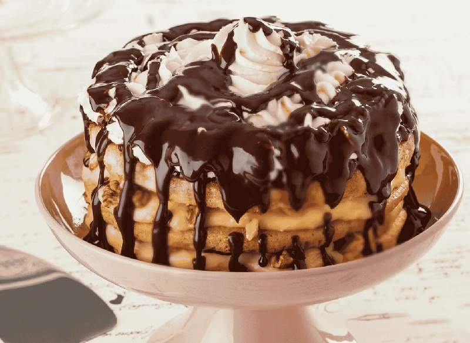

# Somlói Galuska

*Hungary's celebrated trifle: three sponges layered with rum-citrus syrup, raisins and walnuts, drowned in dark chocolate sauce and topped with whipped cream.*

**Serves:** 8 to 10

**Prep Time:** 45 minutes

**Cook Time:** 30 minutes (plus 4 hours chilling)

## Overview
Three thin sponges bake side by side or in batches: one vanilla, one cocoa, one walnut. Each is moistened with a warm rum-citrus syrup and layered in a deep dish with raisins, walnuts and a vanilla pastry-cream-style filling. The whole thing chills overnight so the layers meld. Served by scooping (galuska means "dumpling", referring to the soft scoops), drowned in warm chocolate sauce and crowned with cold whipped cream.

## Ingredients

### Sponges (one batch divided into three)
- 6 eggs (large, separated)
- 180 g caster sugar
- 180 g plain flour
- 1 teaspoon vanilla extract
- A pinch of salt
- 2 tablespoons cocoa powder (for the cocoa sponge)
- 80 g walnuts, finely ground (for the walnut sponge)

### Vanilla cream
- 500 ml whole milk
- 4 egg yolks (large)
- 120 g caster sugar
- 40 g cornflour
- 1 teaspoon vanilla extract
- 50 g unsalted butter (cubed)

### Rum syrup
- 200 ml water
- 150 g caster sugar
- 1 lemon (zest)
- 1 orange (zest)
- 4 tablespoons dark rum (or 2 tablespoons rum + 2 tablespoons orange juice)

### Layering extras
- 100 g raisins (soaked in 2 tablespoons rum or hot water for 20 minutes)
- 80 g walnuts (roughly chopped)

### Chocolate sauce
- 200 g dark chocolate, 60-70% (chopped)
- 200 ml double cream
- 30 g unsalted butter
- 1 tablespoon cocoa powder

### To finish
- 300 ml double cream
- 1 tablespoon icing sugar

## Method

### Stage 1 - Sponges
1. Heat the oven to 180°C (160°C fan). Line a 30 × 22 cm tray or two smaller trays with parchment.
2. Whisk the yolks with 90 g of the sugar and the vanilla until pale and thick.
3. Whip the whites with the salt to soft peaks; rain in the remaining 90 g sugar to stiff glossy peaks.
4. Fold the whites into the yolks in three additions; sift in the flour and fold gently.
5. Divide the batter into three equal bowls. Leave one plain. Fold the cocoa into the second. Fold the ground walnuts into the third.
6. Spread each sponge in a thin layer (about 1 cm) and bake one at a time, 8-10 minutes each, until just springy. Cool on a rack.

### Stage 2 - Vanilla cream
1. Heat 400 ml of the milk with the vanilla in a saucepan until just steaming.
2. Whisk the yolks, sugar and cornflour with the remaining 100 ml cold milk to a smooth paste.
3. Pour the hot milk over the yolk mixture in a thin stream, whisking. Return everything to the pan.
4. Cook over medium heat, whisking constantly, until thick and just bubbling, about 3 minutes.
5. Off the heat, beat in the cubed butter until smooth. Press cling film directly onto the surface; cool to lukewarm.

### Stage 3 - Rum syrup
1. Combine the water, sugar and both zests in a small pan.
2. Bring to a simmer; cook 3 minutes.
3. Off the heat, stir in the rum. Strain. Cool slightly (use warm, not hot).

### Stage 4 - Assemble
1. Cut each sponge to fit a deep glass dish (about 25 × 20 cm) or trifle bowl. Trim any edges.
2. Layer 1: plain sponge on the bottom. Brush generously with rum syrup. Spread with one third of the cooled vanilla cream. Scatter a third of the raisins and walnuts.
3. Layer 2: walnut sponge. Brush, cream, raisins, walnuts.
4. Layer 3: cocoa sponge. Brush, cream, raisins, walnuts. The top should be cream.
5. Cover and chill at least 4 hours, ideally overnight.

### Stage 5 - Chocolate sauce and serve
1. Bring the cream to a bare simmer; pour over the chopped chocolate. Rest 2 minutes; whisk smooth. Stir in the butter and cocoa.
2. Whip the double cream with the icing sugar to soft peaks.
3. To serve, scoop generous spoonfuls of the chilled trifle into bowls. Pour warm chocolate sauce over (it should be pouring consistency, not stiff). Top with a cloud of whipped cream.

## Notes
- **Three sponges, three flavours:** Plain, cocoa, walnut is the canonical split. Some Budapest cafés use only two; the three-flavour version is what most home recipes follow.
- **Rum:** Genuine dark rum (Captain Morgan, Wood's, Plantation) is what was originally used. Non-alcohol version: substitute orange juice mixed with a teaspoon of rum extract.
- **Make ahead:** This is a make-ahead dessert. The overnight chill is when the magic happens; the layers settle and the flavours marry.
- **Serve scooped:** Not a slice. The soft scoops are the point of the name (galuska = dumpling). Use a large serving spoon.
- **Warm sauce, cold trifle, cold cream:** The temperature contrast is part of the dish.

## Storage
- 3 days refrigerated, covered.
- Make the chocolate sauce fresh each time; rewarm gently.
- Don't freeze.
