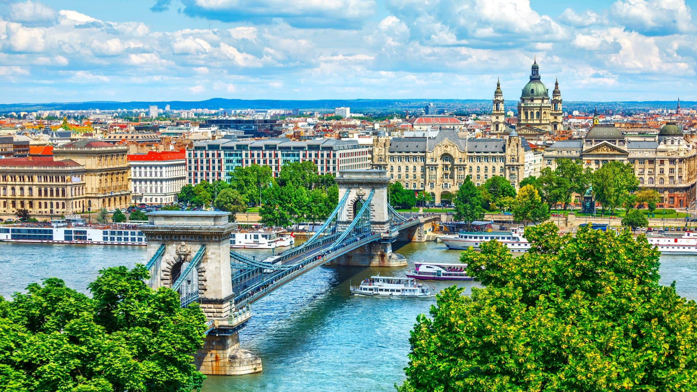

# Hungarian Cuisine

Paprika-led cooking from Central Europe, where sweet, smoked and hot Hungarian paprika are entire ingredients in their own right. Onions cook deep and slow as the base of every stew; soured cream, dill and caraway shape the finish. Goulash and pörkölt (paprika braises), chicken paprikash, and the layered cake patisserie of Budapest define the tradition.
