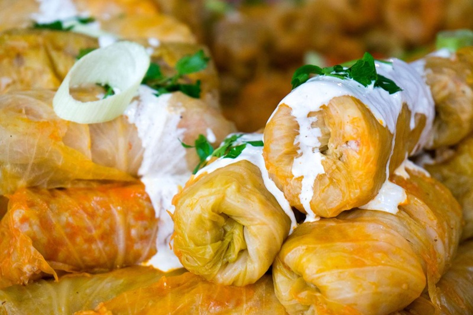

# Káposzta

*Hungarian braised cabbage: sweet white cabbage cooked down with onion, lard and sweet paprika until it slumps into a glossy, paprika-stained tangle. The standard winter side, eaten alongside roast pork, sausages, stuffed peppers, or piled onto buttered noodles.*

**Serves:** 4 to 6

**Prep Time:** 15 minutes

**Cook Time:** 40 minutes

## Overview
Onion is softened in lard or oil, paprika blooms off the heat, then shredded cabbage goes in with a splash of stock and a pinch of sugar. The cabbage is cooked slow and covered until it has collapsed into something silky and savoury-sweet, sharpened at the end with a hit of vinegar. A spoonful of sour cream stirred through at the end is optional but traditional in many homes.

## Ingredients

- 1 medium white cabbage, about 1 kg (cored and finely shredded)
- 2 tablespoons lard or sunflower oil
- 2 medium onions (finely sliced)
- 2 garlic cloves (crushed)
- 1 ½ tablespoons Hungarian sweet paprika
- ½ teaspoon caraway seeds (lightly crushed)
- 1 teaspoon sugar
- 150 ml chicken or vegetable stock
- 1 tablespoon white wine vinegar or cider vinegar
- Salt and black pepper
- 2 tablespoons sour cream (optional, to finish)

## Method

### Stage 1 - Onions
1. Heat the lard in a wide, heavy pan or casserole over medium heat.
2. Add the onions with a pinch of salt; cook 10 minutes, stirring often, until soft and starting to turn golden.
3. Add the garlic; cook 1 minute.

### Stage 2 - Paprika
1. Pull the pan off the heat (paprika scorches and turns bitter on direct heat).
2. Stir in the paprika and caraway. The onions will turn deep orange-red.
3. Return to medium heat for 20 seconds, no more.

### Stage 3 - Braise
1. Add the shredded cabbage in two or three handfuls, tossing to coat between additions. It will look like too much; it will collapse.
2. Stir in the sugar, stock, salt and pepper.
3. Cover and reduce the heat to low. Cook 25-30 minutes, stirring every 8-10 minutes, until the cabbage is completely soft and glossy. The volume halves.
4. Uncover for the last 5 minutes if there's liquid left; you want a wet but not soupy braise.

### Stage 4 - Finish
1. Stir in the vinegar; taste and adjust salt, pepper or sugar. The balance should be sweet, savoury and slightly sharp.
2. Off the heat, swirl in the sour cream if using.
3. Serve hot.

## Notes
- **Hungarian sweet paprika:** Generic supermarket paprika or smoked Spanish paprika both give the wrong flavour. Hungarian édes paprika is brighter and slightly sweeter; track it down for the proper colour and taste.
- **Lard vs oil:** Lard (zsír) is traditional and adds noticeable savoury depth. Sunflower oil works; butter goes brown too quickly.
- **Don't burn the paprika:** Off-the-heat addition is non-negotiable. Even 20 seconds at high heat ruins the dish.
- **Caraway:** A small amount; it's the background note, not the headline. Skip if you genuinely dislike it.

## Variations
**Sweet-sour (édes-savanyú káposzta):** Double the vinegar and sugar for a more pronounced sweet-and-sour profile, closer to a sauerkraut-style side.
**With sausage:** Add 200 g sliced smoked Hungarian sausage (kolbász) or Polish kielbasa at the start of the braise; turns it into a one-pan supper.

## Serving
Serve with: Roast pork, pork chops, schnitzel, sausages, stuffed cabbage rolls (töltött káposzta), or piled onto buttered nokedli.
Garnish with: A spoonful of sour cream, a dusting of extra paprika, chopped flat-leaf parsley.

## Storage
- Keeps 4 days refrigerated; flavour deepens overnight.
- Freezes 2 months. Reheat slowly with a splash of stock.
