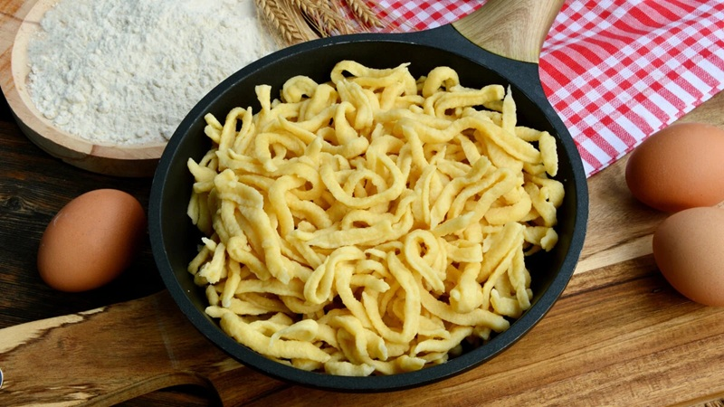

# Nokedli

*Hungary's everyday dumpling: rough, comma-shaped scraps of egg-and-flour batter pushed through a spätzle plane into boiling water. The Central-European cousin of spätzle, served as the standard side under chicken paprikash, pörkölt, goulash sauces and anything else with gravy to soak up.*

**Serves:** 4

**Prep Time:** 10 minutes

**Cook Time:** 8 minutes

## Overview
A loose batter of flour, egg and water rests briefly, then gets pressed through a spätzle plane (or a wide-holed colander) into salted boiling water. The dumplings cook in under a minute, get lifted out, and finish in melted butter. Texture should be soft and slightly chewy with irregular edges that catch sauce.

## Ingredients

### Batter
- 300 g plain flour
- 3 eggs (large)
- 180 ml water
- 1 ½ teaspoons salt

### To finish
- 40 g unsalted butter
- Black pepper (optional)
- 1 tablespoon fresh parsley, chopped (optional)

## Method

### Stage 1 - Batter
1. Beat the eggs with the water and salt in a wide bowl.
2. Whisk in the flour until you have a thick, sticky batter: pourable but lumpy, holding shape on a spoon for a moment before falling.
3. Rest 10 minutes; the gluten relaxes and the batter tightens slightly.

### Stage 2 - Boil
1. Bring a large pan of well-salted water to a rolling boil (pasta-water salty).
2. Set a spätzle plane (lapostészta-szaggató) over the pan, or hold a wide-holed colander above the water.
3. Scrape a portion of batter onto the plane and slide it back and forth so short scraps drop into the water. Work in 3-4 batches: crowding gives lumps.
4. Each batch cooks in 60-90 seconds. They are done when they float to the surface plus 15 seconds.
5. Lift out with a slotted spoon or spider; drain in a colander. Toss with a touch of oil between batches to stop sticking.

### Stage 3 - Finish
1. Melt the butter in a wide frying pan over medium heat until just foaming.
2. Add the drained nokedli; toss gently to coat in butter for 1 minute.
3. Season with pepper if using; scatter parsley.
4. Serve immediately under whatever stew, sauce or gravy you've made.

## Notes
- **Spätzle plane:** A flat metal plane with a sliding hopper is the classic tool. A wide-holed colander or a potato ricer with the largest disc both work; rough comma-shapes are the goal, not uniform pellets.
- **Batter consistency:** Too thin and the dumplings dissolve; too thick and they won't drop through the plane. It should fall in a slow, sticky ribbon.
- **Salt the water properly:** Bland nokedli are the most common home-cook failing. Salt the water like pasta water.
- **Make ahead:** Cook, drain and toss with oil; refrigerate up to 2 days. Reheat in butter in a hot pan.

## Variations
**Toasted:** After tossing in butter, keep frying 3-4 minutes until edges crisp. Excellent under pörkölt.
**Cheesy (sajtos nokedli):** Stir 80 g grated semi-hard cheese (Trappista, Gruyère or mature cheddar) through the buttered nokedli off the heat.

## Serving
Serve with: Chicken paprikash, pörkölt, beef goulash, mushroom paprikash. Also good with a fried egg and a spoonful of sour cream for a quick supper.
Garnish with: Chopped parsley, a dusting of sweet paprika.

## Storage
- Best fresh.
- Cooked, plain nokedli keep 2 days refrigerated.
- Don't freeze: texture turns gluey.
