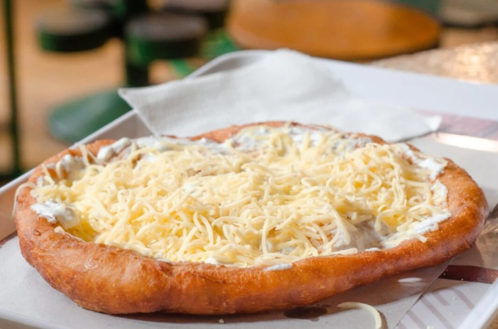

# Lángos

*Hungary's deep-fried flatbread: a soft yeasted dough stretched thin, dropped into hot oil and puffed into a golden disc, then rubbed with raw garlic and crowned with sour cream and grated cheese. Market-stall food, street food, late-night food. Eaten hot, by hand, often standing up.*

**Serves:** 4 (makes 4 large lángos)

**Prep Time:** 20 minutes (plus 1 ½ hours rise)

**Cook Time:** 12 minutes

## Overview
A soft potato-enriched yeast dough rises slowly, gets stretched thin (not rolled), and shallow-fries in hot oil for 60-90 seconds a side until puffed, blistered and golden. Out of the pan, it's brushed with a smashed garlic-water and immediately topped with sour cream and grated cheese. The classic combination is unbeatable, but plain salted lángos eaten with the garlic rub alone is also traditional.

## Ingredients

### Dough
- 250 g plain flour
- 100 g cooked, mashed floury potato (cooled)
- 7 g instant dried yeast (1 sachet)
- 1 teaspoon caster sugar
- 1 teaspoon salt
- 160 ml warm milk
- 2 tablespoons sunflower oil
- 1 litre sunflower oil, for frying

### Garlic rub
- 4 garlic cloves (crushed)
- 3 tablespoons warm water
- ½ teaspoon salt

### Topping (classic)
- 200 ml sour cream (tejföl)
- 150 g semi-hard cheese, grated (Trappista, Edam or mature cheddar)

## Method

### Stage 1 - Dough
1. Whisk the yeast and sugar into the warm milk; rest 5 minutes until foamy on top.
2. Mix the flour, mashed potato and salt in a large bowl. Pour in the yeasty milk and the 2 tablespoons of oil.
3. Mix to a soft, sticky dough. Knead in the bowl or on an oiled surface for 6-8 minutes until smooth and elastic. It should be tacky but not gluey.
4. Cover; rise in a warm spot 1 ½ hours, until doubled.

### Stage 2 - Shape
1. Tip the dough onto an oiled surface; divide into 4 equal pieces.
2. Rest the pieces 10 minutes covered (the gluten relaxes; stretching gets easier).
3. Working one piece at a time, flatten with oiled hands then stretch gently into a 20 cm disc. The middle should be thin enough to see light through; the edges slightly thicker. Don't use a rolling pin: hand-stretching keeps the bubbles.

### Stage 3 - Fry
1. Heat 3-4 cm of oil in a wide, deep pan to 180°C (a small piece of dough should bubble vigorously and brown in 30 seconds).
2. Slide one disc in carefully. It will sink, then float and puff within 15 seconds.
3. Fry 60-90 seconds, spooning hot oil over the top, until the underside is deep golden.
4. Flip; fry the other side 45-60 seconds. The lángos should be puffed, blistered and dark-gold all over.
5. Lift onto kitchen paper. Repeat with the rest, keeping the oil temperature steady.

### Stage 4 - Garlic and top
1. Whisk the crushed garlic, warm water and salt together.
2. Brush each hot lángos generously with the garlic water on one side.
3. Spread thickly with sour cream and shower with grated cheese.
4. Eat immediately while hot.

## Notes
- **Hand-stretch, don't roll:** Rolling crushes the gas bubbles and you get a flat, leathery lángos instead of a puffed one.
- **Oil temperature:** 180°C is the sweet spot. Too cool and it absorbs oil; too hot and the outside browns before the middle cooks. A thermometer is genuinely useful here.
- **Mashed potato:** Adds moisture and softness; gives the proper lángos texture. Don't skip.
- **Eat hot:** Lángos goes leathery within 15 minutes. Time it so people are at the table.

## Variations
**Sajtos-tejfölös (classic):** As above, sour cream and cheese.
**Fokhagymás (plain garlic):** Garlic rub only, no toppings. The original.
**Pizza-style (modern):** Tomato sauce, ham, cheese, sour cream. Common at Lake Balaton stalls; purists object.

## Serving
Eat hot, by hand, ideally outdoors with a cold beer or a glass of fröccs (white wine with soda).

## Storage
- Best eaten within 30 minutes of frying.
- Reheating doesn't really work; the texture is gone.
- Dough can be made and refrigerated overnight after the first rise; bring back to room temperature before stretching.
