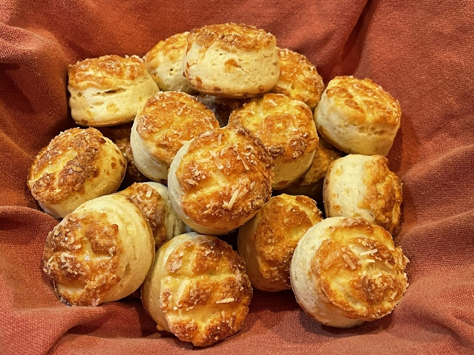

# Pogácsa

*Hungary's savoury scone: a short, flaky, deeply buttery (or lardy) round, scored on top in a crosshatch and baked until burnished. Made for travelling, for gatherings, for the bowl on the bar with a glass of pálinka. Cheese pogácsa is the most common modern version; cracking varieties exist (crackling, dill, potato).*

**Serves:** Makes 20 to 24

**Prep Time:** 25 minutes (plus 1 hour chill)

**Cook Time:** 20 minutes

## Overview
A yeast-leavened, fat-rich dough rests cold so the fat stays solid in flaky layers. The dough is rolled, folded and rolled again like a rough puff pastry, then cut into rounds, scored, brushed with egg and baked at high heat until golden and crisp on the outside, tender inside. Cheese is added by folding grated cheese into the dough and showering more on top.

## Ingredients

### Dough
- 400 g plain flour
- 200 g cold lard (or cold unsalted butter), cubed
- 100 g semi-hard cheese, finely grated (Trappista, mature cheddar or Gruyère)
- 1 egg yolk (large)
- 100 ml sour cream
- 100 ml whole milk (lukewarm)
- 7 g instant dried yeast
- 1 teaspoon caster sugar
- 1 ½ teaspoons salt

### To finish
- 1 egg, beaten with 1 teaspoon water
- 50 g semi-hard cheese, grated (for the tops)
- Flaky salt (optional)

## Method

### Stage 1 - Dough
1. Whisk the yeast and sugar into the warm milk; rest 5 minutes until foamy.
2. In a large bowl, rub the cold lard or butter into the flour and salt until you have rough pea-sized lumps. Don't over-rub: the visible chunks are what makes the pogácsa flaky.
3. Stir in the 100 g of grated cheese.
4. Add the yolk, sour cream and yeasty milk. Mix to a rough, shaggy dough; turn out and bring together with a few presses. Don't knead smooth.
5. Shape into a flat brick; wrap and chill 30 minutes.

### Stage 2 - Fold
1. Lightly flour the surface. Roll the dough into a 1 cm thick rectangle.
2. Fold in thirds like a letter (book fold). Rotate 90°.
3. Repeat: roll out, book fold, rotate. Do this 3 times in total.
4. Wrap and chill 30 minutes. (This is what creates the leafing texture.)

### Stage 3 - Cut
1. Heat the oven to 200°C (180°C fan). Line two baking sheets with parchment.
2. Roll the chilled dough to 2 cm thick. Score the top in a 3 mm-deep diamond crosshatch using the back of a knife: every 5 mm one way, every 5 mm the other.
3. Cut rounds with a 4 cm cutter dipped in flour, pressing straight down (twisting seals the edges).
4. Place on the trays with 3 cm between each. Re-roll offcuts once.

### Stage 4 - Bake
1. Brush the tops with beaten egg; sprinkle with grated cheese and a few flakes of salt.
2. Rest 15 minutes at room temperature while the oven finishes heating.
3. Bake 18-22 minutes until deep golden on top and crisp underneath.
4. Cool 10 minutes on the tray; the texture sets as they cool.

## Notes
- **Lard or butter:** Lard (zsír) is traditional and gives a flakier, more savoury result. Butter works and is easier to source; expect slightly shorter and less flaky.
- **Cold fat, cold dough:** Both the rubbing-in and the rolling steps depend on cold fat staying in distinct flecks. If the kitchen is warm, chill between every stage.
- **Score the tops:** The crosshatch is structural, not just decoration: it controls how the pogácsa rises and gives the characteristic flaky-edged top.
- **Don't twist the cutter:** Press straight down. Twisting pinches the layered edges shut and the pogácsa won't rise straight.

## Variations
**Töpörtyűs (crackling):** Replace 80 g of the fat with finely chopped pork crackling (töpörtyű). The most traditional version.
**Krumplis (potato):** Add 150 g cold mashed floury potato to the dough; reduce flour by 50 g. Softer crumb.
**Kapros-túrós (dill and curd cheese):** Replace the grated cheese with 150 g dry curd cheese and add 2 tablespoons chopped dill.

## Serving
Serve with: Bowls of soup (especially gulyásleves or bean soup), a wine and cheese board, or as a snack with cured meats and pickles.

## Storage
- Best within 24 hours of baking.
- Keep in a sealed tin 3 days; refresh in a 160°C oven for 4 minutes.
- Freeze baked 1 month; warm from frozen in a 170°C oven for 8 minutes.
