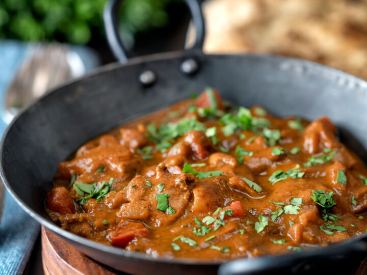

# Chicken Balti

*Authentic baltis are cooked over a high gas flame that is much hotter than is possible on most conventional hobs. As they are cooked, the whole pan turns into a big ball of fire as the oil catches light, cooking off the oil and adding a delicious smoky flavour*

**Serves:** 4

**Prep Time:** 20 minutes

## Overview
BIR chicken balti is Birmingham's defining curry, cooked hard and fast in a thin two-handled steel balti pan over a roaring flame, the dish that made the Balti Triangle of Birmingham a global curry destination. The high heat caramelises the masala onto the meat and burns off the oil, leaving a slightly smoky, tomato-forward sauce. The technique is what defines a balti: minimal liquid, maximum heat, and the pan that gives the dish its name. Eat straight from the pan with naan; the sauce is medium-thick, never soupy. Serve with extra chopped coriander on top and a cold beer.

## Ingredients
- 3 tbsp rapeseed oil (or seasoned oil)
- 1 onion (small), roughly chopped 
- 1 green pepper deseeded and roughly chopped 
- 1 tomato, diced 
- 1 tbsp garlic and ginger paste 
- 1 tbsp finely chopped green chillis
- 1 tsp ground cumin 
- 1 tsp ground turmeric 
- 1 tsp paprika 
- 250ml [Curry Base Gravy](Base/curry-base.md)
- 200 g  [Pre-Cooked Chicken](Base/pre-cooked-chicken.md)
- 1 tbsp [garam masala](../../base-ingredients/curry-powder/garam-masala.md)
- 1 tsp dried fenugreek leaves 
- Salt 
- Chopped coriander to serve 

## Method
1. Heat the oil in a frying pan (or wok, karahi or balti pan) over a high heat until almost smoking. 
1. Add the onion, pepper (bell pepper) and tomato, and fry for about a minute. 
1. Stir in the garlic and ginger paste and chilli paste. 
1. The oil will sizzle as they release their moisture. 
1. If you’re feeling brave and have a gas hob, tilt the pan towards the flame and see if you can get the oil to catch fire. 
1. Don’t panic if it lights.
1. Add the ground spices and 5 tbsp of the base curry sauce. 
1. Let this come to a boil then add the chicken pieces and another 5 tbsp of the base sauce. 
1. Stir occasionally so that the sauce doesn’t catch, and scrape the caramelized sauce from the sides of the pan. 
1. Pour in the remaining base sauce and let the curry simmer until the chicken is cooked through and the sauce is quite thick. 
1. Baltis are usually served with fresh naans or chapatis, which are used to soak up the sauce and meat instead of cutlery, and your sauce needs to be thick enough to do this. 
1. To finish, stir in the garam masala and dried fenugreek leaves and check for seasoning. 
1. If there is any oil on the surface, skim it off for a healthier curry. 
Top with chopped coriander to serve. 

*This is normally cooked in a large balti pan, but you can you can substitute this with a frying pan*

## Storage
- Refrigerate 2-3 days in an airtight container
- Freezes up to 2 months; thaw fully before reheating
- Reheat gently on low heat with a splash of stock or water if the gravy has thickened
- Flavour deepens overnight as the spices meld
