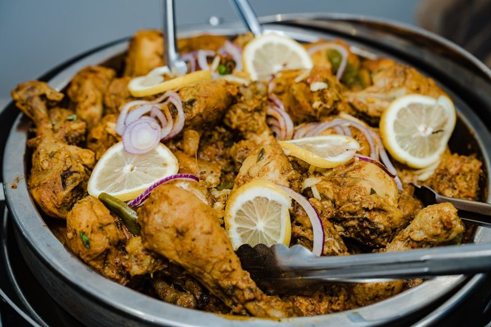

# Chicken Karahi

*A BIR chicken karahi: pre-cooked chicken finished hot in a wok with tomato, ginger, green chilli and a heavy hand of black pepper.*

**Serves:** 4

**Prep Time:** 10 minutes

**Cook Time:** 1 hour

## Overview
A classic karahi curry inspired by Imran’s in Birmingham, featuring tender chicken pieces simmered in a rich, spiced tomato-onion sauce. Traditionally served sizzling in a karahi pan, this dish is perfect for soaking up with naan.

## Ingredients
### Marinade
- 1 tbsp rapeseed (canola) oil
- 100 g (scant ½ cup) Greek yoghurt
- 2 tbsp garlic and ginger paste
- 1 tsp salt
- 1 tbsp freshly ground black pepper

### Protein
- 800 g  [Pre-Cooked Chicken](Base/pre-cooked-chicken.md)
- 125 ml (½ cup) Chicken stock (or stock from Pre-Cooked Chicken)

### Base
- 4 tbsp rapeseed (canola) oil
- 2 tbsp garlic and ginger paste
- 1 quantity fried onions
- 1 tbsp pungent dried red chilli flakes
- 2 tomatoes (large), diced

### Spices
- 1 ½ tbsp ground cumin
- 1 ½ tbsp ground coriander
- 1 tbsp Kashmiri chilli powder
- Salt, to taste

### Finishers
- 7 ½ cm (3 in) piece ginger, peeled and julienned
- 2 fresh green bullet chillies, roughly chopped
- 1 tsp [Garam Masala](Spice-Mixes/garam-masala.md)
- Coriander (cilantro), to serve

## Method

### Stage 1 - Marinate chicken
1. Mix chicken with marinade ingredients in a bowl.
1. Cover and marinate in fridge at least 2 hours, ideally overnight.

### Stage 2 - Cook aromatics and chicken
1. Heat oil in a pan over medium-high heat.
1. Add garlic and ginger paste; stir 30 seconds.
1. Add marinated chicken and marinade; stir to coat.
1. Add fried onions, chilli flakes, and tomatoes; combine.

### Stage 3 - Add spices and simmer
1. Sprinkle in cumin, coriander, and Kashmiri chilli powder.
1. Add enough water to cover; simmer 40 minutes to 1 hour, topping up water as needed.
1. Cook until chicken is tender and sauce is dry.

### Stage 4 - Finish
1. Check seasoning; add salt or spices to taste.
1. Add ginger, fresh chillies, and garam masala.
1. Serve topped with coriander.

## Notes
- Traditionally made with bone-in pieces for flavor; boneless works too.
- Serve sizzling in a karahi pan for presentation.
- Adjust water for desired dryness; keep it saucy for naan dipping.

## Serving
- Serve with fresh naan or rice.
- Garnish with extra coriander and lime wedges.

## Storage
- Refrigerate 2-3 days in an airtight container.
- Freeze up to 2 months; thaw fully before reheating.
- Reheat gently on low heat with a splash of stock or water.
- Best eaten within 24 hours for tender texture.
