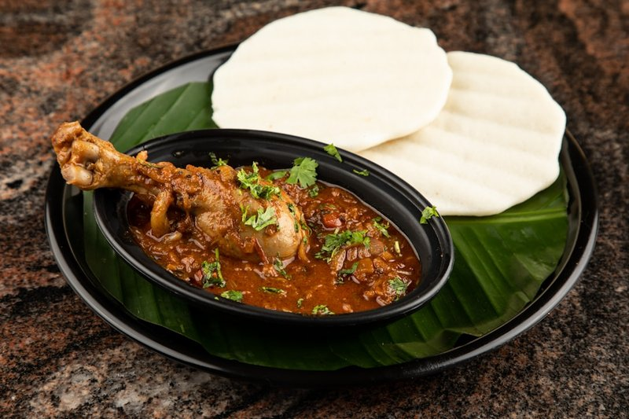

# Chicken Pasanda

*The BIR chicken pasanda: pre-cooked chicken in a creamy almond-and-coconut sauce sweetened lightly.*

**Serves:** 4

**Prep Time:** 10 minutes

**Cook Time:** 10 minutes

## Overview
BIR chicken pasanda is the mild creamy almond-and-coconut curry the restaurant menu reserves for diners who want richness without heat. Traditional pasanda uses flattened tenderised meat (the word means "favoured"); this version uses thinly sliced chicken breast (or tandoori-marinated chicken if you have it) cooked in a sauce based on ground almonds, coconut and cream. Sultanas fold through for the sweet edge. A splash of red wine is optional and adds depth; some restaurant cooks insist on it, others skip. Serve with basmati rice and a kachumber salad.

## Ingredients
### Base and nuts
- 4 tbsp almond flakes
- 4 tbsp rapeseed (canola) oil or seasoned oil
- 3 tbsp coconut flour
- 3 tbsp ground almonds
- 2 tbsp sugar
- 20 sultanas

### Curry sauce
- 500 ml [Curry Base Gravy](Base/curry-base.md)
- 100 g block coconut, cut into small pieces

### Protein
- 800 g  [Pre-Cooked Chicken](Base/pre-cooked-chicken.md)
- Splash of red wine (125 ml/½ cup) (optional)
- Salt, to taste

### Finishers
- 100 ml (scant ½ cup) single (light) cream
- 1 tsp [Garam Masala](../../base-ingredients/curry-powder/garam-masala.md)

## Method

### Stage 1 - Toast nuts
1. Toast almond flakes in a dry pan over medium-high heat until golden.
1. Transfer toasted almonds to a plate and set aside.

### Stage 2 - Build curry base
1. Heat oil in the same pan until bubbly.
1. Add coconut flour, ground almonds, and sugar; stir 30 seconds.
1. Add sultanas, base gravy, and block coconut pieces.

### Stage 3 - Add chicken and simmer
1. Once simmering, add chicken slices.
1. Simmer 5 minutes until chicken is cooked and sauce thickens; stir if sticking to bottom.
1. If using, add red wine and simmer until alcohol cooks off.

### Stage 4 - Finish and serve
1. Check seasoning and adjust salt, extra coconut, or sugar to taste.
1. Stir in cream, then sprinkle in garam masala and toasted almonds.

## Notes
- Pasanda is mild; increase chilli if you want more warmth.
- Use pre-cooked tandoori chicken for a restaurant-style finish with extra char flavour.
- Coconut and ground almond give texture; avoid over-thickening by adding a little base sauce or stock.

## Serving
- Serve with steamed basmati rice, pilau, naan, or paratha.
- Garnish with fresh coriander and extra toasted almond flakes.

## Storage
- Refrigerate 2-3 days in an airtight container.
- Freeze up to 2 months; thaw fully before reheating.
- Reheat gently on low heat with a splash of stock or water.
- Best eaten within 24 hours for best texture and flavor.
