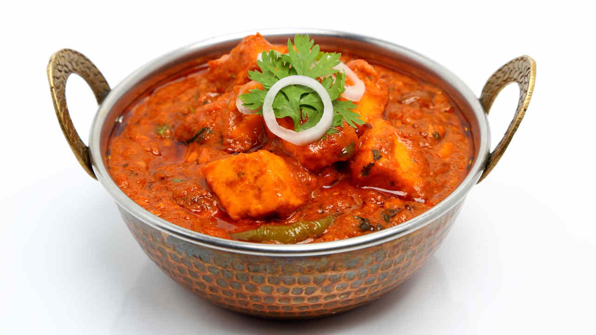

# BIR Chicken Phall

*The hottest curry on the takeaway menu: a vindaloo with extra fresh chillies, often scotch bonnet or naga, and a thin scarlet gravy that announces itself before the plate lands. Approach with cold lager.*

**Serves:** 1 (the curry-house portion size)

**Prep Time:** 5 minutes (assumes base gravy and pre-cooked chicken are ready)

**Cook Time:** 10 minutes

## Overview
Phall (sometimes phaal) is the curry-house hot end of the menu. It is a vindaloo with the volume turned up: more chilli powder, more fresh chilli, an extra-hot finishing pepper (scotch bonnet, naga or Carolina reaper depending on how seriously the kitchen takes its reputation), and a thinner finish. Some curry houses serve it with a small disclaimer; some give a free meal if you can finish without water. Phall is genuinely hot, and not in a chip-on-the-shoulder way; the heat scaffolds the rest of the curry rather than burying it. A well-made phall still tastes of curry, with vinegar and tomato underneath; a bad one is just chilli pain dressed up.

This is the assembly-step recipe in the BIR system: it assumes you already have base gravy and pre-cooked chicken in the fridge. If you do not, see the [BIR Curry Course home page](../../tutorials/bir-curry/home.md) for those components first.

## Ingredients

### The hot mix
- 1 tbsp Kashmiri chilli powder (for colour, not heat)
- 1½ tsp hot chilli powder (or cayenne)
- 1 tsp paprika
- ½ tsp ground cumin
- ½ tsp ground coriander
- ¼ tsp ground turmeric

### The pan
- 3 tbsp neutral oil
- 2 garlic cloves (minced)
- 10 g fresh ginger (grated)
- 1 fresh red chilli (sliced)
- 2 fresh green chillies (sliced)
- 1 scotch bonnet or 1 naga chilli (deseeded if you wish, finely chopped; this is the heat fingerprint)
- 1 tomato (medium, finely chopped) or 2 tbsp tinned chopped tomato
- 1 tbsp tomato paste
- 2 tbsp red wine vinegar (or white wine vinegar)
- 200 ml [Curry Base Gravy](Base/curry-base.md), hot
- 150 g [Pre-Cooked Chicken](Base/pre-cooked-chicken.md), warmed in its stock
- ½ tsp salt
- Small handful fresh coriander (chopped)
- Wedge of lemon (to serve)

## Method

### Stage 1 - Bloom the mix
1. Combine the hot mix spices in a small bowl.
1. Heat the oil in a wide pan or wok over high heat until shimmering.
1. Add the garlic, ginger, sliced red and green chillies, and the scotch bonnet or naga. Stir-fry 20 seconds.
1. Lower the heat slightly and add the hot mix. Bloom the spices in the oil for 20-30 seconds; the oil should turn deep red. Do not let the spices burn (they go bitter in seconds).

### Stage 2 - Build the sauce
1. Add the tomato paste and stir 30 seconds.
1. Add the chopped tomato and stir until the tomato breaks down into the oil, about 1 minute.
1. Pour in the vinegar and let it bubble down for 30 seconds.
1. Pour in the hot base gravy. Stir to combine. The sauce should be thin and scarlet.

### Stage 3 - Add the chicken and finish
1. Add the pre-cooked chicken and salt. Stir through the sauce, then bring to a gentle boil.
1. Simmer 3-4 minutes, until the gravy reduces to a coating consistency and the chicken is heated through.
1. Taste. The dish should be very hot, vinegared, slightly sweet from the tomato, and deeply spiced. If it tastes one-note hot, add a small pinch of sugar to round it.
1. Off the heat. Stir in the chopped coriander and serve.

## Notes
- **The colour is from Kashmiri chilli, not heat chilli.** Kashmiri (or paprika) is what gives a phall its characteristic deep red without escalating the burn beyond what the hot chilli powder provides. Skipping the Kashmiri gives a brown curry.
- **Vinegar is non-negotiable.** Phall borrows from vindaloo's Goan roots; vinegar is the corner that distinguishes it from a plain hot curry. Red wine vinegar gives the richest result; white wine works.
- **The fresh chilli choice defines the heat fingerprint.** Scotch bonnet brings tropical fruit and a long burn; naga brings sharp citrus and a faster burn; Carolina reaper brings pain. Pick one and accept the day.
- **A glass of full-fat milk on the table.** Casein in milk binds the capsaicin and cuts the heat faster than water (which spreads it).

## Serving
Serve with [Pilau Rice](rice/pilau-rice.md), a [Plain Naan](Breads/naan.md) and a generous bowl of [Mint Raita](sauces-pickles/mint-raita.md). The bread and rice carry the curry; the raita resets the palate. A cold lager beats water for the heat-management job.

## Storage
- Best eaten straight from the pan.
- Refrigerates 2 days. The heat mellows slightly overnight; the body of the dish stays right.
- Freezes well 1 month. The fresh chilli loses some bite on thawing; finish with a fresh chopped chilli on reheat to restore the kick.
