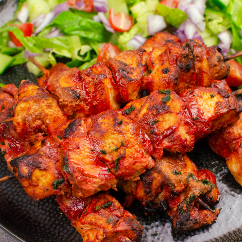

# Chicken Tikka Masala

*Britain's restaurant favourite: tandoori-marinated chicken tikka simmered in a creamy tomato-and-spice sauce.*

**Serves:** 2

**Prep Time:** 10 minutes

**Cook Time:** 2 minutes

## Overview
BIR chicken tikka masala is the dish the British restaurant menu invented, almost certainly in Glasgow in the 1970s, by combining tandoori chicken tikka with a creamy tomato curry sauce designed to satisfy British diners asking for gravy with their dry-roasted meat. The result became one of Britain's most-eaten dishes and a culinary export, served in restaurants from Tokyo to Mumbai. The masala is a creamy tomato base, sweetened slightly with sugar, perfumed with kasoori methi, and finished with double cream and a swirl of red colouring. The chicken is the centerpiece, marinated tandoori-style, grilled to a slight char, and folded into the sauce just before serving. Serve with basmati rice and naan.

## Ingredients

### Chicken Marinade
- 400 g  [Pre-Cooked Chicken](Base/pre-cooked-chicken.md)
- 2 tbsp yogurt  
- 1 tbsp ginger-garlic paste  
- 1 tsp chilli powder  
- 1 tsp [Garam Masala](../../base-ingredients/curry-powder/garam-masala.md)  
- Salt  

### Base
- 2 tbsp oil  
- 1 onion (chopped)
- 1 tbsp ginger-garlic paste  
- 2 tbsp tomato paste  
- 250ml [Curry Base Gravy](Base/curry-base.md)

### Finish
- 3 tbsp cream  
- 1 tsp sugar  
- ½ tsp [Garam Masala](../../base-ingredients/curry-powder/garam-masala.md)  

---

## Method

### Stage 1 - Prep
1. Marinate chicken 1-24h.  
1. Grill or fry until lightly charred.

### Stage 2 - Base
1. Cook onions until soft.  
1. Add ginger-garlic paste → cook 1 min.  
1. Add tomato paste → cook until darkened.

### Stage 3 - Cook
1. Add base gravy and chicken.  
1. Simmer 10-15 min.

### Stage 4 - Finish
1. Add cream, sugar, garam masala.  
1. Simmer until thick.

---

## Notes
- Balance = creamy + slightly sweet + mild spice  

---

## Serving
- Rice, naan

- ---

## Storage
3 days fridge
