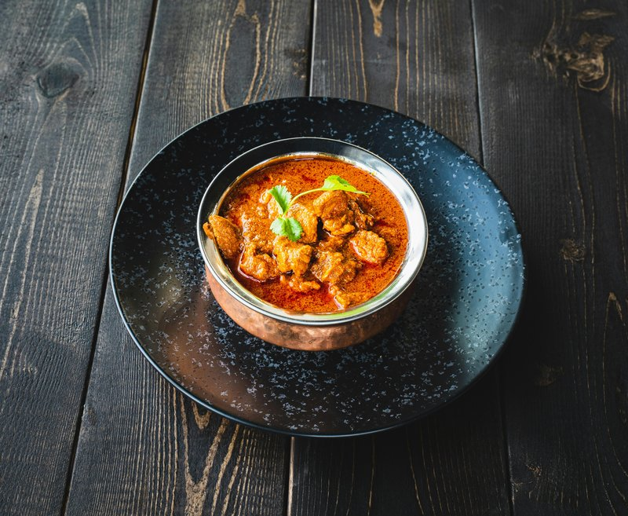

# Vindaloo 

   
*The Goan-Portuguese fusion: pork shoulder marinated overnight in a thick paste of Kashmiri chillies, vinegar, garlic, ginger and pepper, slow-cooked dark.*

**Note**: The recipe here calls for Indian Bay leaf, which has a subtle cinnamon and clove taste, and less woody than the European counterpart.

**Prep Time:** 10 Minutes
**Cook Time:** 10 Minutes
**Serves:** 4 People

## Overview
The fiery Goan original: a vinegar-and-garlic-marinated meat (traditionally pork, adapted in BIR menus to chicken or lamb) simmered in a dark masala loaded with red chillies, cumin and mustard seeds. The sharp acidity from vinegar plus aggressive chilli is the signature; potatoes are a BIR addition (the "aloo" suggestion) but not part of the Portuguese-origin dish.

## Ingredients
### Step 1
- 3 tbsp oil
- 6 green cardamom pods (crushed)
- 1 Indian Bay leaf
### Step 2
- 2 tbsp Garlic and Ginger paste
- 2 fresh green Bullet Chillies (finely chopped)
- 2 Scotch Bonnet chillies (finely chopped)
- 1 tsp Ground Turmeric
- 2 Tbsp hot Chilli powder
- 2 Tbsp [Mixed Powder](Spice-Mixes/mixed-powder.md)
- 125ml [tomato purée](Base/tomato-puree.md)
- 2 tsp sugar
### Step 3
- 600ml (2 ½ Cups) [Curry Base Gravy](Base/curry-base.md)
- 8 pieces of [pre-cooked Chicken](Base/pre-cooked-chicken.md) or [pre-cooked Lamb](Base/pre-cooked-lamb.md)
### Step 4
- 2 Tbsp white wine vinegar
- 1 tsp Dried Fenugreek leaves
- 2 pre-cooked stewed potatoes (quartered)
- 3 Tbsp Chopped Coriander
- salt
- pepper

## Method
### Step 1
1. Heat the oil over a medium-high heat.
2. When the oil begins to bubble, add the Cardamom and Bay Leaf.
### Step 2
1. Add the Garlic and Ginger paste and fry for 1 minute.
2. Add the chopped Chillies, Turmeric, Chilli powder and Mixed Powder.
3. Add the Tomato Puree and Sugar.
4. Mix and allow the Tomato Puree to bubble.
### Step 3
1. Pour in 250ml (1 cup) of the Base Sauce and allow it come to a rolling simmer.
2. Don't stir the sauce unless it looks like it is going to catch.
3. Scrape back any sauce that caramelises around the sides of the pan.
4. The sauce should be going crazy over the heat.
5. Swirl in the remaining base sauce.
6. Add the meat to the sauce.
7. Let the sauce simmer over a high heat, until it cooks down to your desired consistency
### Step 4
1. Add the vinegar, dried fenugreek and potatoes.
2. Add the coriander and season with salt and black pepper.
