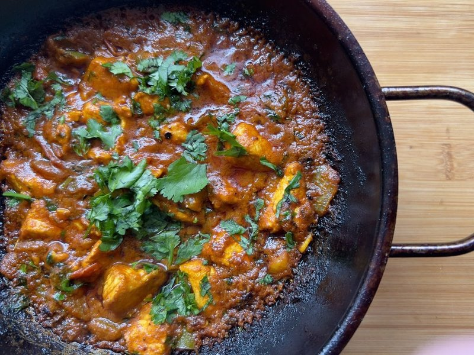

# Special Balti

*A BIR special balti: pre-cooked lamb, chicken and prawn finished hot in a balti pan with the curry base, balti masala and fresh herbs.*

**Serves:** 1-2

**Prep Time:** 10 minutes

**Cook Time:** 10 minutes

## Overview
BIR special balti is the customisable British restaurant chef's signature, mixing pre-cooked meats, seafood and vegetables in a rich spiced sauce, the "special" on every Balti Triangle menu. The principle is simple: take whatever's available from the day's prep (chicken tikka, lamb, prawn, fish, vegetables) and combine them in a single balti pan with the base sauce, spices, peppers and onions. The result is the closest thing to a chef's table curry in the restaurant tradition; the chef adapts each plate to ingredient availability. Serve sizzling with naan and basmati rice.

## Ingredients
### Base
- 3 tbsp rapeseed (canola) oil
- ½ onion, finely chopped
- 1 tomato (large), diced
- 2 green chillies, finely chopped

### Proteins and veggies
- 200 g pre-cooked lamb keema
- 3 pieces [Tandoori Chicken Tikka](side-dishes/tandoori-chicken-tikka.md)
- 3 pieces tandoori lamb tikka
- 2 handfuls chopped spinach
- 3 prawns (shrimp), shelled and cleaned
- Handful tinned chickpeas (garbanzo beans) (optional)

### Spices and sauce
- 2 tbsp tomato purée
- 1 tsp paprika
- ½ tsp ground turmeric
- 1 tsp [Mixed Powder](Spice-Mixes/mixed-powder.md) (or curry powder)
- 1 tsp chilli powder (optional)
- 150 ml [Curry Base Gravy](Base/curry-base.md)
- 100 ml  thick coconut milk

### Finishers
- Salt, to taste
- ½ tsp dried fenugreek leaves (kasoori methi)
- ½ lemon (juice)

## Method

### Stage 1 - Fry base
1. Heat oil in a balti pan or similar over medium-high heat.
1. Add onion and fry 3 minutes.
1. Stir in tomato and chillies.

### Stage 2 - Add spices and proteins
1. Add keema and tomato purée.
1. Stir in paprika, turmeric, mixed powder, and chilli powder (if using).
1. Add half the base sauce, then chicken and lamb tikka.
1. Bring to simmer; add more base sauce as needed.

### Stage 3 - Add coconut and greens
1. Add coconut milk and spinach; let spinach wilt.
1. Add prawns and cook 2 minutes until pink.
1. Top up with base sauce if needed; season with salt.

### Stage 4 - Finish
1. Rub kasoori methi between fingers and add to pan.
1. Add chickpeas (if using) and squeeze lemon juice over top.

## Notes
- Special baltis are highly customizable; add or substitute meats/veggies like paneer, mushrooms, or fish.
- Use pre-cooked ingredients for quick assembly during a curry feast.
- Adjust spices to taste for your signature version.

## Serving
- Serve with hot naan or steamed rice.
- Garnish with extra coriander and lemon wedges.

## Storage
- Refrigerate 2-3 days in an airtight container.
- Freeze up to 2 months; thaw fully before reheating.
- Reheat gently on low heat with a splash of stock or water.
- Best eaten within 24 hours for fresh textures.
