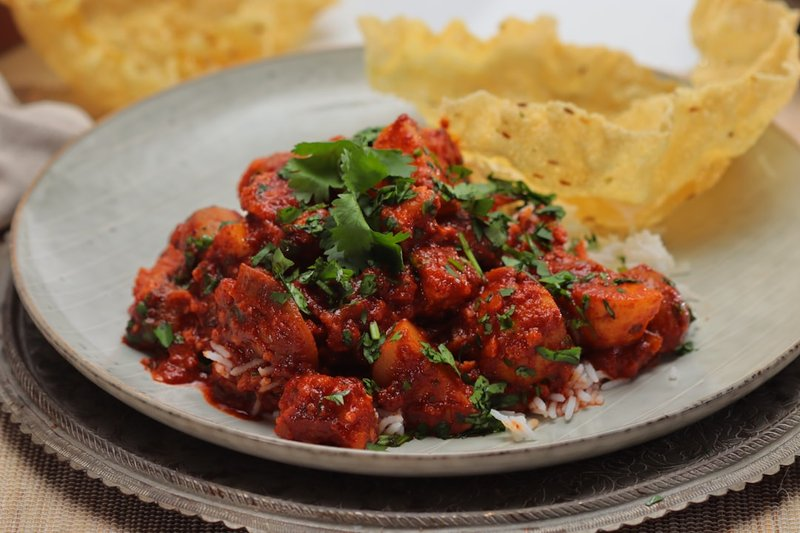

# Vindaloo (Restaurant-Style)

*The BIR vindaloo: pre-cooked meat in a fiery dark gravy of dried red chillies, vinegar, garlic and Madras spice.*

**Serves:** 2

**Prep Time:** 15 minutes

**Cook Time:** 4 minutes

## Overview

BIR vindaloo is the British-Indian-Restaurant version of the Goan original, a hot sour deeply-spiced curry built on a vinegar marinade and a chilli-forward masala, adapted to the BIR workflow with a base gravy that speeds up service. The Goan original is pork marinated in wine vinegar and garlic; the BIR version generalises to chicken or lamb and ramps up the chilli for British restaurant expectations. The signature is the sharp vinegar tang against the wall of chilli heat; the dish never goes sweet, never goes mild. Serve with basmati rice and a cold beer.

## Ingredients
### Protein
- 400 g  [Pre-Cooked Chicken](Base/pre-cooked-chicken.md)
### Marinade (Vindaloo Paste)
- 6-8 cloves garlic
- 1 tbsp ginger (chopped)
- 2-4 tsp chilli powder (adjust to heat level)
- 1 tsp cumin seeds
- 1 tsp coriander seeds
- 4-6 black peppercorns
- 2 cloves
- 1 cinnamon stick (small, or ½ tsp ground)
- 2-3 tbsp white vinegar
- 1 tsp sugar
- ½ tsp turmeric
- Salt to taste
### Curry Base
- 2-3 tbsp oil
- 1 onion (150g), finely chopped
- 1 tbsp ginger-garlic paste
- 2 tbsp tomato paste (optional, BIR-style)
- 250-300ml [Curry Base Gravy](Base/curry-base.md)
- Water as needed
### Finish
- 1-2 tsp vinegar (to taste)
- Fresh coriander (optional)

## Method
### Stage 1 - Marinade
1. Blend all marinade ingredients into a smooth paste.
1. Coat the meat thoroughly.
1. Marinate at least 1 hour (overnight preferred).

Vindaloo traditionally relies on vinegar + garlic marinade for its signature flavour. 

### Stage 2 - Build the Base
1. Heat oil over medium heat.
1. Add chopped onions + pinch of salt.
1. Cook 8-12 minutes until soft and lightly golden.
1. Add ginger-garlic paste → cook 1 minute.
1. Add tomato paste (if using) → cook until darkened slightly.

### Stage 3 - Cook the Curry
1. Add marinated meat + all marinade.
1. Fry on medium-high heat for 3-5 minutes until fragrant.
1. Add base gravy.
1. Simmer 15-25 minutes (depending on meat), stirring occasionally.

### Stage 4 - Reduce & Balance

**Cook until:**

- sauce thickens
- oil begins to separate at edges
- meat is tender

**Add:**

- extra vinegar (for tang)
- salt to taste

## Notes
- **Heat level:** Vindaloo should be hot, but the defining feature is sourness, not just chilli. 
- **Authenticity:** Traditional Goan versions often skip tomatoes and use pork + vinegar-heavy marinades. 
- **BIR variation:** Tomato paste + base gravy gives the familiar UK restaurant style. 
Variations
**Traditional (Goan):**
- No tomato
- Use pork
- Increase vinegar slightly
**Milder version:**
- Reduce chilli
- Add a pinch more sugar
**Extra hot:**
- Add fresh green chillies during cooking

## Serving

Serve with:

- basmati rice
- naan or chapati
- yogurt (to balance heat)

## Storage
Keeps 3 days refrigerated
Freezes well up to 3 months
Flavour improves after 24 hours
