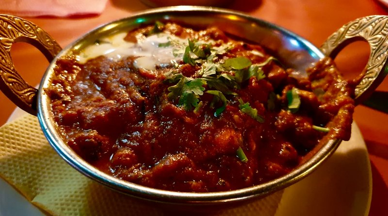

# Chicken Pathia

*A BIR chicken pathia: pre-cooked chicken in a sweet-sour-spicy Parsi-inspired gravy of tamarind, sugar and chilli.*

**Serves:** 4

**Prep Time:** 10 minutes

**Cook Time:** 10 minutes

## Overview
BIR chicken pathia is the British-Indian-Restaurant sweet-and-sour curry, lemon and mango chutney pulling against sugar and chilli to make a balanced acidic-sweet sauce. The dish is the restaurant's most balanced offering: not a sweet curry like korma or chasni, not a hot curry like madras or vindaloo, but a tangy-sweet-spicy middle ground. Optional red food colouring delivers the classic restaurant appearance. The flavour comes from the layering: tamarind, lemon, mango chutney, sugar, all balanced against chilli powder and ginger. Serve over basmati rice with a side of cucumber raita.

## Ingredients
### Fat and aromatics
- 4 tbsp rapeseed (canola) oil or seasoned oil
- 1 onion (small), very finely chopped
- 2 tbsp garlic and ginger paste
- Salt, to taste

### Spices and sweet/sour
- 2 tbsp [Mixed Powder](../../base-ingredients/curry-powder/mixed-powder.md)
- 1 tsp chilli powder
- 2 tbsp sugar, or to taste
- 125 ml (½ cup) tomato purée

### Sauce and protein
- 500 ml [Curry Base Gravy](Base/curry-base.md)
- 800 g [Pre-Cooked Chicken](Base/pre-cooked-chicken.md)
- 125 ml (½ cup) Chicken Stock (or stock from Pre-cooked Chicken)

### Finishers
- 1 tbsp smooth mango chutney, or to taste
- ½ tsp tamarind concentrate
- 1 tsp dried fenugreek leaves (kasoori methi)
- 1-2 lemons, to taste (juice)
- Red food colouring powder (optional)
- 3 tbsp chopped coriander (fresh coriander)

## Method

### Stage 1 - Fry onion base
1. Heat oil in a large pan over medium-high heat until bubbling.
1. Stir in onion and fry 5 minutes until soft and translucent.
1. Add garlic and ginger paste; sizzle 1 minute.
1. Add a pinch of salt to release onion moisture.

### Stage 2 - Add spice base
1. Add mixed powder, chilli powder, and sugar; stir briskly.

### Stage 3 - Build sauce
1. Add tomato purée and 250 ml (1 cup) base curry sauce; bring to a rolling simmer.
1. Scrape caramelized sauce from pan sides back into mix.
1. Add remaining base curry sauce and stock; stir in pre-cooked chicken.
1. Simmer until sauce reduces to desired consistency (add more sauce/stock if needed).

### Stage 4 - Finish and balance
1. Stir in mango chutney, tamarind, fenugreek leaves, and lemon juice.
1. Adjust sweetness/tang: add more sugar, mango chutney, or lemon juice as needed.
1. Add optional red food colouring, starting with ½ tsp, to reach desired colour.
1. Season with salt, then sprinkle with coriander.

## Notes
- Pathia is all about the sweet-and-sour balance; adjust fruit and lemon gradually.
- Optional food colouring is traditional but adds no flavour.
- For lighter texture, use less stock; for richer, a dash more cream or butter can be added.

## Serving
Serve with: steamed basmati rice, naan, or chapatis
Garnish: fresh coriander, lime wedges
Accompaniment: cucumber raita and poppadoms

## Storage
- Refrigerate 2-3 days in airtight container
- Freeze up to 2 months; thaw in fridge before reheating
- Reheat gently on low heat with a splash of stock or water
- Best eaten within 24 hours for peak flavour

## Tip
Prawns (shrimp) are an excellent and popular alternative to chicken.
