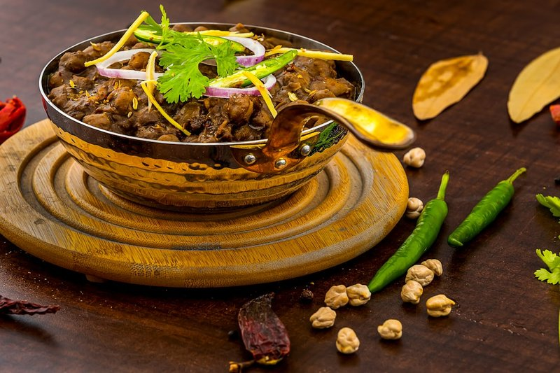

# Lamb Naga Phall

*The hottest restaurant dish: pre-cooked lamb in a fierce dark gravy built on Naga chillies and phaal-strength curry spice.*

**Serves:** 1-2

**Prep Time:** 10 minutes

**Cook Time:** 10 minutes

## Overview
BIR lamb naga phaal is the British-Indian restaurant's hottest curry, named for the ferocious Naga (ghost pepper) chilli of Northeast India and the Mr Naga pickle that's the BIR shortcut to its heat. The dish is not for the faint-hearted: Naga chillies and Mr Naga pickle deliver intense heat that builds into a slow burn; the lamb is the only thing tempering the fire. Serve with cooling accompaniments: rice, naan, raita and a cold lager. Eat at your own risk; the heat doesn't fade for an hour.

## Ingredients
### Chilli paste
- 4 habanero chillies, finely chopped (blended with water to paste)

### Base
- 2 tbsp rapeseed (canola) oil or mustard oil
- ½ small onion, finely chopped
- ½ red bell pepper, diced

### Aromatics and spices
- 1 tbsp garlic and ginger paste
- 1 tbsp Mr Naga chilli pickle (optional but recommended)
- 1 tbsp [Mixed Powder](Spice-Mixes/mixed-powder.md) (or curry powder)
- 2 tsp Kashmiri chilli powder
- 70 ml (¼ cup) tomato purée

### Sauce and protein
- 300 ml [Curry Base Gravy](Base/curry-base.md)
- 200 g lamb tikka or [Pre-cooked Lamb](Base/pre-cooked-lamb.md)

### Finishers
- Salt, to taste
- 1 tsp dried fenugreek leaves (kasoori methi)
- ½ tsp [Garam Masala](Spice-Mixes/garam-masala.md)
- 2 tbsp finely chopped coriander (fresh coriander)

## Method

### Stage 1 - Prepare chilli paste
1. Blend habanero chillies with enough water to make a paste; set aside.

### Stage 2 - Fry vegetables
1. Heat oil in a large frying pan over medium-high heat.
1. Add onion and fry 5 minutes until soft and translucent.
1. Stir in red bell pepper and cook 1 minute.

### Stage 3 - Add aromatics and spices
1. Add garlic and ginger paste, blended habaneros, and Mr Naga pickle (if using); cook 30 seconds, stirring.
1. Add mixed powder, Kashmiri chilli powder, and tomato purée; stir.
1. Add 125 ml (½ cup) base sauce and bring to simmer.

### Stage 4 - Add lamb and finish
1. Add lamb tikka or pre-cooked lamb with a splash of cooking liquid.
1. Cook 5 minutes to heat through, adding more base sauce if needed; scrape caramelized bits.
1. Season with salt; rub kasoori methi between fingers and sprinkle.
1. Garnish with garam masala and coriander.

## Notes
- Extremely hot; adjust habaneros and Naga pickle for tolerance while preserving flavor.
- Use ghost chillies for maximum heat, but they may overpower other ingredients.
- Cook outdoors if possible to avoid overwhelming indoor spice fumes.

## Serving
- Serve with steamed rice, naan, papadams, and ice-cold lager to cool down.
- Garnish with extra coriander and lime wedges.

## Storage
- Refrigerate 2-3 days in an airtight container.
- Freeze up to 2 months; thaw fully before reheating.
- Reheat gently on low heat with a splash of stock or water.
- Best eaten within 24 hours for peak intensity.
