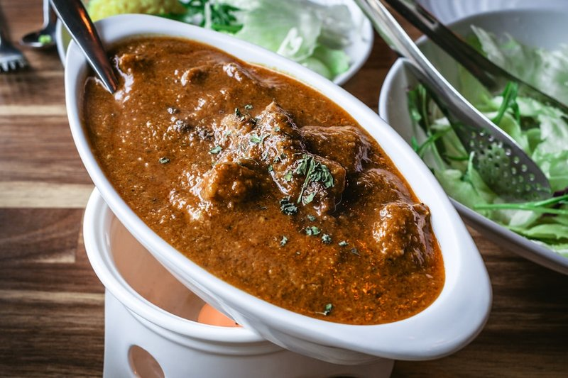

# Lamb Achari

*A BIR lamb achari: pre-cooked lamb in a curry-base gravy with mango pickle (achar), mustard seed and nigella.*

**Serves:** 4

**Prep Time:** 10 minutes

**Cook Time:** 10 minutes

## Overview
A Punjabi-inspired achari curry featuring pickle spices like panch poran and dried chillies, balanced with sweet mango chutney and tangy lime pickle. This dish captures the essence of Indian pickles in a rich, flavorful lamb curry.

## Ingredients
### Base
- 4 tbsp rapeseed (canola) oil or vegetable oil
- 1 tbsp [Panch Poran (Indian Five Spice)](Spice-Mixes/panch-poran.md)
- 2 Kashmiri dried red chillies, split lengthways and deseeded
- 1 onion, thinly sliced into rings

### Aromatics and spices
- 2 tbsp garlic and ginger paste
- 2 bird’s eye chillies, finely chopped
- 125 ml (½ cup) tomato purée, plain passata, or blended canned tomatoes
- 2 tbsp [Mixed Powder](Spice-Mixes/mixed-powder.md) (or curry powder)
- 1 tsp ground coriander
- 1 tsp Kashmiri chilli powder

### Sauce and protein
- 600 ml [Curry Base Gravy](Base/curry-base.md)
- 750 g [Pre-cooked Lamb](Base/pre-cooked-lamb.md)
- 200 ml (generous ¾ cup) Lamb stock (or stock from Pre-cooked Lamb)

### Finishers
- 2 tbsp lime pickle, or 1 tbsp each lime pickle and smooth mango chutney
- 4 tbsp plain yoghurt
- 1 tsp dried fenugreek leaves (kasoori methi)
- 1 tsp [Garam Masala](Spice-Mixes/garam-masala.md)
- Salt, to taste
- 1 lemon (juice)
- 3 tbsp finely chopped coriander leaves, to garnish

## Method

### Stage 1 - Temper spices and fry onion
1. Heat oil in a frying pan over medium-high heat.
1. Add panch poran and Kashmiri chillies; let crackle.
1. Add sliced onion and fry until soft and translucent (~5 mins); sprinkle salt to release moisture.

### Stage 2 - Add aromatics and spices
1. Add garlic and ginger paste and bird’s eye chillies; fry 30 seconds, stirring.
1. Pour in tomato purée, mixed powder, ground coriander, chilli powder, and 250 ml (1 cup) base curry sauce.
1. Let bubble; scrape caramelized sauce from sides.

### Stage 3 - Add lamb and simmer
1. Add lamb, stock, and remaining base curry sauce.
1. Simmer until reduced to desired consistency.

### Stage 4 - Finish with pickles and yoghurt
1. Stir in lime pickle and mango chutney (if using).
1. Add yoghurt 1 tbsp at a time, stirring to prevent curdling.
1. Swirl in kasoori methi and garam masala; season with salt.
1. Squeeze lemon juice over top and garnish with coriander.

## Notes
- Achari curries are known for their pickle-like tang; adjust lime pickle and mango chutney for balance.
- Panch poran provides a unique spice blend; ensure it's fresh for best crackling.
- Stir yoghurt slowly to avoid separation.

## Serving
- Serve with steamed basmati rice, naan, or roti.
- Garnish with extra coriander and lemon wedges.

## Storage
- Refrigerate 2-3 days in an airtight container.
- Freeze up to 2 months; thaw fully before reheating.
- Reheat gently on low heat with a splash of stock or water.
- Best eaten within 24 hours for vibrant flavors.