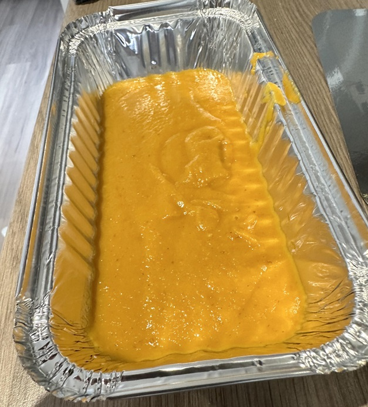

# Curry Base Gravy

*The British-Indian-Restaurant curry base: onion, garlic and ginger slow-simmered with spices, then blended smooth.*

**Prep Time:** 10 minutes

**Yield:** 4kg

## Overview
The foundation sauce behind almost every British-Indian-Restaurant curry. A huge pot of onions is simmered with cumin until completely collapsed, then oil and a small handful of spices go in, then it is blended smooth and held back for service. Once you have a batch in the fridge or freezer, BIR-style curries come together in minutes: a ladle of base into a hot pan with garlic-ginger and spice, then the protein, then finished to order. The sauce itself is mildly sweet and neutral; the character of the finished curry comes from what you do with it at the end.

## Ingredients
- 4 kg Onions (roughly chopped)
- 1 tsp cumin seeds
- 3L Water 
- 500ml Vegetable oil
- 2 tbsp salt
- 2 tbsp turmeric
- 1 rounded tsp garam masala
- ½ tsp chilli powder
- 30g coconut cream
- 2tbs tomato purée 

## Method
Remember to periodically stir during the following process to stop the onions from burning. Add a little water if it reduces too much
### Step 1
- Place onions and water in a large pot.
- Sprinkle cumin seeds over onions.
- Cook for 2 hours over a medium heat

### Step 2
- Add oil.
- Cook for a further 1 hour.

### Step 3
- Add remaining ingredients.
- Cook for ½ an hour.

### Step 4
- Allow to cool slightly.
- Blend into a smooth sauce.
- Cook for ½ an hour over a low heat.

*Classic British Indian Restaurant(B.I.R.) curry base*
*This is the classic curry base that is used in most UK Indian restaurants. The finished sauce has a sweet taste and should be a thick consistency.*

## Storage
- Keeps 4 days refrigerated in an airtight container
- Freezes well in portion-sized lots up to 3 months
- Pre-cooked meat is best frozen on the day it's made; thaw fully before adding to a curry
- Reheats straight from frozen into a hot curry pan
