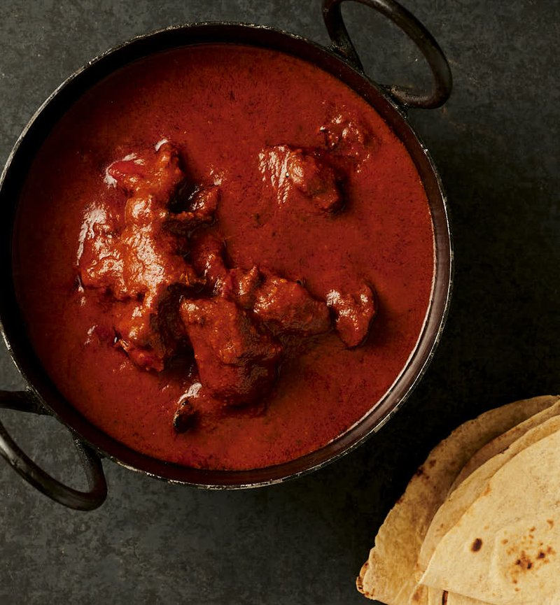

# Red Masala Sauce

*The deep-red masala foundation: tomato puree, fried onion and ground spices simmered together.*

**Prep Time:** 10 minutes

**Makes:** 500 ml marinade

## Overview
The vivid-red yogurt-based marinade that defines the British curry-house tandoori dishes: thick yogurt blended with shop-bought tandoori paste (Patak's is the canonical brand), garam masala, ground coriander, chilli powder, lemon juice and salt into a deep-red sauce that coats chicken, lamb or paneer before grilling or roasting. The mixture works two ways at once. The acid in the yogurt and lemon tenderises the meat by breaking down surface proteins, while the spices stain the outside that signature glowing red-orange colour and carry through into the flesh as it cooks. A minimum four-hour marinade is essential, overnight is far better, and skipping this rest gives meat that's bland and stays pale grey under the grill. Shop-bought tandoori paste is the everyday British curry-house shortcut; making the spice blend from scratch is the restaurant kitchen's domain.

## Ingredients
- 500 ml yoghurt
- Pinch of chilli powder
- Pinch of [Garam Masala](../Spice-Mixes/garam-masala.md)
- Pinch of coriander powder
- 1 tsp salt
- 1 heaped tbsp Pataks tandoori paste
- 1 level tsp garlic and ginger paste
- 1 tbsp red food colouring
- Few squirts of lemon juice

## Method
1. Mix all ingredients together thoroughly.

## Notes
- **Consistency:** The marinade should be thick enough to coat the back of a spoon; adjust with a little more yoghurt if too thick.
- **Colour:** The red food colouring is traditional for restaurant-style presentation; it can be omitted without affecting flavour.
- **Marinating time:** For best results, marinate protein for at least 2 hours, or overnight in the refrigerator.

## Serving
Use as: A marinade for tandoori chicken, lamb chops, king prawns, or vegetables before grilling or roasting.

## Storage
- Refrigerate unused marinade in a sealed container for up to 3 days
- Do not freeze once mixed with yoghurt
