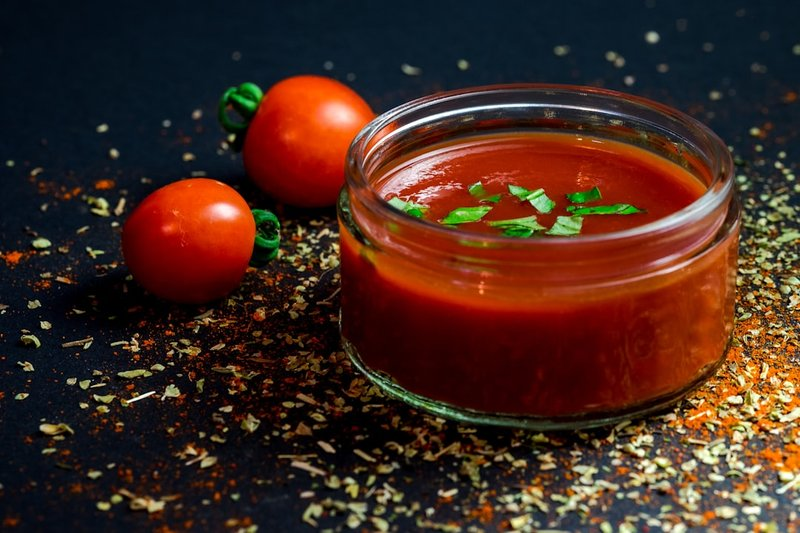

# Tomato Puree

*This is simply a thin purée of tomatoes used in many curries for flavour and colour. Here are two ways you can make it.*

**Prep Time:** 15 minutes

## Overview
A thin pourable tomato purée sits behind a lot of Indian curries. It is not the same as the thick double-concentrate paste sold in tubes; that is too intense to use on its own. The three methods below give you the same result by different routes: diluting concentrate, blending tinned tomatoes, or starting with shop-bought passata. Pick whichever fits what is already in the cupboard.

## Method
### Method 1
1. Mix 1 part concentrated tomato paste with 3 parts water. 

### Method 2
1. Blend a 400g tin (2 cups) of plum tomatoes to a smooth purée. 
1. Add a little concentrated tomato paste if you want a deeper red colour. 

### Method 3
1. Sieved, unseasoned Italian passata.
