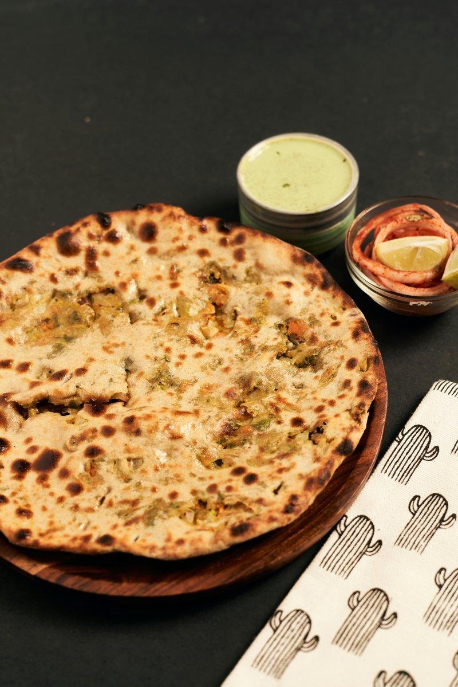

# Bengali Paratha

*Bengal's layered flatbread: dough pleated and coiled before rolling, so it opens into dozens of paper-thin strips on the hot tawa. Threaded with chilli and herb.*

**Makes:** 4-5 parathas

**Prep Time:** 15 minutes (plus 20 minutes rest)

**Cook Time:** 10 minutes

## Overview
Bengal's distinctive layered flatbread: dough pleated like an accordion and coiled into a spiral before rolling, so each paratha bakes into dozens of paper-thin flaky leaves rather than a single uniform disc. Brushed generously with ghee between the folds and threaded with chopped fresh green chilli, finely chopped coriander, freshly crushed black pepper and sometimes nigella seed. The pleat-and-coil move is the technique that distinguishes the Bengali version from the Punjabi laccha paratha; the same principle (fan-folding to make layers) but tighter and more deliberate, with the coil flattened on the tawa rather than left bunched. Hot ghee is non-negotiable; the dough laminates only at proper temperature, and a cold pan flattens the layers into a thick chewy disc. Eat straight off the tawa with dal, a curry, a bowl of fresh yogurt, or the morning street-vendor's egg roll.

## Ingredients

### Dough
- 180 g whole wheat flour (atta) or maida
- 1 tablespoon ghee (or oil)
- ½ teaspoon salt
- Warm water (as needed)

### Herb filling
- 3 tablespoons chives (finely chopped)
- 2 tablespoons flat leaf parsley (chervil) (finely chopped)
- 1-2 Thai bird's eye chillies (very finely sliced or minced)
- 1 teaspoon Tellicherry black peppercorns (coarsely crushed)
- ½ teaspoon salt

### To finish
- Ghee (for layering and pan-frying)

## Method

### Stage 1 - Prepare the dough
1. In a large mixing bowl, combine the flour and salt.
1. Add the ghee and rub through with your fingertips until the mixture is crumbly.
1. Gradually add warm water and knead to a soft, smooth, non-sticky dough.
1. Cover with a damp cloth and rest for at least 20 minutes.

### Stage 2 - Mix the herb filling
1. In a small bowl, combine the chopped chives, chervil, sliced chillies and crushed Tellicherry pepper.
1. Stir in the salt and set aside.

### Stage 3 - Pleat and coil (lachha style)
1. Divide the rested dough into 4-5 equal balls.
1. Take one ball and roll it into a thin circular disc, dusting with flour as needed.
1. Spread a teaspoon of ghee evenly over the entire surface.
1. Sprinkle the herb-chilli-pepper mixture across the disc.
1. Starting from one edge, fold the dough back and forth into a fan or zigzag pleat.
1. Roll the pleated strip into a tight spiral coil and tuck the loose end underneath.
1. Dust with flour and roll the coil out again into a paratha about ¼ inch thick.

### Stage 4 - Cook
1. Heat a tawa or cast iron pan over medium-high heat.
1. Place the paratha on the hot tawa and cook for 30-40 seconds, until small bubbles appear on the surface.
1. Flip and spread a teaspoon of ghee on the cooked side.
1. Flip again, spread ghee on the second side, and press gently with a spatula, working the edges so they crisp up.
1. Cook until both sides are golden brown with prominent dark spots, then remove and serve immediately.

## Notes
- **Lachha pleating:** The fan-fold and spiral coil are what create the flaky layers; if the coil is over-rolled flat, the layers compress and the paratha turns dense.
- **Tellicherry pepper:** Crush the peppercorns coarsely rather than grinding them to a powder so the bite stays distinct against the herbs.
- **Generous ghee:** Each layer needs a thin film of ghee; skimping flattens the crust and the paratha will stay soft instead of crisping.
- **Rest the dough:** The 20-minute rest relaxes the gluten so the disc rolls thin enough to take the filling without tearing.

## Serving
Serve with: A wet curry (dal, chana masala, lamb karahi) or a bowl of plain yoghurt.
Garnish with: A small extra knob of melted ghee brushed across just before eating.

## Storage
- Best eaten straight from the tawa; the layers soften within minutes.
- Wrap leftovers in a clean cloth and reheat on a hot pan for 30 seconds a side; microwave reheating turns them rubbery.
- The dough keeps for a day refrigerated in cling film if you want to roll fresh parathas later.
