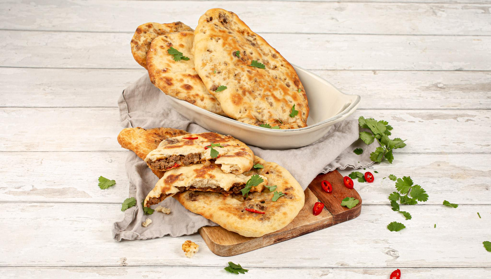

# Keema Naan

*Naan stuffed with spiced minced lamb: a meal on its own. The curry-house version of stuffed flatbread.*

**Makes:** 2 large naan

**Prep Time:** 25 minutes (plus 2 hours proving)

**Cook Time:** 15 minutes

## Overview
A keema naan is a plain naan dough wrapped around a spoonful of pre-spiced minced lamb, sealed, rolled out gently, and grilled or tandoor-baked. The lamb cooks inside the dough as the bread puffs, and the bread soaks up the meat's fat as it cooks, ending up rich, slightly stained, and almost dish-like. Most curry houses use lamb but minced beef or even spiced potato work; keema is the catch-all word for "spiced mince" and the stuffing tradition extends to anything you can grind.

The trick is to cook the keema before it goes into the dough. A raw stuffing makes a tough naan because the dough cooks fast but the meat needs longer. Twenty minutes on the hob takes the keema almost-but-not-quite to done; the final minute inside the naan brings it home.

## Ingredients

### Dough
- 450 g strong white flour
- 1 tbsp baking powder
- 1 tbsp granulated sugar
- 2 tbsp full-fat Greek yoghurt
- 1 tsp fine salt
- Lukewarm water (about 250 ml, as needed)

### Keema filling
- 250 g minced lamb (or beef, 15-20% fat)
- 1 small onion (finely chopped)
- 3 garlic cloves (minced)
- 15 g fresh ginger (grated)
- 1 green chilli (finely chopped)
- 1 tsp ground cumin
- 1 tsp ground coriander
- ½ tsp ground turmeric
- ½ tsp garam masala
- ½ tsp Kashmiri chilli powder
- 1 tsp salt
- 1 tbsp neutral oil
- Small handful fresh coriander (chopped)

### To finish
- Melted ghee (for brushing)
- A pinch of nigella seeds (kalonji)

## Method

### Stage 1 - Make the dough
1. Combine all the dough dry ingredients in a large bowl. Stir in the yoghurt.
1. Add warm water a little at a time, working it in with your fingers until the mixture comes together as a single smooth lump.
1. Tip onto a floured board and knead for 5 minutes, until soft and smooth.
1. Return to the bowl, cover, and prove in a warm place for 2 hours, until doubled.

### Stage 2 - Cook the keema filling
1. Heat the oil in a wide pan over medium heat. Add the chopped onion and cook 5 minutes, until soft.
1. Stir in the garlic, ginger and green chilli. Cook 1 minute.
1. Add all the dry spices and salt. Stir 30 seconds.
1. Add the minced lamb and break it up with a wooden spoon. Cook 8-10 minutes, stirring, until the meat is no longer pink and any liquid has cooked off completely. The mixture should be dry; if there is liquid in the pan when you stop cooking, the naan will leak.
1. Off the heat, stir in the fresh coriander. Cool to room temperature on a plate (spread thin so it cools fast). The cooled filling can be made several hours ahead.

### Stage 3 - Shape the naan
1. Knock the proved dough back and divide into two equal balls.
1. Take one ball and flatten it gently into a 12 cm disc on a floured surface.
1. Place half the cooled keema in the centre, leaving a 2 cm border clear.
1. Bring the edges of the dough up over the filling and pinch firmly to seal into a stuffed parcel. Turn the parcel seam-side down.
1. Press gently with the heel of your hand to flatten, then roll out with a rolling pin to a 25 cm oval. Roll carefully and unevenly with light pressure; firm pressure will rupture the seal. Patch any tears immediately with a small pinch of spare dough.
1. Repeat with the second ball.

### Stage 4 - Grill
1. Heat the grill to three-quarters power. Cover the bottom rack with foil to give the bread room to expand without burning.
1. Place the first naan on the foil. Grill for 90 seconds to 2 minutes, watching closely; the upper side should develop brown patches.
1. Turn the naan over with tongs. Brush the now-uppermost side with melted ghee and scatter with a pinch of nigella seeds.
1. Return to the grill for another 60-90 seconds, until the second side is patched brown and the bread is firm to the touch.
1. Lift onto a board and rest 1 minute (the meat inside is hot enough to scald). Cut into wedges and serve.

## Notes
- **Cook the filling dry.** Liquid in the keema soaks into the dough during the seal-and-roll step and the naan splits in the grill. If your finished keema looks wet, leave it on a plate to cool and the liquid evaporates.
- **Cool the filling completely.** Warm filling melts the dough and makes it sticky; sealing fails.
- **Roll gently.** This is not a regular naan; rolling too hard pushes the filling out through the seal. Aim for a thicker, more rustic naan than the plain version.
- **A pizza stone in a 250°C oven works** if you don't want to grill: 4 minutes a side, no flipping required.
- **Tandoor-style at home:** a 250°C cast-iron pan, dough slapped on, lid on for 90 seconds, then a quick blast under the grill to colour the top.

## Serving
A keema naan is substantial enough to eat as a meal. Cut into wedges and serve with [Mint Raita](../sauces-pickles/mint-raita.md), a sliced cucumber salad and a wedge of lemon. As a side to a curry, a half-naan per person is plenty.

## Storage
- Best straight off the grill.
- Cooled keema naans refrigerate for 2 days. Reheat under a hot grill for 60 seconds a side, or in a 200°C oven for 5 minutes.
- Freezes well wrapped tight. Defrost at room temperature and reheat under the grill rather than microwave; microwaving makes the dough rubbery.
