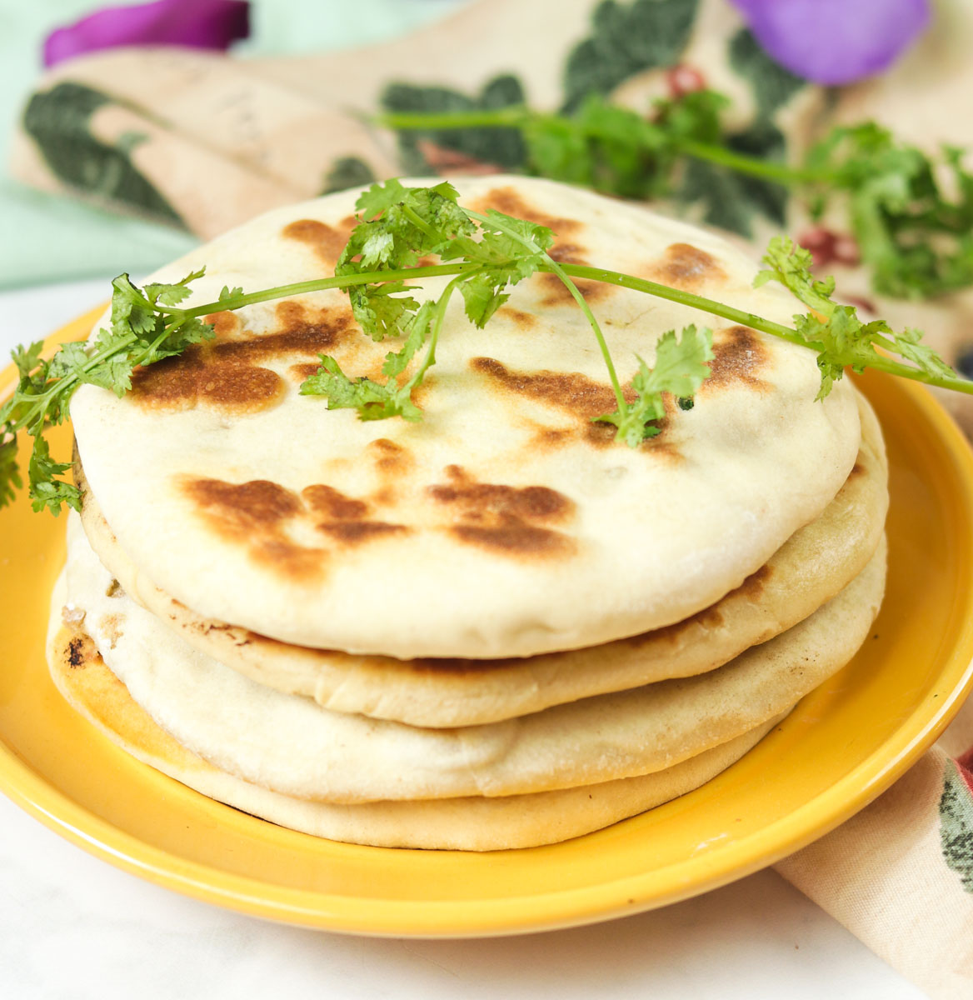

# Kulcha

*A yeasted Punjabi flatbread, lighter and slightly chewier than naan, often stuffed with paneer, potato or onion. The Amritsari classic, eaten with chole.*

**Makes:** 4 kulcha

**Prep Time:** 25 minutes (plus 2 hours proving)

**Cook Time:** 15 minutes

## Overview
Kulcha is a yeasted flatbread from the Punjab, traditionally baked in a tandoor and eaten with chole (spiced chickpeas) in the lassi-and-bread breakfast tradition of Amritsar. It looks like a naan but cooks differently: kulcha dough uses milk instead of yoghurt, plain flour rather than half-strong-half-plain, and is given a longer prove for a more open crumb. The result is lighter, slightly more bready, and less sweet than naan, with a cleaner background flavour that does not fight the bold stuffings the bread is built to carry.

The most common stuffings are paneer (grated, with chilli and coriander), spiced potato (similar to a samosa filling but drier), or simply finely chopped onion with nigella seed and chilli. This recipe gives the plain kulcha and the three classic stuffings; plain kulcha is the curry-house version.

## Ingredients

### Dough
- 500 g plain white flour
- 7 g instant dried yeast (1 sachet)
- 1 tsp granulated sugar
- 1 tsp fine salt
- ½ tsp baking powder
- 30 g unsalted butter (softened)
- 200 ml warm whole milk
- 50 ml warm water (approximate)

### To finish
- Melted ghee or butter (for brushing)
- A pinch of nigella seeds (kalonji)
- A pinch of fresh coriander (chopped)

### Optional stuffings (pick one; quantities are for all 4 kulcha)
- **Paneer:** 200 g paneer (grated), 1 green chilli (finely chopped), small handful coriander, ½ tsp ground cumin, ½ tsp salt
- **Spiced potato:** 2 medium potatoes (boiled, peeled, mashed coarsely), ½ tsp ground cumin, ½ tsp [garam masala](../../../base-ingredients/curry-powder/garam-masala.md), 1 small chopped green chilli, salt to taste
- **Onion:** 1 small onion (very finely chopped), 1 tsp nigella seeds, ½ tsp dried mint, ½ tsp salt, pinch of chilli powder

## Method

### Stage 1 - Make the dough
1. Combine the flour, yeast, sugar, salt and baking powder in a large bowl.
1. Rub in the softened butter with your fingertips until the mixture resembles fine breadcrumbs.
1. Add the warm milk and bring the dough together with one hand. Add warm water a tablespoon at a time only if the dough is too dry; it should be soft and slightly tacky.
1. Tip onto a clean surface and knead 8-10 minutes, until smooth, elastic and silky. Kulcha dough rewards good kneading; 5 minutes is not enough.
1. Return to a lightly oiled bowl, cover, and prove in a warm place for 2 hours, until doubled.

### Stage 2 - Shape (plain)
1. Knock back the proved dough and divide into 4 equal balls.
1. Cover and rest 10 minutes.
1. Roll each ball on a floured surface into a 20 cm oval or round, about 5-6 mm thick.

### Stage 2 - Shape (stuffed)
1. Prepare the stuffing of choice. The mixture should be dry and stick together when squeezed.
1. Divide the dough into 4 balls. Cover and rest 10 minutes.
1. Flatten one ball into a 12 cm disc. Place a quarter of the stuffing in the centre and gather the edges of the dough up over the filling. Pinch firmly to seal.
1. Turn seam-side down. Gently flatten with the heel of your hand, then roll out with light pressure to a 20 cm oval. Do not press hard; the seal will burst.
1. Repeat with the rest. Patch any small tears with a pinch of spare dough.

### Stage 3 - Grill
1. Heat the grill to three-quarters power. Cover the rack with foil at the bottom of the grill chamber for headroom.
1. Lay the first kulcha on the foil. Grill 90 seconds, watching, until the surface develops big brown patches.
1. Flip with tongs. Brush the now-upper side with melted ghee, scatter with nigella seeds and a pinch of fresh coriander.
1. Grill another 60-90 seconds until the underside is patched and the bread feels firm.
1. Lift to a board. Cut into wedges and serve. Repeat with the rest.

## Notes
- **Milk, not yoghurt.** The use of milk distinguishes kulcha from naan. Yoghurt gives the briochey naan texture; milk gives the lighter, cleaner kulcha crumb.
- **Plain flour, not strong flour.** A softer flour is correct here. Strong bread flour gives kulcha a chewy, almost pizza-base texture that is wrong for the bread.
- **The full 2 hour prove is necessary.** Yeast does the lift for kulcha; baking powder is only a top-up. A short prove gives a dense bread.
- **Roll thicker than naan.** Kulcha is a bread, not a wrap. Aim for 5-6 mm thick.
- **A tandoor or pizza stone is ideal** if you have one: 240°C for 4 minutes, no flipping. The grill method is the home compromise.

## Serving
- Plain kulcha pairs with rich curries the way naan does (sauce-heavy dishes that need bread to scoop). Stuffed kulcha is a meal in itself: serve with chole (chickpea curry), a wedge of lemon, sliced raw onion and a small pot of mint raita. The breakfast plate in Amritsar.

## Storage
- Best fresh off the grill.
- Cooled kulcha keeps a day at room temperature in a sealed bag; revive under a hot grill for 30-45 seconds a side.
- Refrigerates 2 days; reheat on a dry hot pan or under the grill.
- Stuffed kulcha freezes well wrapped in foil. Defrost and reheat in a 200°C oven for 5-7 minutes.
