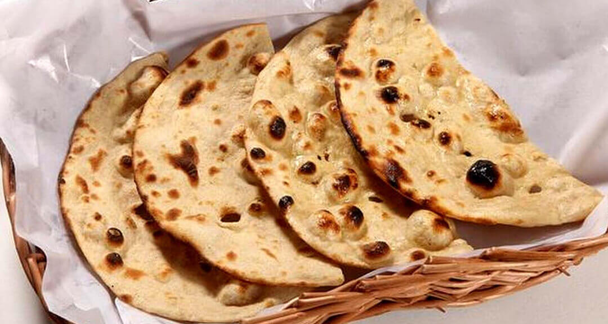

# Tandoori Roti

*An unleavened whole-wheat round, baked against the wall of a tandoor (or a screaming-hot cast-iron pan at home). Drier and chewier than naan, with a more wheaty flavour.*

**Makes:** 4 rotis

**Prep Time:** 15 minutes (plus 30 minutes resting)

**Cook Time:** 8 minutes

## Overview
Tandoori roti is the curry-house bread for people who find naan too soft or too sweet. Where naan is yeasted, yoghurt-rich and pillowy, tandoori roti is plain wholewheat flour, water, and a touch of salt, with no yeast and no yoghurt. Slapped against the inside of a tandoor it crisps into a chewy, lightly charred round with deep wheat flavour and a noticeable bite. It is the bread to eat with a heavily-spiced curry where you want the bread to step back and let the dish speak.

Without a tandoor, a heavy cast-iron pan heated to maximum can fake the wall-of-the-oven effect well enough. The bread cooks on the dry pan until it starts to char and lift, then it goes briefly under a hot grill to puff and finish on the second side. The technique is closer to making a pizza on a stone than making a chapati.

## Ingredients

### Dough
- 300 g chapati flour (atta) or wholewheat plus 50 g plain white flour
- ½ tsp fine salt
- 1 tsp neutral oil
- About 180 ml lukewarm water

### To finish
- Melted ghee (for brushing)
- A pinch of fresh coriander, chopped (optional)

## Method

### Stage 1 - Make the dough
1. Combine the flour and salt in a wide bowl.
1. Pour in the oil and rub it through the flour with your fingertips.
1. Add the water gradually, mixing with one hand, until you have a soft, slightly tacky dough. Tandoori roti dough is stiffer than chapati dough.
1. Tip onto a clean surface and knead 8 minutes, until smooth and elastic. Cover and rest 30 minutes at room temperature.

### Stage 2 - Shape
1. Divide the rested dough into 4 equal balls.
1. Dust each ball with flour and roll out on a floured surface to a 20 cm disc, about 4-5 mm thick. Tandoori roti is thicker than chapati; do not roll thin.

### Stage 3 - Cook (cast-iron pan plus grill method)
1. Heat a heavy cast-iron pan or tava on the highest heat your hob will give. The pan should be hot enough that a drop of water vapourises within a second.
1. Pre-heat the grill to full power.
1. Lift a rolled disc and slap it directly onto the dry pan (no oil). After 30-45 seconds the surface will show large blisters and the bottom will start to char in spots. The dough should still feel slightly damp on top.
1. Lift the pan to the grill (or transfer the roti to a foil-covered grill rack). Place under the heat. In 30-60 seconds the upper side will puff and char in patches; the bread looks alive and inflated.
1. Lift onto a board, brush with melted ghee, and scatter with a pinch of fresh coriander.
1. Repeat with the remaining discs, working quickly so the pan stays hot.

### Stage 4 - Cook (oven method)
1. Pre-heat the oven with a pizza stone or heavy baking sheet inside at 280°C (550°F) or its hottest setting. Allow 30 minutes for the stone to come up.
1. Slide a disc onto the hot stone. Bake 90 seconds; the roti will puff and patch with brown.
1. Flip with tongs and bake 30 more seconds.
1. Brush with ghee on lifting.

## Notes
- **Atta flour, not wholewheat bread flour.** Indian atta is finely ground and gives the right texture. UK wholewheat bread flour is coarser; cut it with plain white flour to soften the texture.
- **Dough is stiffer than chapati.** Tandoori roti needs more body to hold the puff against the grill. Wet dough collapses.
- **Cast-iron is essential for the home method.** A non-stick pan does not get hot enough and the bread comes out flabby.
- **Roll thicker than naan.** A 4-5 mm thickness is what allows the bread to puff with steam without going crisp like a cracker.
- **Grill or oven, not microwave.** The puff comes from sudden top-heat; without it the bread is dense and dry.

## Variations
- **Missi roti:** add 2 tbsp chickpea flour, ½ tsp ajwain (carom) seed and a teaspoon of pounded mint to the flour. A Punjabi variant with nutty depth.
- **Garlic tandoori roti:** brush the cooked roti with garlic butter (melted ghee plus a crushed clove) before serving.

## Serving
Tear pieces by hand and eat with rich, heavily-spiced curries. Tandoori roti is the right bread for a vindaloo, a madras, a rogan josh; it stands up to assertive flavour where naan would feel out of place. Serve hot off the grill.

## Storage
- Best fresh. Cooled tandoori roti softens within an hour and can be revived under a hot grill for 30 seconds a side.
- Refrigerates 2 days wrapped in foil. Reheat on a dry hot pan, not the microwave.
- Freezes well stacked between baking parchment in a freezer bag. Defrost and reheat on a dry pan.
