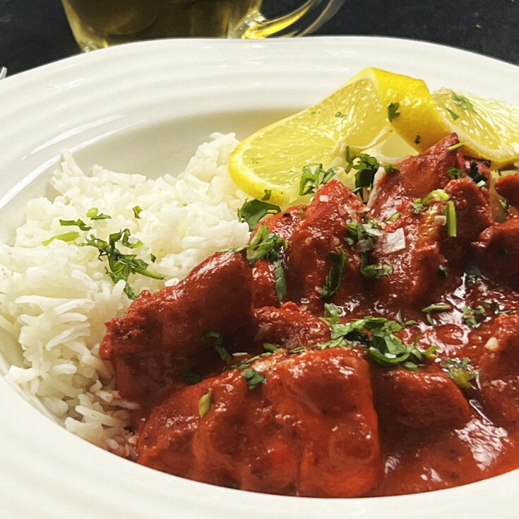

# Chicken Chasni

*The BIR chicken chasni: pre-cooked chicken in a sweet-sour creamy sauce built on mango chutney, tomato ketchup and yogurt.*

**Prep Time:** 10 minutes

## Overview
A sweet, creamy Scottish curry with minimal spice.

---

## Ingredients

### Protein
- 400 g  [Pre-Cooked Chicken](../../Base/pre-cooked-chicken.md)

### Base
- 2 tbsp oil
- 1 onion
- 1 tbsp ginger-garlic paste
- 2 tbsp tomato paste
- 250ml [Curry Base Gravy](../../Base/curry-base.md)

### Finish
- 3 tbsp cream
- 2 tbsp sugar
- 1 tbsp ketchup

---

## Method

### Stage 1 Base
1. Cook onions until soft.
1. Add ginger-garlic paste.
1. Add tomato paste.

### Stage 2 Cook
1. Add chicken and fry briefly.
1. Add base gravy and simmer.

### Stage 3 Finish
1. Add cream, sugar, ketchup.
1. Cook until smooth and sweet.

---

## Notes
- Very mild, dessert-like curry
## Storage
- Refrigerate 2-3 days in airtight container
- Freeze up to 2 months; thaw fully before reheating
- Reheat gently on low heat with a splash of stock or water
- Best eaten within 24 hours for peak flavour

