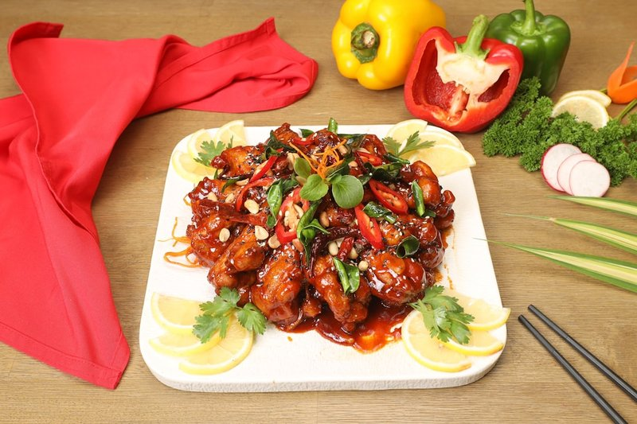

# Chicken Chilli Garlic

*A BIR chilli-garlic chicken: pre-cooked chicken finished hot in a curry-base gravy thick with fried garlic, green chilli and chilli powder.*

**Serves:** 4

**Prep Time:** 10 minutes

**Cook Time:** 10 minutes

## Overview
A bold, garlicky curry with a brisk curry-house kick. This jalfrezi-style dish uses plenty of fresh garlic, green chillies, and tandoori tikka, making it spicy but not overwhelming.

## Ingredients
### Base
- 4 tbsp rapeseed (canola) oil or seasoned oil
- 15 garlic cloves, cut into thin slivers
- 1 onion, finely chopped
- ½ tsp salt
- 2 tbsp garlic and ginger paste

### Heat and sauce
- 3 fresh green chillies, thinly sliced (plus extra to serve)
- 1 tsp chilli powder
- 2 tbsp [Mixed Powder](../../Spice-Mixes/mixed-powder.md)
- 2 tbsp [Tandoori Masala](../../Spice-Mixes/tandoori-masala.md)
- 125 ml (½ cup) tomato purée
- 500 ml [Curry Base Gravy](../../Base/curry-base.md)

### Protein
- 800 g  [Pre-Cooked Chicken](../../Base/pre-cooked-chicken.md)
- 125 ml (½ cup) Chicken stock (or stock from Pre-Cooked Chicken)

### Finishers
- 1 tsp dried fenugreek leaves (kasoori methi)
- Salt, to taste
- Small bunch coriander (cilantro), finely chopped
- Dried garlic flakes, to serve (optional)

## Method

### Stage 1 - Crisp garlic
1. Heat oil in a pan over medium heat.
1. Add garlic slivers and cook gently until soft and lightly golden; avoid burning.

### Stage 2 - Sweat onions and aromatics
1. Add onion and cook 3 minutes until soft/translucent with a pinch of salt.
1. Stir in garlic and ginger paste and sliced green chillies; fry 20 seconds.

### Stage 3 - Build the sauce
1. Increase heat to medium-high.
1. Add chilli powder, mixed powder, tandoori masala, and tomato purée; cook 30 seconds.
1. Add 250 ml (1 cup) base curry sauce and bring to a rolling simmer.
1. Scrape caramelized sauce from pan sides back into the curry.

### Stage 4 - Add chicken and finish
1. Add remaining base curry sauce, chicken tikka, and stock.
1. Simmer 2 minutes until chicken is heated and sauce is your preferred consistency.
1. Stir in kasoori methi and season salt.
1. Garnish with coriander, dried garlic flakes, and extra chilli rings.

## Notes
- This is intended to be spicy and garlicky; adjust chillies to taste.
- Keep total pan time short for a crisp vegetable texture.
- Toasted dried garlic flakes add a crunchy finish.

## Serving
- Serve with steamed basmati rice or naan.
- Garnish with extra coriander and fresh chillies.

## Storage
- Refrigerate 2-3 days in an airtight container.
- Freeze up to 2 months; thaw fully before reheating.
- Reheat gently on low heat with a splash of stock or water.
- Best eaten within 24 hours for best flavour.