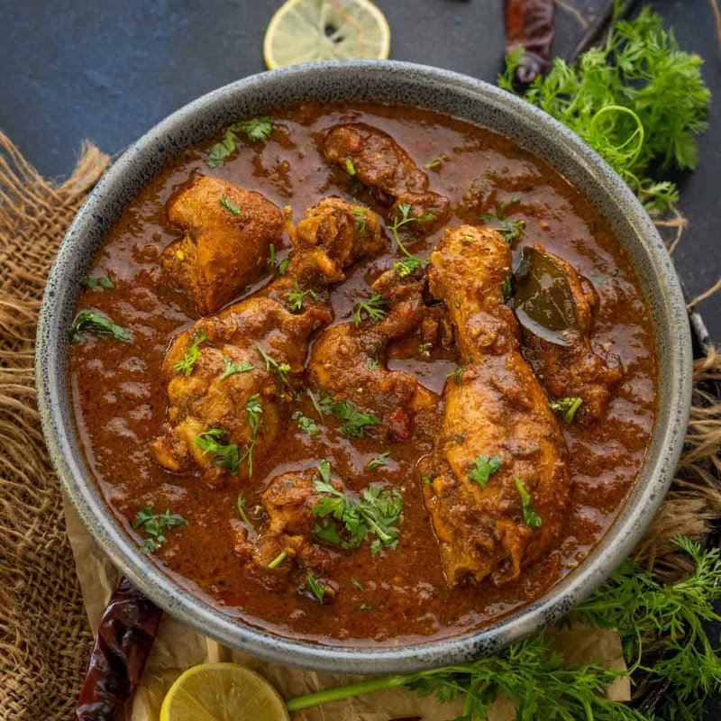

# Chicken Chettinad

*Tamil Nadu's peppery chicken: chicken simmered in a freshly ground paste of dry-roasted whole spices with grated coconut, curry leaves and shallots.*

**Serves:** 4

**Prep Time:** 25 minutes (plus 30 minutes marinating)

**Cook Time:** 50 minutes

## Overview
Whole spices dry-toast in a pan until aromatic; grind with grated coconut, dried red chillies and a splash of water into a thick paste (the Chettinad masala). Chicken thighs marinate briefly in turmeric, salt and yogurt. Shallots fry to soft gold; the masala paste cooks until the oil splits out; chicken cooks in the masala with curry leaves and water. Finishes thick, dark and intensely peppery.

## Ingredients

### Chettinad masala
- 2 tablespoons black peppercorns
- 6 dried Kashmiri chillies (de-stemmed)
- 3 dried bird's-eye chillies (optional, for heat)
- 2 tablespoons coriander seeds
- 1 tablespoon fennel seeds
- 1 stick cinnamon (broken)
- 4 cloves
- 1 star anise
- 1 teaspoon cumin seeds
- ½ teaspoon ground turmeric
- 4 tablespoons grated fresh coconut (or 3 tablespoons desiccated coconut, soaked 5 min in 60 ml warm water)

### Chicken marinade
- 1 kg bone-in chicken thighs and drumsticks
- 1 teaspoon ground turmeric
- 1 teaspoon salt
- 4 tablespoons natural yogurt
- 1 tablespoon ginger-garlic paste

### To cook
- 4 tablespoons coconut oil or vegetable oil
- 8 small shallots (sliced) or 1 large onion (finely chopped)
- 2 sprigs fresh curry leaves
- 3 fresh green chillies (slit)
- 1 thumb fresh ginger (sliced)
- 1 medium tomato (chopped)
- 300 ml hot water
- 1 teaspoon salt (to taste)
- Fresh coriander (chopped, to finish)

## Method

### Stage 1 - Marinate chicken
1. Mix chicken with turmeric, salt, yogurt and ginger-garlic paste; rest 30 minutes.

### Stage 2 - Masala
1. Toast peppercorns, dried chillies, coriander, fennel, cinnamon, cloves, star anise and cumin in a dry pan over medium heat 2 minutes until aromatic.
1. Cool.
1. Grind in a spice grinder to a coarse powder.
1. Add to a blender with the grated coconut and 60 ml water; blitz to a thick paste.

### Stage 3 - Cook
1. Heat the coconut oil in a wide heavy pan over medium-high heat.
1. Add curry leaves; sizzle 10 seconds.
1. Add shallots; fry 8 minutes until deep gold.
1. Add ginger and green chillies; cook 1 minute.
1. Stir in the masala paste and ¼ teaspoon turmeric; fry 5-6 minutes, stirring, until the oil splits out (this is the key step - don't rush).
1. Add tomato; cook 4 minutes until soft.

### Stage 4 - Add chicken
1. Add the marinated chicken; toss to coat in the masala.
1. Cook 5 minutes, stirring.
1. Pour in the hot water; bring to a simmer.
1. Cover; cook on low 30 minutes, stirring occasionally, until the chicken is tender.
1. Uncover; reduce 10 more minutes if the gravy is loose.

### Stage 5 - Finish
1. Taste; adjust salt.
1. Scatter coriander.

### Stage 6 - Serve
1. Eat with steamed rice, dosa, or appam.

## Notes
- **Pepper is the signature:** Chettinad is famously pepper-forward. The black peppercorns are toasted whole and ground; they give the curry its heat and dark colour, not just chilli.
- **Fresh-grind masala:** Pre-ground masala goes flat fast. Grind right before cooking.
- **Coconut oil:** The right fat for Tamil Nadu cooking. Vegetable oil is fine; lacks the regional signature.

## Storage
- Refrigerate 3 days. Reheats well.
- Freezes 3 months.
