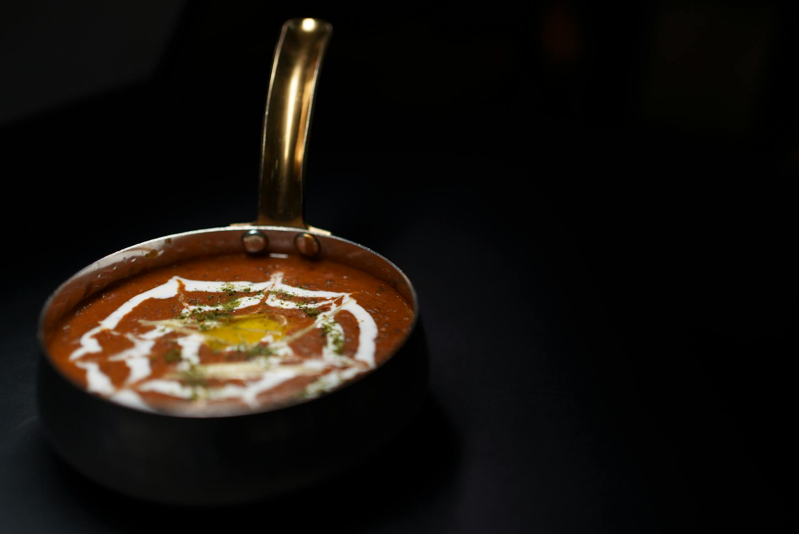

# Dal Makhani

*Punjabi slow-cooked black lentil and kidney bean dal, finished with butter and cream. The richest dal in the Northern repertoire; traditionally simmered overnight over a low flame.*

**Serves:** 6

**Prep Time:** 15 minutes (plus overnight soak)

**Cook Time:** 3 hours

## Overview
Whole black urad lentils and a small handful of red kidney beans are soaked overnight, then pressure-cooked or simmered until completely tender. A tomato-and-spice masala is built separately with onion, garlic, ginger and a careful hand with the spices. The lentils are folded into the masala and simmered, low and slow, for two hours, while butter and cream are stirred through in the final stage. The lentils break down into a glossy, almost-velvet finish.

## Ingredients

### Lentils
- 250 g whole black urad dal (also sold as kali dal or sabut urad)
- 50 g red kidney beans (rajma)
- 1.5 litres water (for cooking)
- 1 teaspoon salt (added late)
- ½ teaspoon turmeric

### Masala
- 50 g butter
- 2 tablespoons ghee (or oil)
- 2 onions (finely chopped)
- 6 garlic cloves (finely chopped)
- 30 g fresh ginger (finely grated)
- 2 green chillies (slit)
- 4 ripe tomatoes (pureed, or 400 g tinned chopped tomatoes blended smooth)
- 1 tablespoon tomato paste
- 2 teaspoons Kashmiri chilli powder (mild, for colour)
- 1 teaspoon garam masala
- 1 teaspoon ground cumin
- 1 teaspoon ground coriander
- 1 teaspoon salt (to taste)

### To finish
- 50 g butter
- 150 ml double cream
- 1 teaspoon kasuri methi (dried fenugreek leaves, crushed between palms)
- ½ teaspoon garam masala

### To serve
- A swirl of cream
- A small knob of butter
- A handful of coriander
- Naan or rice

## Method

### Stage 1 - Soak and cook the lentils
1. Rinse the urad dal and kidney beans, then soak overnight in plenty of cold water.
1. Drain and rinse again.
1. Place in a large heavy pot with 1.5 litres of water, the turmeric and a teaspoon of salt.
1. Bring to a boil, skim any foam, then reduce to a low simmer.
1. Cover partially and cook for 1 hour 30 minutes to 2 hours, until the urad is completely soft and starting to break (a pressure cooker reduces this to 30 minutes).
1. Mash a quarter of the lentils against the side of the pot to thicken the cooking liquor.

### Stage 2 - Build the masala
1. Melt the butter with the ghee in a wide pan over medium heat.
1. Add the onions and a pinch of salt; cook for 12-15 minutes, stirring, until deep golden brown (this is non-negotiable; pale onions leave a pale dal).
1. Add the garlic, ginger and green chilli; cook for 2 minutes.
1. Stir in the tomato paste, Kashmiri chilli, garam masala, cumin and coriander; cook for 1 minute.
1. Pour in the pureed tomato; cook for 8-10 minutes, stirring often, until the oil separates from the sauce at the edges.

### Stage 3 - Combine and slow-simmer
1. Tip the cooked lentils and their liquor into the masala.
1. Add 250 ml hot water.
1. Bring to a gentle simmer.
1. Cook uncovered for 1 hour 30 minutes to 2 hours over the lowest possible heat, stirring every 10-15 minutes (the long simmer is the dish; the lentils slowly thicken and the flavour deepens).

### Stage 4 - Finish
1. Stir in the second 50 g of butter, the cream, the crushed kasuri methi and ½ teaspoon garam masala.
1. Cook for 5 more minutes.
1. Taste and adjust salt.

### Stage 5 - Serve
1. Ladle into bowls.
1. Swirl in a little extra cream, drop a small knob of butter on top, and scatter coriander.
1. Serve with naan or basmati rice.

## Notes
- **Time is the key ingredient:** A 2-hour simmer is what separates restaurant dal from home dal. The lentils need to disintegrate into the sauce.
- **Brown the onions properly:** Pale onions give a pale dal. Cook them past golden into the early reach of brown for the depth.
- **Kasuri methi at the end:** Adding it earlier loses the aroma. Crush between palms over the pot for the perfume.

## Storage
- Refrigerate up to 4 days; tastes better on day two as the spices settle.
- Freezes well for 2 months. Loosen with a splash of cream or milk when reheating.
