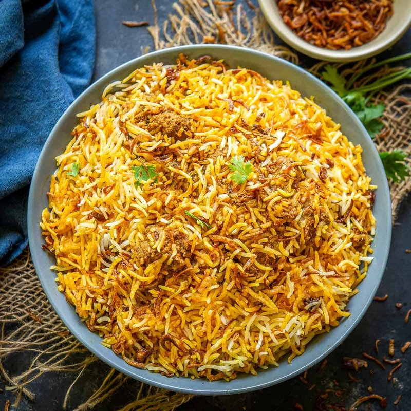

# Hyderabadi Mutton Biryani

*Hyderabad's biryani: raw mutton marinated in yogurt, layered uncooked with par-cooked basmati, sealed under dough and slow-cooked in its own steam.*

**Serves:** 6

**Prep Time:** 30 minutes (plus 4 hours marinating)

**Cook Time:** 1 hour 30 minutes

## Overview
Bone-in mutton (or lamb) marinates 4 hours in yogurt, ginger-garlic paste, deep-fried onion (birista), garam masala, chilli and saffron. Basmati rice par-boils 4 minutes with whole spices to 70% done. Half the rice layers on top of the marinated mutton at the bottom of a heavy pot; saffron milk, mint, more birista and ghee drizzle on top; the rest of the rice on top of that. Sealed (cover + dough or foil tight), cooked on the lowest heat 1 hour. The meat cooks from raw inside the steaming rice. Opened at the table.

## Ingredients

### Marinade
- 1.2 kg bone-in mutton or lamb (shoulder or neck, cut into 4 cm chunks)
- 400 g full-fat Greek yogurt
- 4 tablespoons ginger-garlic paste
- 200 g birista (deep-fried onions - see Notes)
- 2 tablespoons garam masala
- 1 tablespoon ground turmeric
- 1 tablespoon Kashmiri chilli powder (or 1 tsp regular chilli + 2 tsp paprika)
- 1 tablespoon salt
- 4 green chillies (slit)
- 100 ml lime juice (about 3 limes)
- 3 tablespoons fresh mint (chopped)
- 3 tablespoons fresh coriander (chopped)
- 4 tablespoons ghee

### Rice
- 500 g basmati rice (rinsed; soaked 30 minutes; drained)
- 2 litres water
- 1 tablespoon salt
- 4 green cardamom pods
- 2 black cardamom pods
- 1 stick cinnamon
- 4 cloves
- 2 bay leaves
- 1 teaspoon caraway (shahi jeera)

### Layering
- 1 large pinch saffron (bloomed in 4 tablespoons warm milk)
- 3 tablespoons fresh mint (more)
- 100 g remaining birista
- 2 tablespoons ghee (melted)

### Seal
- 300 g plain flour + 150 ml water (for dough seal - or use 2 layers of foil)

## Method

### Stage 1 - Marinate
1. Mix all marinade ingredients in a large bowl with the mutton.
1. Cover; refrigerate at least 4 hours, ideally overnight.

### Stage 2 - Par-cook the rice
1. Bring the 2 litres of water to a hard boil with the salt and all the whole spices.
1. Add the drained rice.
1. Boil 4 minutes only - the rice should be 70% done (a grain crushed between the fingers should still have a chalky centre).
1. Drain immediately into a colander.

### Stage 3 - Layer
1. Spread the marinated mutton (with all its yogurt marinade) in the bottom of a heavy 5-litre pot.
1. Spread half the par-cooked rice on top.
1. Drizzle half the saffron milk over the rice.
1. Scatter half the additional mint and birista.
1. Add the second half of the rice.
1. Drizzle the rest of the saffron milk; scatter the rest of the mint and birista.
1. Pour the melted ghee over the top.

### Stage 4 - Seal and dum-cook
1. Make a soft dough with the flour and water; roll into a long rope.
1. Press the rope around the rim of the pot; press the lid down on top to seal. (Or seal tight with 2 layers of heavy foil and the lid.)
1. Heat the pot on high for 5 minutes, then reduce to the absolute lowest heat your hob will produce.
1. Cook 1 hour without disturbing.
1. Turn off; rest sealed 15 minutes.

### Stage 5 - Open and serve
1. Break the seal at the table. Steam rises dramatically.
1. Lift gently from the side with a long-handled spoon to bring up some meat with each scoop of rice.
1. Serve with mirchi ka salan (peanut and chilli curry), raita and lime wedges.

## Notes
- **Birista (fried onion):** Critical. Thinly slice 2 large onions; deep-fry slowly in oil 12-15 minutes until deep crisp and brown (not burnt). Drain on kitchen paper - they crisp on cooling. Cannot substitute; can buy ready-made at Indian shops.
- **Raw meat in raw rice:** The defining technique. The meat tenderises in the steam from the par-cooked rice. Boneless mutton cooks faster - reduce dum to 45 minutes.
- **Sealing matters:** No steam escapes. A poorly sealed pot gives undercooked rice and chewy meat.

## Storage
- Refrigerate 3 days; reheat covered with a small splash of water.
- Freezes 2 months.
