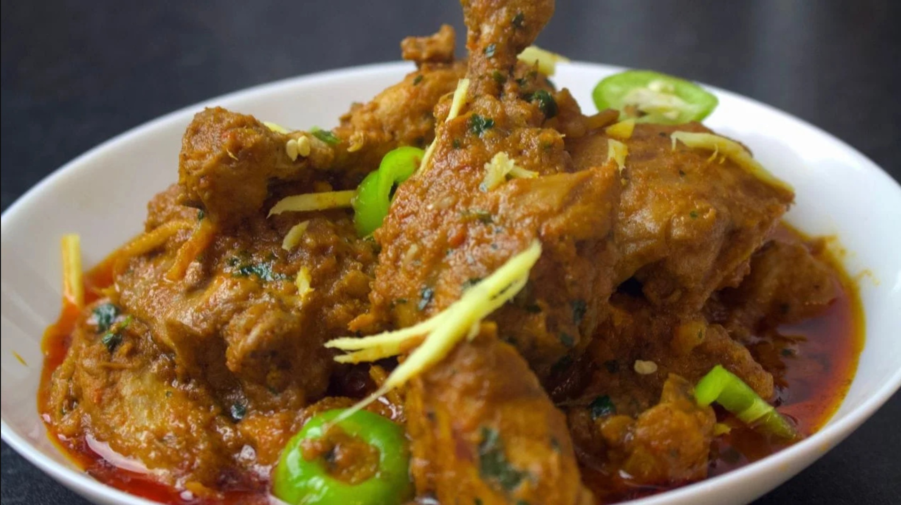

# Restaurant-Style Adrak (Ginger) Curry

*A ginger-forward BIR curry built around 1.25 tablespoons of fresh ginger cut into half-centimetre cubes, with pineapple and mango chutney for a tropical sweet-tart edge.*

**Serves:** 1

**Prep Time:** 10 minutes

**Cook Time:** 12 minutes

## Overview
"Adrak" is Hindi for ginger, and this curry treats the root not just as a base aromatic (where it normally sits in ginger-garlic paste) but as a distinct ingredient. Just over a tablespoon of fresh ginger goes in cubed rather than minced, so the pieces stay identifiable as you eat, bright, hot, slightly fibrous chunks dotted through a medium-spiced sauce. A small reserve of ginger gets held back for the plate, layering a final raw note over the cooked dish.

The build is otherwise familiar BIR territory: cassia, green cardamom seeds, optional star anise or fennel, softened onion and green pepper, [Mix Powder](Spice-Mixes/mixed-powder.md), three-pour [Curry Base Gravy](Base/curry-base.md). What pushes the dish past simple "ginger curry" is the fruit pairing, pineapple chunks (optional but recommended) and mango chutney both go in with the final gravy pour, giving the sauce a sweet-tart edge that plays well against the pungent ginger.

Use the freshest ginger you can get. Older, fibrous ginger turns stringy in the half-centimetre cubes; young ginger with thin skin is the ideal.

---

## Ingredients

### Tempering
- 4 tbsp oil or ghee (60 ml), butter ghee or vegetable ghee in part rounds the flavour
- 10 cm cassia bark
- seeds from 3 green cardamom pods (discard the outer pods)
- 1 star anise, or 1 tsp fennel seeds (optional)

### Aromatics
- 75 g onion, thickly sliced
- 75 g green pepper, cut into small triangles (about half a medium pepper)
- 1.5 tsp ginger-garlic paste
- 1.25 tbsp fresh ginger, peeled and cut into 0.5 cm cubes (reserve a third for garnish)

### Spice
- 1 tsp kasuri methi
- 1.25 tsp [Mix Powder](Spice-Mixes/mixed-powder.md)
- 0.75 tsp Kashmiri chilli powder (or regular chilli powder)
- a pinch of [Garam Masala](Spice-Mixes/garam-masala.md) (about an eighth of a tsp)
- 0.25 to 0.5 tsp salt

### Sauce
- 5 to 6 tbsp tomato paste
- 1 to 2 tbsp finely chopped fresh coriander stalks
- 200 g [Pre-Cooked Chicken](Base/pre-cooked-chicken.md), [Pre-Cooked Lamb](Base/pre-cooked-lamb.md), prawns, or vegetables
- 330 ml+ [Curry Base Gravy](Base/curry-base.md), heated through

### Sweet-Tart Finish
- 80 g pineapple chunks (optional but recommended)
- 1.25 tsp lemon or lime juice
- 2 to 3 tsp mango chutney
- finely chopped fresh coriander leaves, to garnish
- the reserved ginger cubes, to garnish

---

## Method

### Stage 1 - Temper
1. Set a frying pan on medium-high heat and add the oil or ghee.
2. Drop in the cassia bark, green cardamom seeds, and the optional star anise or fennel seeds.
3. Fry for 30 to 40 seconds, stirring frequently, to infuse the oil.

### Stage 2 - Soften the aromatics
1. Add the sliced onion and the pepper triangles. Fry for about 2 minutes, stirring often, until the onion softens and just starts to brown.
2. Add the ginger-garlic paste and most of the cubed fresh ginger, keep about a third back for the garnish.
3. Fry for 15 to 30 seconds, stirring frequently, until the sizzling drops.

### Stage 3 - Bloom the spices
1. Add the kasuri methi, mix powder, garam masala, Kashmiri chilli powder, and salt.
2. Splash in about 30 ml of base gravy if the mixture starts drying out, the spices need a touch of liquid to cook through without scorching.
3. Fry for 20 to 30 seconds, stirring constantly.

### Stage 4 - Tomato base
1. Add the tomato paste, the chopped coriander stalks, and the pre-cooked chicken (or chosen main).
2. Turn the heat to high. Mix thoroughly so every piece is coated in the masala.

### Stage 5 - Build the sauce
1. Pour in 75 ml of base gravy. Stir once, then leave undisturbed on high heat until the sauce reduces and small craters return around the edges.
2. Add a second 75 ml of base gravy. Stir and scrape once when it goes in, then leave to reduce again.
3. Pour in the final 150 ml of base gravy along with the mango chutney, lemon or lime juice, and the optional pineapple chunks. Stir and scrape once.
4. Cook on high heat for 4 to 5 minutes. Stir and scrape only when needed to prevent burning, the caramelisation on the base and sides is part of the flavour.
5. Add a splash more base gravy if the sauce tightens past the medium-thick consistency you want.

### Stage 6 - Finish
1. Fish out the cassia bark and the star anise.
2. Taste and adjust: more salt for savouriness, more lemon for sharpness, more mango chutney for sweetness.
3. Plate up. Scatter the reserved ginger cubes over the top, then the chopped coriander leaves.

---

## Notes
- Fresh ginger quality really is the heart of this dish. Old, fibrous ginger turns stringy in the half-centimetre cubes and ruins the texture. You want young ginger with thin skin that snaps cleanly when you break a piece. Indian and South Asian grocers tend to carry noticeably fresher stock than supermarkets.
- The reserved ginger garnish layers a final raw bite over the cooked dish, and please don't skip it. The difference between ginger-in-the-sauce and ginger-on-top is genuinely significant.
- The pineapple is marked optional but pairs beautifully with ginger. That tropical-fruit-and-warm-aromatic combination is what gives the dish its character beyond "generic medium curry". Fresh is best, but tinned (well drained) works just fine.
- Kashmiri chilli gives you colour without much heat. If you decide to use regular chilli powder instead, drop the quantity slightly or the dish will read hotter than intended.
- A little technique tip: cut the ginger cubes against the grain to minimise the fibrous bite.
- And the usual: all spoon measurements are level. 1 tsp = 5 ml, 1 tbsp = 15 ml.

---

## Serving
Pair with plain basmati or [Restaurant-Style Special Fried Rice](Restaurant-Style-Special-Fried-Rice.md) and a piece of naan or chapati. A side of cooling raita balances the ginger pungency. A pinch of nigella seeds on top of the rice pairs particularly well with the ginger-pineapple combination.

---

## Storage
Keeps 2 to 3 days in the fridge in a sealed container. The ginger softens overnight as it absorbs sauce; flavours round out by day two. Reheat in a pan with a splash of water rather than the microwave to keep the sauce smooth.
