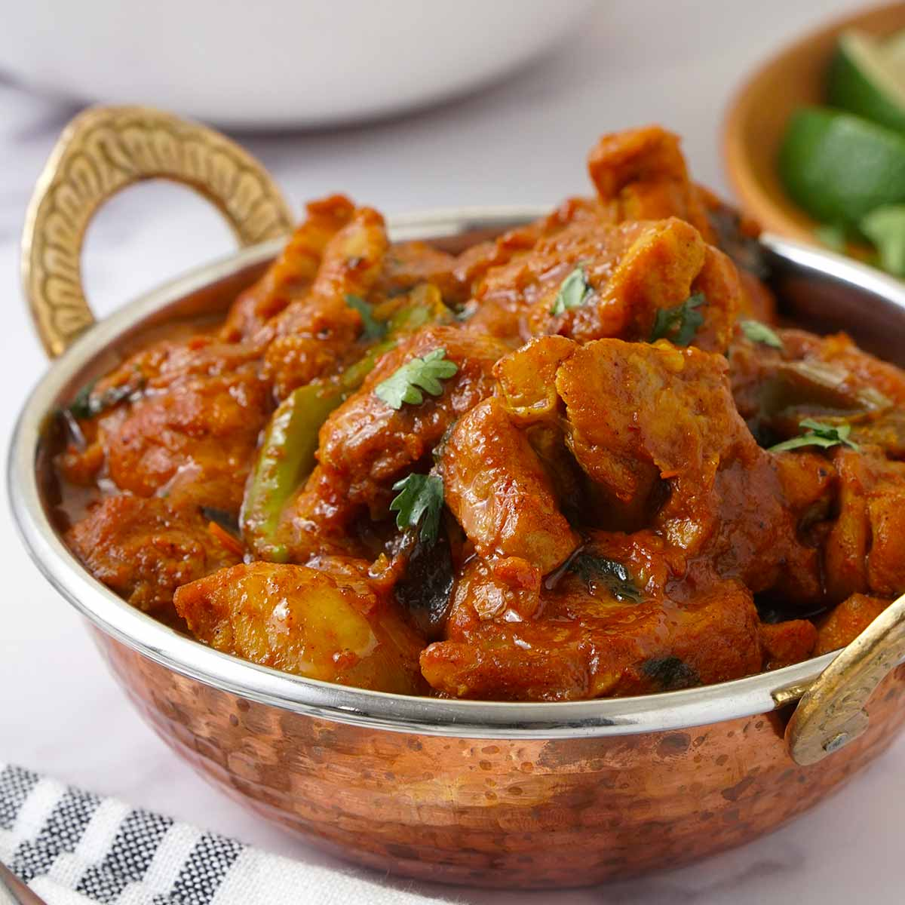

# Restaurant-Style Ceylon Curry

*A coconut-forward BIR curry with the warm-aromatic Sri Lankan profile (cassia, green cardamom, fennel, fenugreek) sitting under a medium-hot tomato-and-coconut sauce.*

**Serves:** 1

**Prep Time:** 5 minutes

**Cook Time:** 10 minutes

## Overview
A Ceylon curry on a British restaurant menu doesn't claim to reproduce authentic Sri Lankan cooking, it's a BIR interpretation that picks the most identifiable Sri Lankan flavour markers (coconut, cassia, green cardamom, fennel, fenugreek) and assembles them on the standard [Curry Base Gravy](Base/curry-base.md) chassis. The result is a medium-hot, coconut-rounded curry that sits in the same family as a korma for richness but with a noticeable warm-aromatic backbone and a touch more chilli.

The defining ingredients are the freshly-ground fennel and fenugreek powders (these matter, pre-ground loses a lot in this dish) and the two-form coconut: coconut powder or flour for body, coconut milk for sauce. A late slug of Worcestershire sauce adds a savoury undertone, and a small spoon of mango chutney can balance the heat if needed, though the caramelised base gravy already brings plenty of natural sweetness.

The dish reads sweet, warm, and rounded rather than fiery, with most of the heat coming from the chilli powder rather than late additions. Calibrate that one ingredient to your taste.

---

## Ingredients

### Tempering
- 3 tbsp oil (45 ml)
- 10 cm cassia bark
- 2 green cardamom pods, split
- 1 tbsp ginger-garlic paste

### Spice
- 0.5 tsp kasuri methi
- 1.5 tsp chilli powder
- 1.5 to 2 tsp [Mix Powder](Spice-Mixes/mixed-powder.md)
- 0.5 tsp fennel powder (freshly ground if possible)
- 0.25 tsp fenugreek powder (freshly ground if possible)
- 0.25 to 0.5 tsp salt

### Sauce
- 6 tbsp tomato paste
- 1 tbsp finely chopped fresh coriander stalks
- 1 tsp lemon juice
- 200 g [Pre-Cooked Chicken](Base/pre-cooked-chicken.md), [Pre-Cooked Lamb](Base/pre-cooked-lamb.md), beef, or vegetables
- 330 ml+ [Curry Base Gravy](Base/curry-base.md), heated through
- 1.5 tbsp coconut powder or flour

### Coconut and Finish
- 50 to 75 ml coconut milk (full fat)
- 3 splashes Worcestershire sauce
- 1 to 2 tsp mango chutney (optional)
- 1 tbsp finely chopped fresh coriander leaves, to garnish

---

## Method

### Stage 1 - Temper
1. Set a frying pan on medium-high heat and add the oil.
2. When hot, drop in the cassia bark and split cardamom pods.
3. Fry for 30 to 45 seconds, stirring, to infuse the oil.
4. Add the ginger-garlic paste. Stir diligently until it starts to brown and the sizzling sound drops.

### Stage 2 - Bloom the spices
1. Add the kasuri methi, mix powder, chilli powder, salt, and the freshly-ground fennel and fenugreek powders.
2. Splash in about 30 ml of base gravy straight away to keep the spices from scorching, the fenugreek powder in particular burns quickly.
3. Fry for 20 to 30 seconds, stirring constantly and using the flat of the spoon to spread the spices evenly across the pan.

### Stage 3 - Tomato base
1. Turn the heat to high. Add the tomato paste.
2. Stir frequently until the oil separates and small craters appear around the edges of the pan.

### Stage 4 - Main ingredient
1. Add the pre-cooked chicken (or chosen main), the coriander stalks, and the lemon juice.
2. Mix well so every piece is coated in the masala.

### Stage 5 - Build the sauce
1. Add 75 ml of base gravy and the coconut powder. Stir once, then leave undisturbed on high heat until the sauce reduces a little and the dry craters return around the edges.
2. Add a second 75 ml of base gravy. Stir and scrape once when it goes in, then leave to reduce again.
3. Pour in the final 150 ml of base gravy along with the coconut milk, the Worcestershire sauce, and the optional mango chutney. Stir and scrape once.
4. Cook on high heat for 4 to 5 minutes, until the sauce hits a medium consistency.
5. Avoid stirring or scraping unless the curry is about to burn. The caramelisation on the base and sides is part of the dish.
6. Add a splash more base gravy at the end if the sauce tightens past where you want it.

### Stage 6 - Finish
1. Add the chopped coriander leaves 30 seconds before the end of cooking. Stir through.
2. Taste and adjust: if the curry reads too hot, add the optional mango chutney; if it reads too sweet, a touch more lemon juice; more salt for savoury depth.
3. Fish out the cassia bark and cardamom pods.
4. Plate up with an extra scatter of coriander on top.

---

## Notes
- Freshly grinding the fennel and fenugreek seeds really does make a difference here. Pre-ground works in a pinch, but you'll lose the aromatic top notes that define a proper Ceylon. Toast the seeds briefly in a dry pan first if you want to push the flavour even further.
- Coconut goes in twice in this one: powder or flour with the first gravy pour for body and thickening, then coconut milk with the final pour for sauce and richness. Both matter, and swapping one for the other will change the texture.
- Please use full-fat coconut milk. The light stuff will thin your sauce out without giving you the body the dish really needs.
- I know Worcestershire sauce sounds wrong in an Indian recipe, but it's standard in BIR kitchens. It brings tamarind, anchovy, and vinegar all in one go, and acts as a savoury counterweight to the coconut richness.
- The mango chutney is genuinely optional. Do taste near the end before deciding, because the caramelised base gravy usually contributes plenty of sweetness already, and the chutney can tip the dish into cloying territory.
- And the usual: all spoon measurements are level. 1 tsp = 5 ml, 1 tbsp = 15 ml.

---

## Serving
Pair with [Restaurant-Style Special Fried Rice](Restaurant-Style-Special-Fried-Rice.md) or plain basmati and a piece of naan to mop the rich sauce. A side of plain raita keeps the palate clean between richer mouthfuls.

---

## Storage
Keeps 2 to 3 days in the fridge in a sealed container. The coconut milk thickens overnight; loosen with a splash of water or a little extra coconut milk when reheating in a pan rather than the microwave, which can split the coconut fat.
