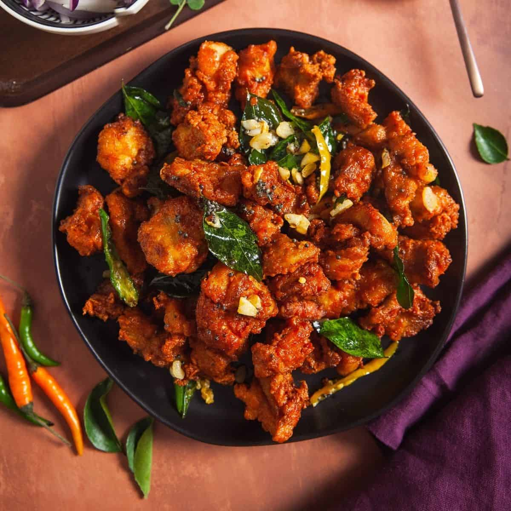

# Restaurant-Style Chicken 65

*The legendary Hyderabadi starter: deep-fried marinated chicken tossed in a sticky, fragrant red sauce with curry leaves, mustard seeds, and a final hit of yoghurt and honey.*

**Serves:** 2 to 3 (as a starter)

**Prep Time:** 2 hours marinade + 15 minutes active
**Cook Time:** 20 minutes

## Overview
Chicken 65 is one of the most-debated origin stories in South Indian cooking. The dish traces to the Buhari Hotel in Chennai in 1965 (hence the name, in the leading theory), but rival accounts include a 65-day marinade, 65 chillies per kilo, or a 65-ingredient masala. What's not debated is the technique: bite-sized chicken pieces marinated in yogurt and spice, deep-fried hard, then tossed in a vivid red sauce that's sweet, savoury and aggressively aromatic. This is unlike anything else in the Restaurant-Style series; no curry base gravy, none of the three-pour BIR conventions. A two-stage build: deep-fry the chicken, make the sauce, toss at the end. Curry leaves, mustard seeds and a heavy hand on the tandoori masala give the South Indian character; ketchup, dark soy and honey give the slightly Indo-Chinese sticky-glaze feel of the modern restaurant version. Eat immediately; chicken 65 loses what makes it great as soon as the batter softens.

---

## Ingredients

### Battered Chicken, Marinade
- 400 g chicken breast, thigh, or leg (cleaned, boneless, skinless), cut into 2 to 3 cm pieces
- 1.5 tsp ginger-garlic paste
- 1 tsp lemon juice
- 0.5 tsp salt
- 0.5 tsp [Garam Masala](Spice-Mixes/garam-masala.md)
- 1 tsp Kashmiri chilli powder
- 1 tsp fennel seeds
- 1 tsp paprika
- 1.5 tsp [Tandoori Masala](Spice-Mixes/tandoori-masala.md) powder, or 1 tsp tandoori masala paste (commercial)

### Battered Chicken, Coating
- 3 to 4 tbsp cornflour
- 1 tbsp all-purpose flour
- a splash of water
- oil for deep-frying (about 1 litre, depending on pan size)

### Sauce, Tempering
- 3 tbsp oil (45 ml)
- 0.75 tsp cumin seeds
- 0.5 tsp mustard seeds
- 1 tbsp fresh curry leaves, or 2 tbsp dried (optional but recommended)

### Sauce, Aromatics
- 80 g onion, finely diced
- 40 g green pepper, finely diced
- 1.5 tsp ginger-garlic paste

### Sauce, Spice
- 1 tsp kasuri methi
- 1.5 tsp [Tandoori Masala](Spice-Mixes/tandoori-masala.md) powder, or 1 tsp paste
- 0.25 to 0.5 tsp turmeric
- 1 tsp ground coriander (freshly toasted and ground is best)
- 1 tsp curry powder (mild Madras-style works well, see [Madrass Mix](Spice-Mixes/madrass-mix.md))
- 1 tsp paprika
- 1 tsp Kashmiri chilli powder
- 0.25 tsp salt

### Sauce, Glaze and Finish
- 2.5 tbsp tomato ketchup
- 1 tsp dark soy sauce
- 1 tsp lemon juice
- a pinch of red food colour (optional, cosmetic)
- 1 fresh red chilli, chopped (optional)
- 2 tbsp natural yoghurt
- 1 tsp honey

### To Serve
- thin slices of raw onion
- lemon wedges
- extra curry leaves (briefly fried in the leftover oil), to garnish (optional)

---

## Method

### Stage 1 - Marinate
1. Cut the chicken into 2 to 3 cm pieces, keeping the sizes as even as possible so they cook through together.
2. In a bowl, combine the chicken with the ginger-garlic paste, lemon juice, salt, garam masala, Kashmiri chilli powder, fennel seeds, paprika, and tandoori masala.
3. Mix thoroughly with clean hands so every piece is coated.
4. Cover and refrigerate for a minimum of 2 hours. Overnight is better.

### Stage 2 - Batter
1. Add the cornflour and plain flour to the marinated chicken bowl.
2. Add a small splash of water and stir well, you want a very thick paste that clings to every piece.
3. If it looks too wet, add a little more cornflour. If too dry to coat, add a teaspoon of water at a time.

### Stage 3 - Deep-fry
1. Heat the oil in a medium-large heavy-based pan (no more than half-full) to 170 to 180°C. A thermometer or temperature gun is genuinely useful here; without one, drop in a small piece of batter, it should sizzle vigorously and brown in about 90 seconds.
2. Carefully lower in the chicken pieces in batches, overcrowding drops the oil temperature and gives soggy results.
3. Fry each batch for 4 to 6 minutes, turning occasionally, until deep golden and crisp. Cut a piece open to check it's cooked through.
4. Drain on kitchen paper. Keep warm while you make the sauce.

### Stage 4 - Sauce: temper
1. In a separate frying pan, heat 3 tbsp of oil on medium-high heat.
2. Add the cumin seeds, mustard seeds, and curry leaves. Fry for 30 to 45 seconds, until the mustard seeds start popping and the curry leaves crisp.

### Stage 5 - Sauce: aromatics
1. Add the diced onion and green pepper. Fry for 2 to 3 minutes, stirring often, until softened and just starting to brown.
2. Add the ginger-garlic paste. Fry for 30 seconds, stirring constantly, until the sizzling subsides.

### Stage 6 - Sauce: bloom and build
1. Add the kasuri methi, tandoori masala, turmeric, ground coriander, curry powder, paprika, Kashmiri chilli powder, and salt.
2. Splash in 30 ml of water immediately to keep the spices from burning. Stir constantly for 20 to 30 seconds.
3. Add a further 75 ml of water. Stir, then leave to cook for a minute or so, intervening only if the sauce threatens to stick.

### Stage 7 - Sauce: glaze
1. Turn the heat up to high. Add the tomato ketchup, dark soy sauce, lemon juice, the optional food colour, the optional chopped red chilli, and a further 75 ml of water.
2. Stir together and cook for 2 minutes.
3. Drop the heat to low. Stir in the yoghurt and honey.
4. Bring the heat back up to high and cook for 1 to 2 minutes until the sauce is thick and glossy.
5. Taste and adjust: more salt for savouriness, more lemon for sharpness, more honey for sweetness.

### Stage 8 - Toss and serve
1. Tip the fried chicken pieces into the sauce.
2. Toss to coat every piece in the glaze.
3. Serve immediately with raw onion slices and lemon wedges. The chicken needs to hit the plate while the batter is still crisp under the sauce.

---

## Notes
- This is a hot-oil dish, so please take it seriously. Half-full pan maximum, a stable hob, no children or pets underfoot. Keep a metal lid within reach in case of an oil flare. Never, ever use water.
- Chicken thigh gives you a juicier, chewier result and is the traditional choice for this. Breast works fine too, but stay sharper on the timing or it'll dry out.
- Fresh curry leaves are noticeably better than dried here. That citrus-aromatic note is really what gives the dish its South Indian character. Indian grocers carry them, and any leftover freeze beautifully in a bag.
- The yoghurt softens the heat and gives the sauce its slightly creamy red colour. It goes in on low heat to stop it splitting.
- The marinade can absolutely sit overnight, and honestly it'll be better for it. Anything under 2 hours and the chicken won't really carry the spice properly.
- All spoon measurements are level: 1 tsp = 5 ml, 1 tbsp = 15 ml.
- Please keep raw chicken away from other ingredients, and give every surface and utensil that's touched it a thorough wash before you start cooking the rest.

---

## Serving
Serve as a starter with sliced raw onion, lemon wedges, and a small ramekin of cool raita. A few extra curry leaves briefly fried in the leftover oil and scattered on top give the dish a restaurant-finish look. Cold beer or a lassi pair particularly well.

---

## Storage
Best eaten immediately while the batter is still crisp. Leftovers keep 1 to 2 days in the fridge in a sealed container, but the batter will soften noticeably, reheat in a hot oven (200°C / fan 180°C) for 8 to 10 minutes to re-crisp rather than the microwave, which makes the chicken rubbery. Sauce-coated chicken doesn't reheat as well as sauce-tossed-on-the-plate; toss only what you'll eat.
