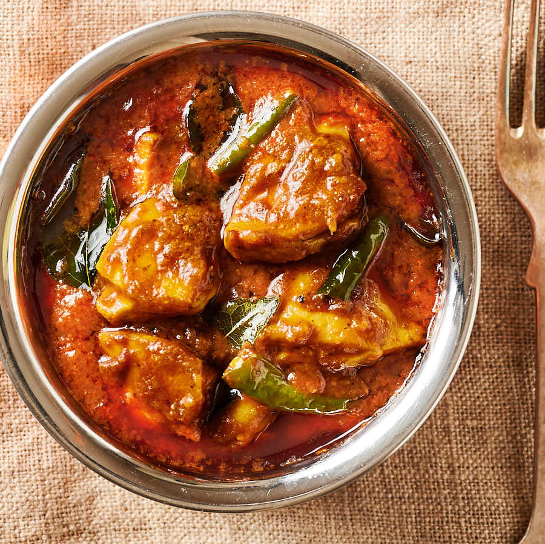

# Restaurant-Style Chicken Chilli Masala

*A BIR fusion curry built around a quick chilli-masala paste, sriracha, tomato paste, pickle, and a touch of lime, for a vivid red sauce that reads hot, tangy, and savoury all at once.*

**Serves:** 1

**Prep Time:** 5 minutes

**Cook Time:** 12 minutes

## Overview
Chicken chilli masala is a relatively modern entry on the British restaurant menu, sitting somewhere between a jalfrezi (which it shares the green-chilli punch with) and a madras (which it borrows the heat-and-tang structure from). What sets it apart is the upfront masala paste, sriracha or similar chilli sauce mixed with tomato paste, a touch of pickle and chutney, lime juice, and a pinch of food colour if you want the full takeaway-red look. The paste goes in mid-build and carries most of the dish's personality.

The recipe runs raw or pre-cooked chicken. Raw gives a slightly thicker sauce and chicken that absorbs more spice; pre-cooked is faster and produces a looser sauce. Both work. A spoon of single cream at the end is optional but worth considering, it tames the chilli without dulling the dish, turning a fiercely hot curry into something that reads as deep-flavoured rather than punishing.

Salt is held back until the end because the chilli sauce, pickle, and chutney all carry their own. Taste before adding any.

---

## Ingredients

### Chilli Masala Sauce (mix together before starting)
- 1 to 2 tbsp sriracha (or a chilli-based sauce of your choice; adjust to your heat preference)
- 4 tbsp tomato paste
- 1 tsp chilli pickle or lime pickle (optional)
- 1 tsp mango chutney (optional)
- 1 tsp lemon or lime juice, or vinegar
- a tiny pinch of red or orange food colour powder (optional, cosmetic)

### Tempering
- 4 tbsp oil (60 ml)
- 1 tsp cumin seeds
- 75 g onion, finely chopped (about half a medium onion)
- 2 tsp ginger-garlic paste

### Spice
- 2 tsp [Mix Powder](../../base-ingredients/curry-powder/mixed-powder.md)
- 1 tsp kasuri methi
- 2 tsp chilli powder (to taste)
- 0.5 tsp [Tandoori Masala](../../base-ingredients/curry-powder/tandoori-masala.md)

### Sauce
- 2 to 3 green chillies, finely chopped (to taste)
- 175 to 200 g chicken, raw, or [Pre-Cooked Chicken](Base/pre-cooked-chicken.md)
- 1 tbsp finely chopped fresh coriander stalks (optional)
- 330 ml+ [Curry Base Gravy](Base/curry-base.md), heated through

### Finish
- 2 fresh tomato segments
- 1 tbsp finely chopped fresh coriander leaves
- 3 to 4 tbsp single cream (optional)
- salt, to taste (added at the end)
- extra chopped fresh red or green chillies, to garnish

---

## Method

### Stage 1 - Make the chilli masala sauce
1. In a small bowl, stir together the sriracha, tomato paste, optional pickle, optional mango chutney, lemon or lime juice, and the optional food colour. Set aside.

### Stage 2 - Temper
1. Set a frying pan on medium-high heat and add the oil.
2. When hot, add the cumin seeds. Leave for 20 seconds until they crackle.
3. Add the chopped onion. Fry for 2 to 3 minutes, stirring from time to time, until the onion starts to brown at the edges.
4. Add the ginger-garlic paste. Cook for a further 45 to 60 seconds, stirring constantly.

### Stage 3 - Bloom the spices
1. Add the mix powder, tandoori masala, kasuri methi, and chilli powder. Hold the salt back, the chilli masala sauce and pickle carry plenty.
2. Splash in a couple of tablespoons of base gravy to keep the spices from burning.
3. Stir constantly for 20 to 30 seconds, working the spices evenly across the pan.

### Stage 4 - Chilli masala paste and chicken
1. Add the chilli masala sauce, the chopped green chillies, the chicken (raw or pre-cooked), and the coriander stalks if using.
2. Stir thoroughly to coat every piece of chicken in the masala.
3. Cook for a short while until the oil floats to the surface and small dry craters appear around the edges. If using raw chicken, give it an extra 2 to 3 minutes here to start it cooking through.

### Stage 5 - Build the sauce
1. Pour in 75 ml of base gravy. Stir and scrape once, then leave undisturbed on high heat until the sauce reduces a little.
2. Add a second 75 ml of base gravy. Stir and scrape once, then leave to reduce again.
3. Pour in the final 150 ml of base gravy. Stir and scrape once.
4. Cook on high heat for 4 to 5 minutes with minimal interference. Let the sauce stick and caramelise on the base and sides of the pan; intervene only to prevent burning.

### Stage 6 - Taste and adjust
1. Taste. Add salt now to bring the seasoning up, plus extra chilli sauce if you want more heat.
2. Add the tomato segments and the chopped coriander leaves.
3. Add a splash more base gravy if the sauce has tightened past where you want it (50 ml is a reasonable starting point).
4. For a richer finish, drop the heat to low and stir in 3 to 4 tbsp of single cream.
5. Stir and cook for a further 30 seconds.

### Stage 7 - Serve
1. If using raw chicken, cut a large piece open and check it's cooked through, no pinkness.
2. Plate up. Scatter the extra chopped coriander and a few fresh red or green chilli rings on top.

---

## Notes
- The chilli masala sauce really is the heart of this dish. Do premix it before the pan goes on the heat, once cooking starts there's genuinely no time to faff about with a separate bowl.
- Sriracha is the most common choice, but any vinegar-and-chilli sauce will work. Korean gochujang gives you a lovely fermented depth; Caribbean scotch bonnet sauces push the heat properly hard if that's your thing.
- Salt deliberately goes in at the end here. The chilli sauce, pickle, and chutney all carry their own salt, so adding more at the start usually overshoots.
- Single cream at the end isn't traditional, but it's a sensible move if the heat has crept up a bit too far for the table. It rounds the edge without flattening the flavour underneath.
- Raw and pre-cooked chicken both work, but they give you different results. Raw gives a thicker, more clinging sauce; pre-cooked gives a looser, softer-textured one. Both are perfectly valid.
- And the usual: all spoon measurements are level. 1 tsp = 5 ml, 1 tbsp = 15 ml.

---

## Serving
Pair with [Restaurant-Style Special Fried Rice](Restaurant-Style-Special-Fried-Rice.md) or plain basmati and a piece of naan to mop the bright red sauce. A cooling raita on the side helps if you've leaned into the chilli.

---

## Storage
Keeps 2 to 3 days in the fridge in a sealed container. The heat softens overnight and the chilli sauce integrates with the masala, both improvements. Reheat in a pan with a splash of water rather than the microwave to keep the sauce smooth and any added cream from splitting.
