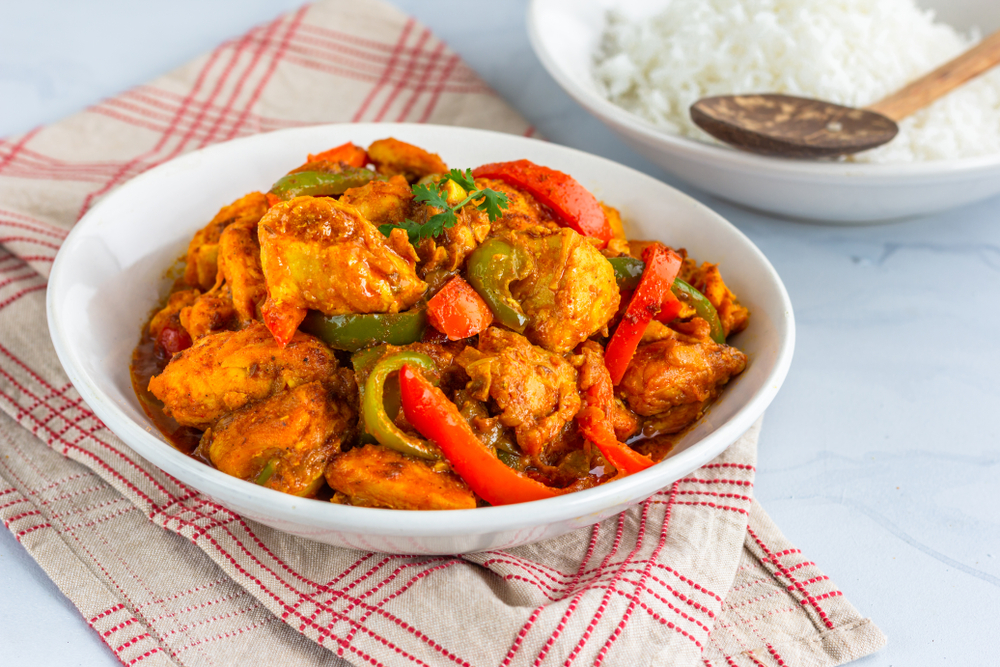

# Restaurant-Style Chicken Jalfrezi

*A medium-hot BIR classic defined by scorched onion and pepper chunks, sliced green chillies, and fresh tomato quarters folded into a thick masala, green-pepper-flecked, vegetable-forward, and unmistakable.*

**Serves:** 1

**Prep Time:** 10 minutes

**Cook Time:** 12 minutes

## Overview
The jalfrezi is one of the defining BIR curries, found on every restaurant menu in the country and arguably the most distinctive dish in the category. What sets it apart isn't the spice mix (which is fairly standard) but the texture: large pieces of scorched onion and pepper, sliced fresh green chillies, and fresh tomato wedges all stay identifiable in the finished dish rather than dissolving into the sauce. That vegetable bulk is part of the body, not just garnish.

The technique that makes a jalfrezi a jalfrezi is the upfront scorch, same idea as a dopiaza but with both onion and pepper hit hard on the highest heat the hob will give. Done right, the chunks come out almost charred on the outside and still bright inside, carrying a deep smoky note that builds into the sauce when they go back into the pan with the final gravy pour.

Heat is medium-hot, mostly from the sliced green chillies stirred in late rather than dry powder. Tandoori masala layers a smoky undertone that pairs with the scorched vegetables. The dish should end up thick, with the vegetables forming most of the body and the sauce clinging rather than pooling.

---

## Ingredients

### Scorched Onion and Pepper
- 0.5 medium-large onion (75 to 100 g), cut into 6 segments with layers separated
- 0.25 red pepper, cut into 3 cm chunks
- 0.25 green pepper, cut into 3 cm chunks
- 0.5 tsp kasuri methi
- a tiny pinch of salt
- 2 tsp oil (10 ml), for the scorch

### Tempering
- 3 to 4 tbsp oil (45 to 60 ml), for the curry
- 2 tsp ginger-garlic paste

### Spice
- 1.25 tsp [Mix Powder](Spice-Mixes/mixed-powder.md)
- 0.75 tsp chilli powder
- 0.25 tsp [Garam Masala](Spice-Mixes/garam-masala.md)
- 0.5 to 1 tsp [Tandoori Masala](Spice-Mixes/tandoori-masala.md)
- 0.5 tsp kasuri methi (the rest of the teaspoon)
- 0.25 to 0.5 tsp salt

### Sauce
- 4 tbsp tomato paste (double-concentrated puree diluted 1:3, blended tinned plum tomatoes, or passata)
- 1 tbsp finely chopped fresh coriander stalks
- 200 g [Pre-Cooked Chicken](Base/pre-cooked-chicken.md), [Pre-Cooked Lamb](Base/pre-cooked-lamb.md), or vegetables
- 330 ml+ [Curry Base Gravy](Base/curry-base.md), heated through

### Late Vegetables
- 2 to 3 fresh green chillies, sliced lengthways
- 2 fresh tomato quarters

### Finish
- 1 tbsp finely chopped fresh coriander leaves, to garnish

---

## Method

### Stage 1 - Prep the vegetables
1. Halve the onion widthways. Cut the half you're using into 6 segments, think of an onion half as a pizza. Separate the layers of each segment.
2. Cut the red and green pepper into 3 cm chunks.
3. Place the onion segments and pepper chunks in a container. Sprinkle with 0.5 tsp kasuri methi and a tiny pinch of salt. Toss to coat.

### Stage 2 - Scorch
1. Set a frying pan or wok on the highest heat the hob will give. Add 2 tsp of oil.
2. When the oil starts smoking, add the onion and pepper chunks.
3. Scorch-fry, stirring frequently to avoid burning, until the vegetables are well browned on the outside and emit a deep smoky aroma, a couple of minutes.
4. Tip back into the container. Put a lid on if you want softer vegetables in the curry; leave uncovered for more bite.

### Stage 3 - Temper
1. Return the same pan to medium-high heat and add 3 to 4 tbsp of oil.
2. Add the ginger-garlic paste. Cook for about 30 seconds, stirring constantly, until it starts to brown and the sizzling drops.

### Stage 4 - Bloom the spices
1. Add the remaining kasuri methi, chilli powder, mix powder, garam masala, tandoori masala, and salt.
2. Fry for 20 to 30 seconds, stirring frequently.
3. Splash in about 30 ml of base gravy if the spices start sticking, they need a touch of liquid to cook through properly.

### Stage 5 - Tomato base
1. Turn the heat to high. Add the tomato paste, the coriander stalks, and the pre-cooked chicken (or chosen main).
2. Stir thoroughly to coat every piece.
3. Cook for a short while until the oil floats to the surface and small craters form around the edges of the pan.

### Stage 6 - Build the sauce
1. Pour in 75 ml of base gravy. Stir once, then leave undisturbed on high heat until the sauce thickens and the craters return around the edges.
2. Add a second 75 ml of base gravy. Stir and scrape once when it goes in, then leave to reduce again.
3. Add the scorched onion and pepper chunks, the sliced green chillies, and the fresh tomato quarters.
4. Immediately pour in the final 150 ml of base gravy. Stir and scrape once.
5. Cook on high heat for 4 to 5 minutes. Let the sauce stick to the pan; the thickened residue is part of the BIR character. Stir and scrape only when needed to prevent burning, be brave with the cook time.
6. Add a splash more base gravy at the end to loosen the sauce slightly. A jalfrezi should end up thick, with the vegetables carrying most of the body.

### Stage 7 - Plate
1. Tip into a serving bowl, scraping every last bit of caramelised residue out of the pan.
2. Scatter the chopped coriander leaves on top.

---

## Notes
- The scorch really isn't optional, I'm afraid. Without it, the dish is just a vegetable-heavy madras. That charring at the edges of the segments and pepper chunks is what makes a jalfrezi a jalfrezi.
- A heavy-based pan or wok is your friend for the scorch step. Thin pans get hot spots and the vegetables tend to burn unevenly before they brown properly.
- The sliced green chillies are where the heat comes from. If you're nervous, hold them back and add them right at the end (taste first); add them in Stage 6 for a properly hot jalfrezi.
- "Tomato paste" here means something medium-bodied: double-concentrated tomato puree mixed with 3 parts water, blended tinned plum tomatoes, or passata. Please don't substitute neat puree directly. It'll be too dense and tip the whole dish out of balance.
- Fresh tomato quarters go in at Stage 6 alongside the scorched vegetables. They'll soften nicely but should keep their shape.
- And the usual: all spoon measurements are level. 1 tsp = 5 ml, 1 tbsp = 15 ml.

---

## Serving
Pair with [Restaurant-Style Special Fried Rice](Restaurant-Style-Special-Fried-Rice.md) or plain basmati and a piece of naan to mop the thick sauce. A small bowl of raita and a wedge of lemon balance the heat and the smoky vegetables.

---

## Storage
Keeps 2 to 3 days in the fridge in a sealed container. The scorched vegetables soften further overnight as they absorb sauce; if you want them to retain their bite, eat fresh. Reheat in a pan with a splash of water rather than the microwave to keep the sauce smooth.
