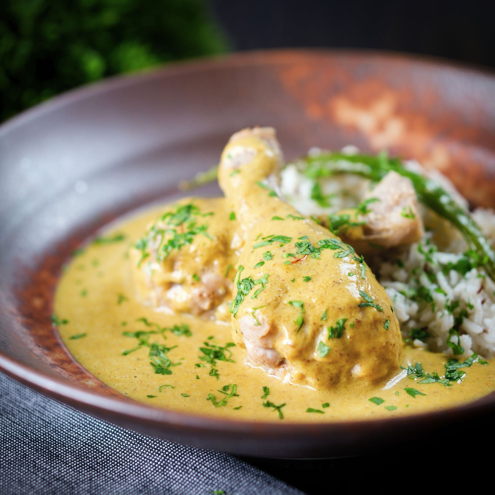

# Restaurant-Style Chicken Rezala

*A mild, ivory-pale BIR curry rooted in Mughlai Bengali tradition: a cashew-and-poppy-seed paste with yoghurt and white pepper, perfumed with kewra or rose water and saffron.*

**Serves:** 1

**Prep Time:** 10 minutes

**Cook Time:** 12 minutes

## Overview
Chicken rezala is a Mughlai dish associated with Kolkata's Muslim-quarter restaurants: traditionally a delicate aromatic curry built around yogurt, ground cashews, white pepper and a final perfume of kewra (screwpine) or rose water. The BIR adaptation keeps the dish's defining quality, its almost ivory-pale colour and gentle floral aromatics, by rebuilding it on a curry-base gravy but holding back the chilli powder, turmeric and Kashmiri chilli that would tint the sauce red or orange. The rezala paste does most of the work: blitzed cashews, poppy seeds, white pepper, yogurt and optional green chillies form a smooth pale base that goes in late with the final gravy pour, so the dairy doesn't split under sustained high heat. White pepper rather than black is deliberate; it carries warmth without the bitter top note that would clash with the cashew sweetness. A few drops of kewra or rose water at the end perfume the bowl; toasted cashews on the plate echo the paste.

---

## Ingredients

### Rezala Paste (blitz before starting)
- 15 unsalted cashew nuts
- 0.5 tsp poppy seeds
- 0.25 to 0.5 tsp ground white pepper
- 75 ml natural yoghurt
- 1 to 2 fresh green chillies (optional)

### Tempering
- 3 tbsp oil (45 ml)
- 3 black peppercorns
- 5 to 10 cm cassia bark
- 0.5 tsp cumin seeds
- 2 cloves
- 3 green cardamom pods, split

### Aromatics
- 75 g onion, cut into thin semi-circular slices
- 2 tsp ginger-garlic paste

### Spice
- 1 tsp [Mix Powder](../../base-ingredients/curry-powder/mixed-powder.md)
- 0.5 tsp [Garam Masala](../../base-ingredients/curry-powder/garam-masala.md)
- 0.5 tsp salt
- 0.75 to 1 tsp sugar
- 0.5 tsp chilli powder (optional, skip for the traditional pale finish)

### Sauce
- 50 to 200 g chicken (raw or [Pre-Cooked Chicken](Base/pre-cooked-chicken.md))
- 240 ml+ [Curry Base Gravy](Base/curry-base.md), heated through

### Aromatic Finish
- a small pinch of saffron (optional, soak in 1 tsp warm milk)
- 1 tsp kewra water or rose water (optional but recommended)
- a few toasted cashew nuts, to garnish

---

## Method

### Stage 1 - Make the rezala paste
1. Add the cashews, poppy seeds, white pepper, yoghurt, and the optional green chillies to a small blender.
2. Blitz until completely smooth. The paste should be pale and pourable; add a touch of water if it's too thick to blend.
3. Set aside.

### Stage 2 - Temper
1. Set a frying pan on medium-high heat and add the oil.
2. When hot, add the black peppercorns, cassia bark, green cardamom pods, cloves, and cumin seeds.
3. Fry for 45 seconds, stirring frequently, to infuse the oil with the whole-spice aromatics.

### Stage 3 - Soften the aromatics
1. Add the sliced onion. Fry for 3 to 5 minutes, stirring often, until the edges turn a deep brown, the dish wants browned onion for depth even if the overall colour stays pale.
2. Add the ginger-garlic paste. Stir constantly until it just starts to brown and the sizzling sound drops. Don't let it stick or scorch.

### Stage 4 - Bloom the spices
1. Add the mix powder, salt, sugar, garam masala, and the optional chilli powder.
2. Splash in 30 ml of base gravy if the mixture starts drying out.
3. Fry for 20 to 30 seconds, stirring very frequently to keep the spices moving across the pan.

### Stage 5 - Chicken
1. Turn the heat to high. Add the chicken (raw or pre-cooked) and mix thoroughly into the masala.
2. If using raw chicken, give it 2 to 3 minutes here to start cooking through.

### Stage 6 - Build the sauce
1. Add 75 ml of base gravy. Stir, then leave undisturbed for 30 to 45 seconds.
2. Add a second 75 ml of base gravy. Stir, then leave on high heat with no further stirring until the sauce reduces and small dry craters form around the edges.
3. Stir in the rezala paste and a further 75 ml of base gravy. The paste needs to integrate gently, stir once when it goes in, then leave.
4. Cook on high heat for 3 to 4 minutes. Stir and scrape once or twice only to prevent burning. The caramelisation on the base and sides is part of the flavour; let it form.
5. Add a splash more base gravy if the sauce tightens past where you want it. A rezala should be medium-thick and pale, not soupy or dark.

### Stage 7 - Aromatic finish
1. Taste and adjust salt.
2. If using raw chicken, cut a piece open to confirm it's cooked through.
3. Splash the kewra or rose water over the surface. A teaspoon is enough, these perfumes are intense.
4. If using saffron, soak a pinch in 1 tsp of warm milk for a minute, then drizzle over the top for the colour contrast.
5. Plate up and scatter the toasted cashew nuts over the dish.

---

## Notes
- Yoghurt-based pastes can split if you leave them on high heat for too long. The Stage 6 instruction to stir once when adding the paste and then leave it isn't about caramelisation; it's about giving the yoghurt time to integrate gently before the pan stays hot too long.
- White pepper is genuinely the right choice here, not black. The warmth without bitterness pairs really cleanly with the cashew and yoghurt sweetness.
- Kewra water is the traditional choice (it's distilled from the screwpine flower, in case you were wondering). Rose water substitutes nicely too, just slightly more floral and slightly less savoury. Both come in small bottles at Indian grocers and will last you years.
- The optional chilli powder is genuinely optional. Traditional rezala stays beautifully pale, so if you want to honour that, leave it out and let the yoghurt and cashew paste do their work. If you fancy a slightly hotter result, add it in Stage 4.
- Do toast the garnish cashews briefly in a dry pan until lightly browned. They bring a much better flavour than raw cashews and only take a minute.
- And the usual: all spoon measurements are level. 1 tsp = 5 ml, 1 tbsp = 15 ml.

---

## Serving
Pair with plain basmati or a saffron-infused pilau, and a piece of buttery naan or paratha. Pickle and chutney are out of character here, let the floral, cashew-led flavours speak. A simple cucumber salad with a sprinkle of black salt makes a clean side.

---

## Storage
Keeps 2 days in the fridge in a sealed container. The yoghurt-based sauce thickens noticeably overnight. Reheat gently in a pan with a splash of water rather than the microwave to keep the dairy smooth, high heat or rapid reheating can split the yoghurt.
