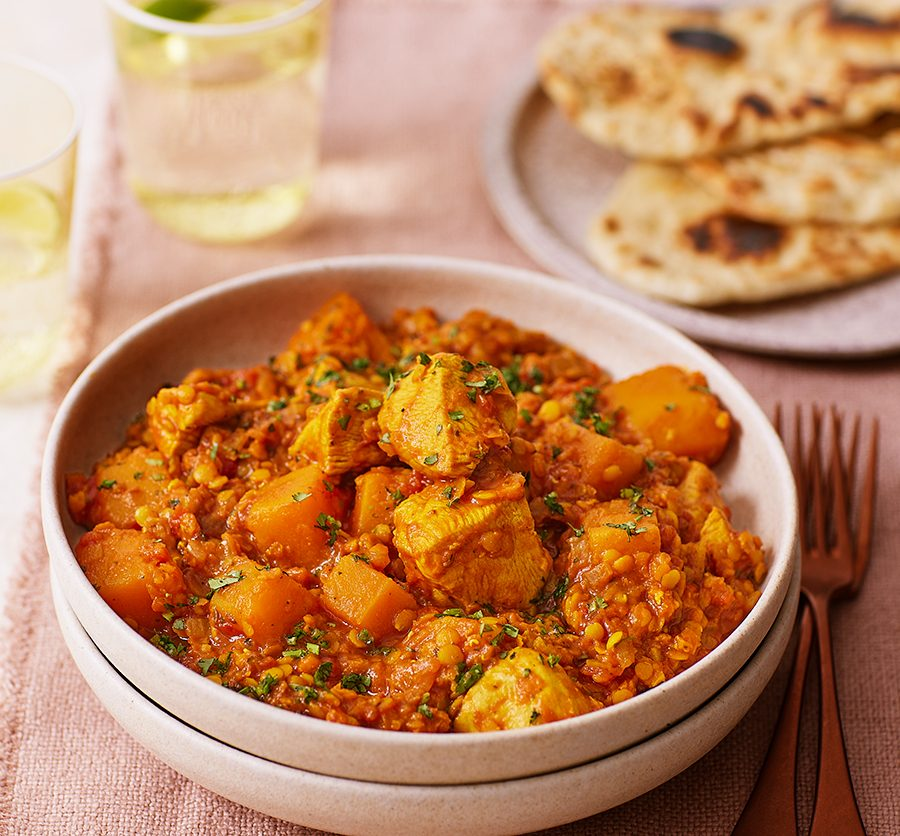

# Restaurant-Style Dhansak

*Parsi-rooted curry-house standard built on lentils, with a sweet-and-sour finish from jaggery and lime — and pineapple chunks, if you side with the North on that particular debate.*

**Serves:** 1

**Prep Time:** 5 minutes

**Cook Time:** 10 minutes

## Overview
Dhansak is a Parsi dish at heart, traditionally a slow-cooked stew of meat, lentils, and vegetables eaten on Sundays. The British curry-house version keeps the lentil core and the sweet-sour edge but rebuilds the dish around a [Curry Base Gravy](Base/curry-base.md) and a separately pre-cooked dhal that's spooned in late, so the lentils stay distinct rather than dissolving into the sauce.

The defining notes are the dhal (which gives the curry its characteristic thick, slightly nubbly body), jaggery for sweetness, and lime juice for sharpness. Pineapple chunks are the running BIR debate — universal in the North of England, divisive in the South, traditionalist Parsis would raise an eyebrow at either. Include them or skip; the dish works both ways.

A dhansak should land thick. The pre-cooked dhal contributes most of the body, so the three-pour gravy reduction concentrates flavour rather than thinning the sauce. The recipe takes 10 minutes once the dhal is ready; pre-cook a batch of lentils at the weekend and dhansak becomes a weeknight curry.

---

## Ingredients

### Tempering
- 3 tbsp oil (45 ml)
- 2 to 3 tsp ginger-garlic paste
- 2 green cardamom pods, split

### Spice
- 1 tsp kasuri methi
- 1.25 tsp [Mix Powder](Spice-Mixes/mixed-powder.md)
- 0.25 to 0.5 tsp chilli powder
- 0.25 tsp salt (less than usual; the dhal carries its own salt)

### Sauce
- 4 to 5 tbsp tomato paste
- 200 g [Pre-Cooked Chicken](Base/pre-cooked-chicken.md), chicken tikka, [Pre-Cooked Lamb](Base/pre-cooked-lamb.md), or vegetables
- 330 ml+ [Curry Base Gravy](Base/curry-base.md), heated through

### Dhal and Sweet-Sour Finish
- 6 to 9 tbsp (90 to 120 ml) pre-cooked dhal (see Notes)
- 1 tbsp jaggery, brown sugar, or white sugar
- 2 tsp lime juice (lemon works in a pinch)
- 6 chunks pineapple (optional)
- 2 tsp ghee (optional, for shine)
- 1 tbsp finely chopped fresh coriander leaves, to garnish

---

## Method

### Stage 1 - Temper
1. Set a frying pan on medium-high heat and add the oil.
2. When hot, add the ginger-garlic paste. Fry for 20 to 30 seconds, stirring constantly, until it starts to brown and the sizzling drops — the cue that the water content has cooked out and the paste is ready for spice.

### Stage 2 - Bloom the spices
1. Add the kasuri methi, mix powder, chilli powder, salt, and the split green cardamom pods.
2. Fry for 20 to 30 seconds, stirring frequently.
3. If the mixture starts sticking, splash in 30 ml of base gravy so the spices cook through without scorching.

### Stage 3 - Tomato base
1. Stir in the tomato paste and turn the heat to high.
2. Stir constantly until the oil separates and small dry craters appear around the edges of the pan.

### Stage 4 - Main ingredient
1. Add the pre-cooked chicken (or chosen main) and mix well to coat every piece in the masala.

### Stage 5 - Build the sauce
1. Pour in 75 ml of base gravy. Stir and scrape once, then leave undisturbed until the oil resurfaces and the dry craters return.
2. Add a second 75 ml of base gravy. Stir and scrape once, then leave to reduce again.
3. Pour in the final 150 ml of base gravy along with the pre-cooked dhal, the lime juice, the jaggery, and the optional pineapple chunks. Stir and scrape once.

### Stage 6 - Cook through
1. Leave on high heat for 4 to 5 minutes with minimal interference.
2. Let the sauce stick and caramelise on the sides and base of the pan — that's where a lot of the depth comes from. Stir and scrape only to prevent outright burning.
3. The dhansak will tighten noticeably as the dhal contributes its body. Add a splash more base gravy at the end if the sauce is thicker than you want.

### Stage 7 - Finish
1. Stir in the optional ghee for extra richness and a glossy surface.
2. Fish out the cardamom pods.
3. When plating, scrape every last bit out of the pan — the crusty residue is some of the best flavour in the dish.
4. Scatter the chopped coriander leaves over the top.

---

## Notes
- Dhal really is the heart of this dish. Pre-cook a batch of lentils with turmeric and a pinch of salt before you start. Chana dhal, or a mix of chana and red lentils, gives you the classic texture. A simple dhal recipe is all you need here, because the dish gets its spice from the curry build, not from the lentils themselves.
- The pineapple question is the running BIR argument and people get surprisingly heated about it. Northern English curry houses include it almost universally; Southern ones often leave it out. The fresh chunks bring sweet-tart pops that play beautifully with the lentils and the lime, but the dish stands up perfectly well without them. Your call.
- I've dialled the salt back here because pre-cooked dhal usually carries its own seasoning. Taste before serving and add more if it needs it.
- The final consistency should be properly thick: thicker than a madras, thinner than a chickpea curry. The dhal sets the floor, so don't worry if it looks dense.
- And the usual: all spoon measurements are level. 1 tsp = 5 ml, 1 tbsp = 15 ml.

---

## Serving
Pair with [Restaurant-Style Special Fried Rice](Restaurant-Style-Special-Fried-Rice.md) or plain basmati and a piece of naan or chapati to mop the thick sauce. A side of cooling raita keeps the sweet-sour register in check.

---

## Storage
Keeps 2 to 3 days in the fridge in a sealed container. The dhal continues to absorb sauce overnight so day-two dhansak is noticeably thicker — loosen with a splash of water or extra base gravy when reheating in a pan.
