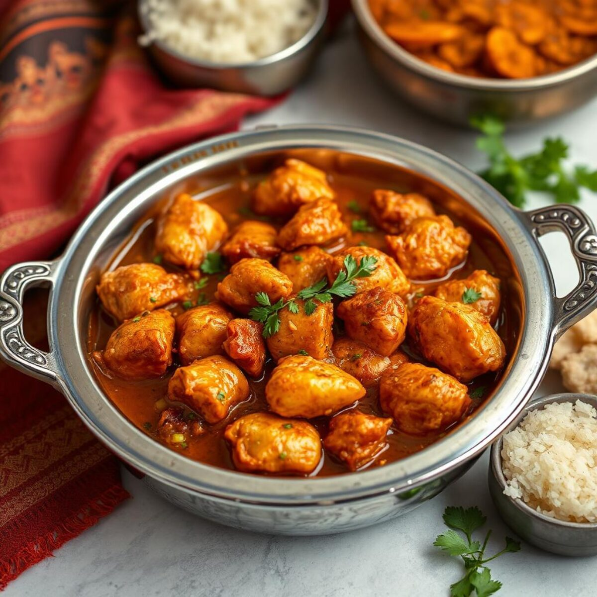

# Restaurant-Style Dopiaza

*Twice-onion BIR curry: a finely chopped onion cooked into the base, plus chunky scorched segments and red pepper stirred in late for char and texture.*

**Serves:** 1

**Prep Time:** 10 minutes

**Cook Time:** 12 minutes

## Overview
The name dopiaza literally means "two onions" (do = two, piaza = onion), and that's the whole concept of the dish. Onion appears twice in two textures: very finely chopped and cooked into the masala at the start, then again as larger charred segments stirred in late so they keep their bite and bring scorched, slightly bitter notes to the sauce. Red pepper chunks ride along with the segments for sweetness and colour.

The build is otherwise standard BIR — a [Curry Base Gravy](Base/curry-base.md) foundation, [Mix Powder](Spice-Mixes/mixed-powder.md), three-pour reduction — but the upfront scorch-frying is what separates a dopiaza from any other onion-heavy curry. Two teaspoons of oil get pushed to the limit on the highest heat the hob will give, then onion segments and red pepper hit the pan and char hard on the outside while staying intact inside. Don't pull them off too early; the controlled blackening at the edges is the dish.

Worcestershire sauce closes the loop with a savoury kick. Pre-cooked chicken is standard, but lamb (especially keema) and tikka all sit comfortably in the dish.

---

## Ingredients

### Onion Prep (two cuts from the same onion)
- 75 g onion, very finely chopped (for the base)
- 75 to 100 g onion, cut into 3 cm segments with layers separated (for the scorch)
- 40 to 50 g red pepper, cut into 1 to 2 cm chunks
- 0.5 tsp kasuri methi (sprinkled on the segments)
- a tiny pinch of salt (for the segments)

### Scorch Oil
- 2 tsp oil (10 ml)

### Tempering
- 4 tbsp oil (60 ml) — the remainder after the scorch
- 1.5 tsp ginger-garlic paste

### Spice
- 1.25 tsp [Mix Powder](Spice-Mixes/mixed-powder.md)
- 0.25 tsp chilli powder
- 0.25 to 0.5 tsp salt
- 0.5 tsp kasuri methi (the rest of the teaspoon)

### Sauce
- 4 tbsp tomato paste
- 200 g [Pre-Cooked Chicken](Base/pre-cooked-chicken.md), chicken tikka, or [Pre-Cooked Lamb](Base/pre-cooked-lamb.md)
- 1 tbsp finely chopped fresh coriander stalks
- 330 ml+ [Curry Base Gravy](Base/curry-base.md), heated through

### Finish
- 3 to 4 splashes Worcestershire sauce
- 1 tbsp onion paste / bunjarra (optional)
- 1 tbsp finely chopped fresh coriander leaves, to garnish

---

## Method

### Stage 1 - Prep the onions
1. Peel and halve a medium onion widthways. Cut one half into very fine cubes (about 75 g) and set aside for the base.
2. Cut the other half into 6 segments — think of the onion half as a pizza. Separate the layers of each segment.
3. Place the segments in a container with the red pepper chunks. Sprinkle on 0.5 tsp of kasuri methi and a tiny pinch of salt. Toss to coat.

### Stage 2 - Scorch
1. Set a frying pan on the highest heat the hob will give. Add 2 tsp of oil.
2. When the oil starts to smoke, add the onion segments and red pepper chunks.
3. Scorch-fry, stirring very often, until the onion edges are deeply caramelised and starting to char in places — but not burnt all the way through. Don't be afraid to let them blacken a little; that's the dish.
4. Tip into a covered container. The trapped steam will soften them slightly while you make the rest. If you prefer them crunchy, leave the lid off.

### Stage 3 - Temper
1. Return the same pan to medium-high heat. Add the remaining 4 tbsp of oil.
2. Add the very finely chopped onion. Cook for 60 to 90 seconds, stirring frequently, until the onion is translucent and just starting to brown.
3. Add the ginger-garlic paste about halfway through that time and keep stirring so it doesn't burn against the hot pan.

### Stage 4 - Bloom the spices
1. Add the remaining 0.5 tsp kasuri methi, mix powder, chilli powder, and salt.
2. Splash in 30 ml of base gravy straight away to keep the spices from scorching.
3. Fry for 20 to 30 seconds, stirring diligently and spreading the spices evenly with the base of the spoon.

### Stage 5 - Tomato base
1. Turn the heat to high. Add the tomato paste.
2. Stir frequently until the oil separates and small craters form around the edges of the pan.
3. Add the pre-cooked chicken (or chosen main) and the coriander stalks. Mix well to coat every piece in the masala.

### Stage 6 - Build the sauce
1. Pour in 75 ml of base gravy. Stir once, then leave undisturbed on high heat until the sauce reduces and the dry craters return.
2. Add a second 75 ml of base gravy. Stir and scrape once when it goes in, then leave to reduce again.
3. Pour in the final 150 ml of base gravy along with the Worcestershire sauce, the scorched onion segments and red pepper chunks, and the optional onion paste. Stir and scrape once.

### Stage 7 - Cook through
1. Leave on high heat for 4 to 5 minutes. Resist fiddling — the caramelisation on the base and sides is part of the flavour.
2. Stir and scrape once or twice only to prevent outright burning. Be brave with the cook time; dopiaza wants the longer end of that range.
3. The dish should end up thick. Add a splash more base gravy at the end if it's tightened past where you want it.

### Stage 8 - Finish
1. Plate up, making sure to scrape every last bit of caramelised residue out of the pan.
2. Scatter the chopped coriander leaves over the top.

---

## Notes
- The scorch really isn't optional, I'm afraid. Without it, the dish is just an onion-heavy madras. That charring at the edges of the segments is what makes a dopiaza taste like a dopiaza.
- A heavy-based pan is your friend for the scorch step. Thin pans get hot spots and the onions tend to burn unevenly before they brown properly.
- Onion paste (sometimes called bunjarra) layers a lovely sweet-savoury depth that pairs beautifully with the scorched onions. Genuinely worth making for this dish if you don't already have some on hand.
- I know Worcestershire sauce sounds wrong in an Indian recipe, but it's standard in BIR kitchens. It brings tamarind, anchovy, and vinegar all in one go, all of which pair really nicely with charred onion.
- And the usual: all spoon measurements are level. 1 tsp = 5 ml, 1 tbsp = 15 ml.

---

## Serving
Pair with [Restaurant-Style Special Fried Rice](Restaurant-Style-Special-Fried-Rice.md) or plain basmati and a piece of naan to mop the thick sauce. A side of cool raita balances the scorched, savoury character.

---

## Storage
Keeps 2 to 3 days in the fridge in a sealed container. The scorched onion segments soften further overnight as they absorb sauce, which some prefer; if you want them to keep their bite, eat fresh. Reheat in a pan with a splash of water rather than the microwave to keep the sauce smooth.
