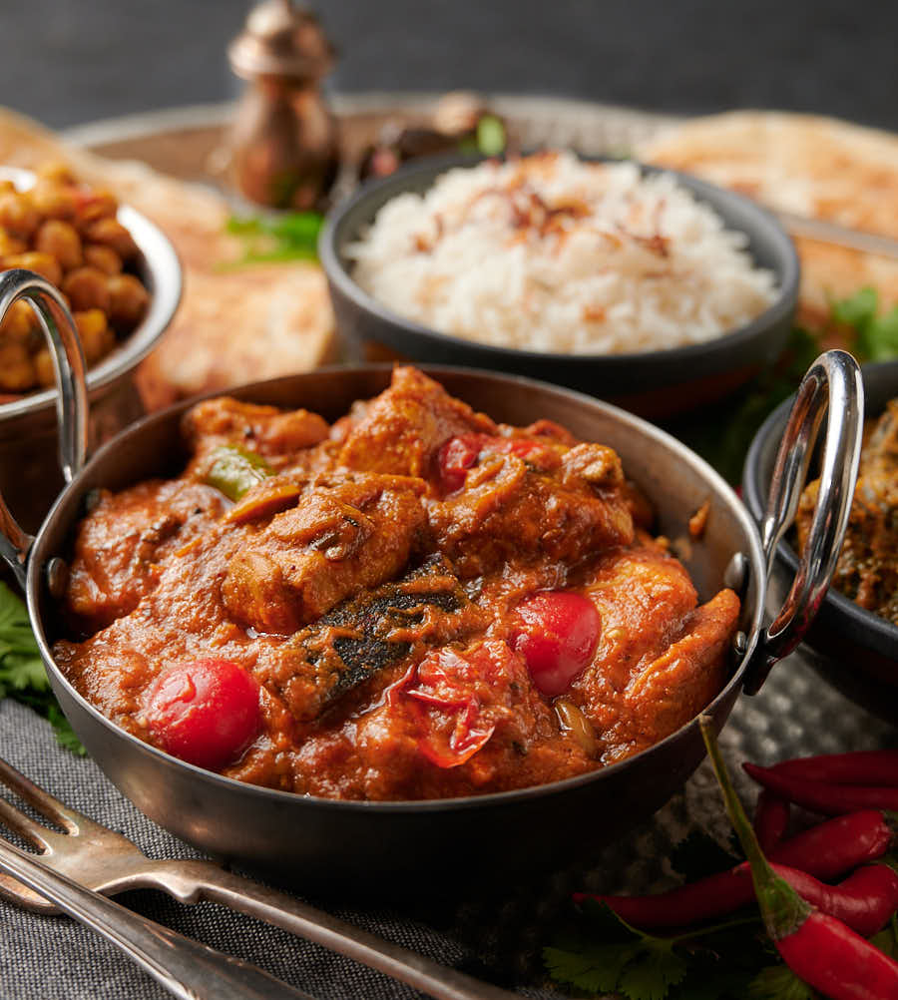

# Restaurant-Style Garlic Chilli Chicken

*A BIR specialty built around six browned garlic cloves, a star-anise temper, fresh green chillies stirred in late, and a soft coconut backdrop that keeps the heat balanced.*

**Serves:** 1

**Prep Time:** 5 minutes

**Cook Time:** 12 minutes

## Overview
Garlic chilli chicken sits in the medium-hot end of the BIR menu, distinguished by two things: heavily browned sliced garlic going in early alongside the onion, and a generous handful of whole (or split) fresh thin green chillies joining the sauce late so they keep their bite. Six cloves of garlic sliced thin gives the dish a sweet nutty depth as they caramelise, quite different to the more neutral ginger-garlic paste that does the standard background work in every BIR build. The rest is a familiar three-pour curry-base reduction, but with a star anise tempered in the oil for a faintly liquorice undertone and coconut in two forms (powder and milk) joining the sauce at different stages to give a soft slightly-sweet backdrop that holds the chilli heat. The dish reads garlic-first, with the chilli following a beat behind. Eat warm rather than hot from the pan; the garlic flavour comes through more cleanly once the heat settles slightly.

---

## Ingredients

### Tempering
- 3 tbsp oil or ghee (45 ml)
- 1 star anise

### Aromatics
- 75 to 100 g onion, finely chopped
- 20 g garlic cloves, thinly sliced (about 6 cloves)
- 1.5 tsp ginger-garlic paste

### Spice
- 1 tsp kasuri methi
- 1 tsp chilli powder
- 1.5 tsp [Mix Powder](../../base-ingredients/curry-powder/mixed-powder.md)
- 0.25 tsp [Garam Masala](../../base-ingredients/curry-powder/garam-masala.md)
- 0.25 to 0.5 tsp salt

### Sauce
- 4 tbsp tomato paste
- 1 tbsp finely chopped fresh coriander stalks
- 1 tsp lemon juice
- 200 g [Pre-Cooked Chicken](Base/pre-cooked-chicken.md) or chicken tikka
- 280 ml+ [Curry Base Gravy](Base/curry-base.md), heated through
- 1.5 tbsp coconut powder or flour

### Coconut and Chilli Finish
- 50 to 75 ml coconut milk (full fat)
- 4 to 6 fresh thin green chillies, whole or sliced lengthways
- 1 to 2 tsp mango chutney (optional, taste first)
- 1 tbsp finely chopped fresh coriander leaves, to garnish

---

## Method

### Stage 1 - Temper
1. Set a frying pan on medium-high heat and add the oil or ghee.
2. Drop in the star anise. Fry for 30 to 45 seconds, stirring, to infuse the oil.

### Stage 2 - Brown the garlic and onion
1. Add the chopped onion and the sliced garlic cloves.
2. Cook for 1 to 2 minutes, stirring frequently, until the onion is translucent and the garlic slices are nicely browned at the edges. The garlic browning is the dish, push it as far as you can without scorching.
3. Add the ginger-garlic paste. Stir for about 30 seconds, until it just starts to brown and the sizzling sound drops.

### Stage 3 - Bloom the spices
1. Add the kasuri methi, chilli powder, mix powder, garam masala, and salt.
2. Fry for 20 to 30 seconds, stirring very frequently.
3. Splash in about 30 ml of base gravy if the mixture starts drying out and sticking, the spices need a touch of liquid to cook through without burning.

### Stage 4 - Tomato base
1. Turn the heat to high. Add the tomato paste.
2. Stir constantly for 30 seconds or so, until the oil separates.
3. Add the pre-cooked chicken (or chicken tikka), the coriander stalks, and the lemon juice. Mix thoroughly so every piece is coated in the masala.

### Stage 5 - Build the sauce
1. Add 75 ml of base gravy and the coconut powder. Mix and cook for 30 seconds with no further stirring. The coconut will tighten the sauce dramatically at this point.
2. Add a second 75 ml of base gravy. Stir into the sauce, then leave on high heat without further stirring until the sauce reduces slightly and small dry craters form around the edges.

### Stage 6 - Coconut milk and chillies
1. Pour in the final 100 ml of base gravy along with the coconut milk and the fresh green chillies. Stir and scrape once when first added.
2. Cook on high heat for 4 to 5 minutes. Stir and scrape only when needed to prevent burning, the caramelisation on the base and sides is part of the flavour.
3. Add a splash more base gravy if the sauce tightens past where you want it.

### Stage 7 - Finish
1. About 30 seconds before the end, stir in the chopped coriander leaves.
2. Taste. Add 1 to 2 tsp of mango chutney if you want a touch of sweetness, the dish often doesn't need it, since the caramelised base gravy and coconut already bring rounded notes.
3. Fish out the star anise.
4. Spoon off excess oil from the surface if you prefer a less rich finish.
5. Plate up and scatter the extra coriander on top.

---

## Notes
- The garlic browning in Stage 2 really is the heart of this dish. Aim for the slices turning a deep gold at the edges with a sweet, nutty smell coming off the pan. Burnt garlic is acrid and you can't really come back from it, so if it's running away from you, pull the heat back to medium for the last 30 seconds.
- Six cloves is the right number. Please don't be tempted to reduce.
- The green chillies can go in whole, split lengthways, or sliced, depending on how much heat you want them to release. Whole keeps the dish quite mild; sliced makes it noticeably hotter.
- Coconut goes in twice in this one: powder with the first gravy pour (Stage 5) for body, then coconut milk with the third (Stage 6) for richness. Both matter.
- One star anise pod is plenty. Please don't add a second. It infuses powerfully, and a second pod tips the whole dish into proper liquorice territory.
- Use full-fat coconut milk. The light stuff will thin your sauce out without giving you the body the dish really needs.
- And the usual: all spoon measurements are level. 1 tsp = 5 ml, 1 tbsp = 15 ml.

---

## Serving
- Pair with [Restaurant-Style Special Fried Rice](Restaurant-Style-Special-Fried-Rice.md) or plain basmati and a piece of garlic naan to double down on the garlic theme. A side of cooling raita and a wedge of lemon balance the heat.

- ---

## Storage
Keeps 2 to 3 days in the fridge in a sealed container. The garlic flavour deepens overnight as the coconut absorbs more of it; many cooks rate day-two garlic chilli chicken above day-one. Reheat in a pan with a splash of water rather than the microwave to keep the coconut milk smooth.
