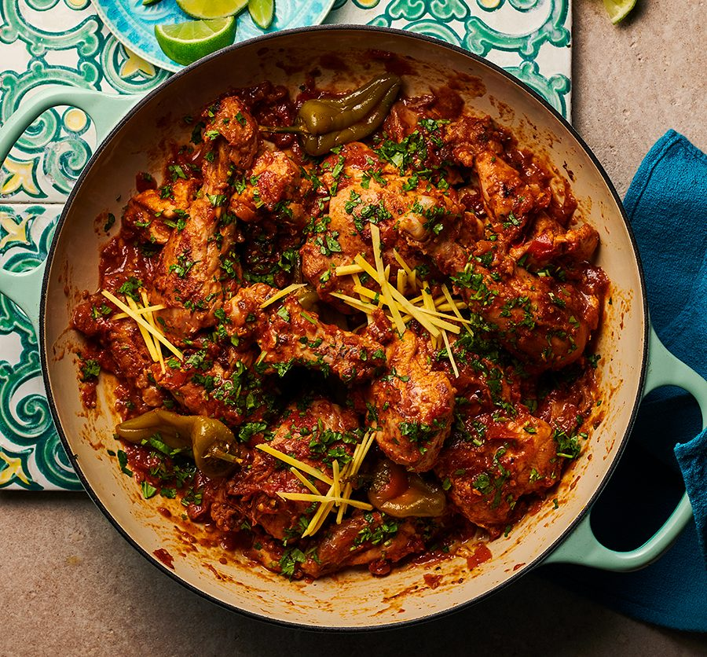

# Restaurant-Style Karahi

*A whole-spice BIR curry built around a fresh green herb-and-chilli paste, freshly toasted cumin and coriander, and fresh tomato wedges stirred in late.*

**Serves:** 1

**Prep Time:** 15 minutes

**Cook Time:** 12 minutes

## Overview
Karahi takes its name from the deep, wok-shaped pan it's traditionally cooked in — a thick metal bowl that heats hard and fast, perfect for the high-heat finish that defines the dish. The BIR version layers two extra steps onto the standard curry-house build: freshly toasted cumin and coriander seeds ground at the start, and a fresh green paste of onion, chillies, peppers, coriander stalks, garlic, and ginger blitzed together. Both add a brightness and depth that ground spices and ginger-garlic paste alone can't deliver.

The flavour profile is medium to hot, distinctly herbaceous from the green paste, and aromatic from the whole-spice tempering (fennel, cloves, green and black cardamom). Fresh tomato wedges go in two minutes before the end and stay only just cooked — pockets of juicy acidity dotted through the sauce. This is the curry to make when you want something a notch more involved than a weeknight madras.

---

## Ingredients

### Special Hot Green Paste (makes more than needed; the recipe uses 3 tbsp)
- 0.5 medium onion
- 2 green chillies
- 0.25 green pepper
- 0.25 red pepper
- 2 tbsp fresh coriander stalks
- 4 garlic cloves
- 2 cm chunk of fresh ginger
- a splash of oil to help it blend

### Toasted Ground Spice
- 0.5 tsp cumin seeds
- 0.5 tsp coriander seeds

### Tempering
- 4 tbsp oil (60 ml)
- 0.5 tsp fennel seeds
- 2 cloves
- 2 green cardamom pods, split
- 1 black cardamom pod, split (optional)
- 1 tsp ginger-garlic paste

### Spice
- 1 tsp [Mix Powder](Spice-Mixes/mixed-powder.md)
- 1 tsp chilli powder
- 0.5 tsp [Garam Masala](Spice-Mixes/garam-masala.md)
- 0.5 tsp salt
- 1 tsp kasuri methi

### Sauce
- 3 tbsp special hot green paste (from above)
- 4 tbsp tomato paste
- 200 g [Pre-Cooked Chicken](Base/pre-cooked-chicken.md), [Pre-Cooked Lamb](Base/pre-cooked-lamb.md), chicken tikka, or vegetables
- 300 to 330 ml+ [Curry Base Gravy](Base/curry-base.md), heated through

### Finish
- 2 fresh tomato quarters
- 1 tbsp finely chopped fresh coriander leaves
- 1 to 2 tsp sugar (optional)
- extra coriander, to garnish

---

## Method

### Stage 1 - Make the green paste
1. Roughly chop the onion, green chillies, peppers, coriander stalks, garlic, and ginger.
2. Blitz in a small blender or food processor with a splash of oil until smooth. Set aside.
3. You will have more paste than the 3 tbsp this recipe needs — keep the rest in the fridge for the next karahi (or spread on toast with extra chopped green chilli).

### Stage 2 - Toast and grind the seeds
1. Set a dry frying pan on medium heat. Add the cumin and coriander seeds.
2. Toast for 45 to 60 seconds, shaking the pan, until the seeds darken and the aroma sharpens.
3. Tip into a mortar (or spice grinder) and grind to a fine powder. Set aside.

### Stage 3 - Temper
1. Set a karahi, wok, or wide frying pan on medium-high heat and add the oil.
2. When hot, drop in the fennel seeds, cloves, green cardamom, and the optional black cardamom. Fry for 30 seconds to infuse the oil.
3. Add the freshly ground cumin and coriander powder along with the ginger-garlic paste.
4. Stir constantly for 20 to 30 seconds until the mixture darkens and the sizzling drops — at which point it's about to burn if you don't keep moving.

### Stage 4 - Bloom the spices
1. Add the kasuri methi, mix powder, chilli powder, garam masala, and salt.
2. Splash in 30 ml of base gravy to keep the spices from scorching.
3. Fry for 20 to 30 seconds, stirring constantly.

### Stage 5 - Green paste and tomato base
1. Stir in 3 tbsp of the special hot green paste.
2. Add the tomato paste. Stir, then turn the heat to high and fry for 45 seconds.

### Stage 6 - Main ingredient and gravy
1. Add the pre-cooked chicken (or chosen main) and mix well into the masala.
2. Pour in 75 ml of base gravy. Stir and scrape once, then leave undisturbed until the sauce reduces and small dry craters form around the edges with the oil surfacing.
3. Add a second 75 ml of base gravy. Stir and scrape once when it goes in, then fry for 30 to 45 seconds until the craters return.
4. Pour in the final 150 ml of base gravy. Stir once.
5. Cook on high heat for 3 to 4 minutes. Resist stirring — the caramelisation on the base and sides of the pan is where the flavour develops. Intervene only if the sauce is about to burn.
6. Add a splash more base gravy at the end if the sauce tightens past where you want it.

### Stage 7 - Tomato and coriander finish
1. Taste and adjust with extra salt or sugar if needed.
2. Add the fresh tomato quarters and the chopped coriander leaves.
3. Stir once and cook for a further 1 to 2 minutes — the tomato should soften and release juice without disintegrating.
4. Fish out the cloves and cardamom pods (alternatively, use the seeds scraped from the cardamom pods at Stage 3 and discard the pods, so there's nothing to retrieve later).
5. Plate up with an extra scatter of fresh coriander.

---

## Notes
- Freshly toasting and grinding the cumin and coriander seeds really does make a difference here. Pre-ground will work in a pinch, but you'll notice the dish lacks a bit of depth in the trade.
- A karahi or wok is the authentic vessel for this one, but a wide heavy-based frying pan does the job just as well, as long as you keep the heat high all the way through the final cook.
- Black cardamom has a smoky, slightly camphorous character that's a bit of a marmite ingredient. Taste a single seed first. Some people love it, others find it overpowering. If you're in any doubt, just skip it.
- Any green paste you've got left over keeps for 3 to 4 days in the fridge. Stir it into a spoon of yoghurt for a quick chutney, or use it as the base for a grilled chicken marinade. Don't waste it.
- And the usual: all spoon measurements are level. 1 tsp = 5 ml, 1 tbsp = 15 ml.

---

## Serving
Pair with [Restaurant-Style Special Fried Rice](Restaurant-Style-Special-Fried-Rice.md), plain basmati, or a fresh chapati. A wedge of lemon and a small bowl of raita round out the plate.

---

## Storage
Keeps 2 to 3 days in the fridge in a sealed container. The toasted-seed and fresh-paste notes are brightest on day one but the dish still holds up well. Reheat in a pan with a splash of water rather than the microwave to keep the sauce smooth and the tomato pieces intact.
