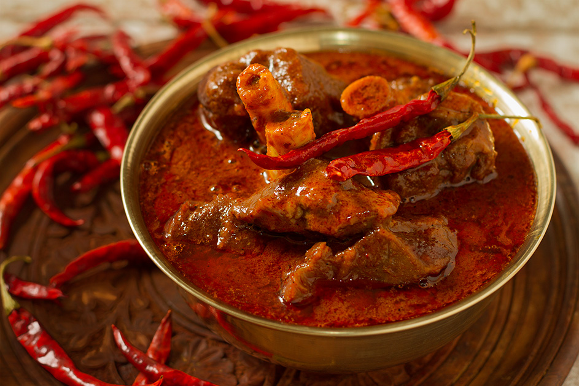

# Restaurant-Style Laal Chicken Curry

*A deep-red BIR curry that earns its name (laal = red) from a heavy paprika hand and Kashmiri chilli, balanced by lemon and a cooling spoon of yoghurt.*

**Serves:** 1

**Prep Time:** 5 minutes

**Cook Time:** 12 minutes

## Overview
"Laal" is Hindi for red, and the dish lives up to the name. Two and a half tablespoons of unsmoked paprika and a heaped tablespoon of Kashmiri chilli powder turn the sauce a vivid brick red. The heat is medium, most of the colour comes from paprika and Kashmiri, which contribute more pigment than punch, and the build sits in jalfrezi territory rather than vindaloo. A late dollop of yoghurt and a wedge of green chilli to garnish cut through the rich tomato-paprika base.

The dish is unusual within the BIR canon in two ways. First, the seed temper is more elaborate than most: cumin alongside optional black mustard seeds and nigella (kalonjee), each contributing a different aromatic note. Second, the recipe runs raw or pre-cooked chicken interchangeably, useful when you want to skip the [Pre-Cooked Chicken](Base/pre-cooked-chicken.md) step, though the build needs a couple of extra minutes in Stage 4 to cook the chicken through if going raw.

---

## Ingredients

### Tempering
- 4 tbsp oil (60 ml)
- 1 tsp cumin seeds
- 0.75 tsp black mustard seeds (optional)
- 0.5 tsp nigella seeds / kalonjee (optional)
- 75 g onion, finely sliced into slivers (about half a medium onion)
- 1 tbsp ginger-garlic paste

### Spice
- 2 tsp [Mix Powder](Spice-Mixes/mixed-powder.md)
- 1 tsp kasuri methi
- 1 tbsp Kashmiri chilli powder
- 0.5 to 2 tsp regular chilli powder (to taste)
- 2.5 tbsp paprika (unsmoked Hungarian or Spanish)
- 0.75 tsp smoked paprika (optional)
- 0.5 tsp salt
- 0.25 tsp ground black pepper

### Sauce
- 4 to 5 tbsp tomato paste
- 175 to 200 g chicken, raw, or [Pre-Cooked Chicken](Base/pre-cooked-chicken.md)
- 330 ml+ [Curry Base Gravy](Base/curry-base.md), heated through
- 1 tbsp fresh lemon juice

### Finish
- 1 tbsp finely chopped fresh coriander
- a dollop of natural yoghurt (optional)
- sliced green chillies (optional)
- a pinch of paprika, to dust

---

## Method

### Stage 1 - Temper
1. Set a frying pan on medium-high heat and add the oil.
2. When hot, add the cumin seeds and the optional mustard and nigella seeds.
3. Stir for 20 seconds, until the seeds start to crackle and infuse the oil.
4. Add the sliced onion. Fry for 2 to 3 minutes, stirring from time to time, until the onion turns translucent and starts to brown at the edges.
5. Add the ginger-garlic paste and continue to fry for a further 45 to 60 seconds, stirring constantly.

### Stage 2 - Bloom the spices
1. Add the mix powder, kasuri methi, Kashmiri chilli powder, regular chilli powder, paprika, smoked paprika (if using), salt, and ground black pepper.
2. Splash in a little base gravy (about 30 ml), paprika in particular is prone to burning at this volume without a touch of liquid.
3. Stir constantly for 20 to 30 seconds, working the flat of the spoon across the base of the pan.

### Stage 3 - Tomato base and chicken
1. Add the tomato paste and the chicken (raw or pre-cooked).
2. Stir thoroughly to coat the chicken in the spice paste.
3. Cook for a short while until the oil floats to the surface and small dry craters appear around the edges of the pan. If using raw chicken, give it an extra 2 to 3 minutes here so it starts cooking through before the gravy goes in.

### Stage 4 - Build the sauce
1. Pour in 75 ml of base gravy. Stir and scrape once, then leave undisturbed until the oil resurfaces and the dry craters return.
2. Add a second 75 ml of base gravy. Stir and scrape once, then leave to reduce again.
3. Pour in the final 150 ml of base gravy along with the lemon juice. Stir and scrape once.
4. Cook on high heat for 4 to 5 minutes with minimal interference. Let the sauce stick and caramelise on the sides and base of the pan; intervene only to prevent burning.
5. Add a splash more base gravy at the end if the sauce tightens past where you want it.

### Stage 5 - Finish
1. Add the chopped coriander. Stir and cook for a further 30 seconds.
2. If using raw chicken, cut a piece open to confirm it's fully cooked through before serving.
3. Taste and adjust with extra lemon juice or salt as needed.
4. Plate up. Top with a dollop of yoghurt, a light dusting of paprika, the rest of the coriander, and the optional sliced green chillies.

---

## Notes
- The paprika is genuinely doing real work in this dish. Unsmoked Hungarian or sweet Spanish paprika gives you the red colour without any smoky character. The optional smoked paprika layers a faint barbecue note on top of that, but it's easy to overdo, so go gently.
- That "0.5 to 2 tsp regular chilli powder" range looks wide on the page, but it's because the Kashmiri is doing most of the colour work. Calibrate the regular chilli to your own taste. If you're not sure, start at 1 tsp.
- Raw and pre-cooked chicken both work here, but they give you slightly different results. Raw chicken absorbs the spice paste as it cooks, which gives you a thicker sauce. Pre-cooked keeps the meat softer and the sauce thinner. Pick whichever suits you on the night.
- The yoghurt goes on the plate at the end rather than stirred into the sauce, so it stays cool against the hot curry. It's visually striking and texturally rather lovely.
- And the usual: all spoon measurements are level. 1 tsp = 5 ml, 1 tbsp = 15 ml.

---

## Serving
Pair with [Restaurant-Style Special Fried Rice](Restaurant-Style-Special-Fried-Rice.md) or plain basmati and a piece of naan to lift the rich sauce. A small bowl of raita on the side is a sensible companion.

---

## Storage
Keeps 2 to 3 days in the fridge in a sealed container. The colour stays vivid; the flavours round out overnight as the paprika integrates. Reheat in a pan with a splash of water rather than the microwave to keep the sauce smooth.
