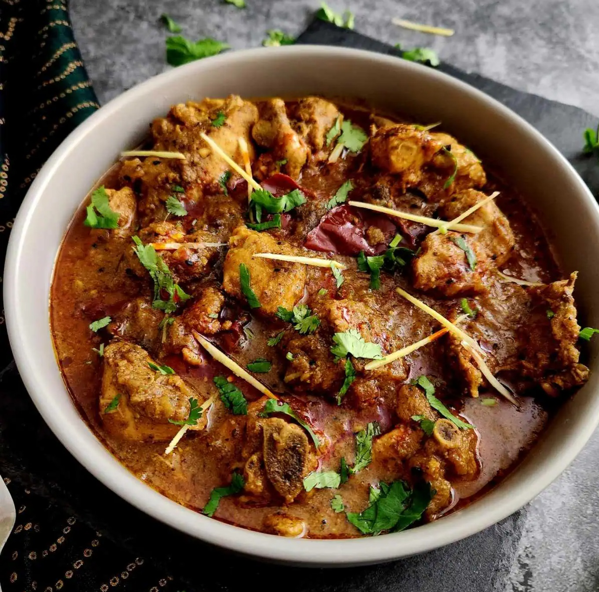

# Restaurant-Style Lamb Achari

*A pickle-led BIR curry built on a panch-phoran-style seed temper, with a heaped tablespoon of Indian pickle stirred in late for the distinctive bright, sour, slightly funky character.*

**Serves:** 1

**Prep Time:** 5 minutes (longer if pre-cooking the potatoes)

**Cook Time:** 12 minutes

## Overview
"Achari" means "of pickle"; the dish is built around Indian-style pickles (achaar) as a flavouring agent rather than a condiment. A heaped tablespoon stirred in late carries the curry: sour, salty, often fiercely hot, and instantly recognisable on the palate. Different pickles produce different curries. Brinjal (aubergine) pickle gives a mild mellow result; lime or mango pickles bring sharp citrus heat; garlic pickle pushes the dish into deep savoury territory; naga pickle takes it into specialist-hot range. The seed temper does most of the work upfront. Mustard, fenugreek, black cumin and nigella all crackle in hot oil for 30 seconds before the onion goes in, essentially panch phoran (the Bengali five-spice). The pickle joins with the final gravy pour; a late spoon of yogurt and fresh tomato segments soften the heat without dulling the sour edge. Lamb is the traditional protein here, its richness stands up to the pickle's intensity better than chicken does.

---

## Ingredients

### Seed Temper
- 3 to 4 tbsp oil (45 to 60 ml)
- 1 tsp mustard seeds
- 0.25 tsp fenugreek seeds
- 0.5 tsp black cumin seeds (see Notes)
- 0.5 tsp kalonji (nigella) seeds
- alternatively: 2.5 tsp [Panch Poran](Spice-Mixes/panch-poran.md) in place of the four seed measures above

### Aromatics
- 75 to 100 g onion, sliced into thin semi-circular rings
- 1.5 tsp ginger-garlic paste

### Spice
- 1 tsp kasuri methi
- 1.5 tsp Kashmiri chilli powder (or 0.75 tsp regular chilli powder)
- 1.5 tsp [Mix Powder](Spice-Mixes/mixed-powder.md)
- 0.25 tsp salt (light, pickles bring their own; see Notes)

### Sauce
- 5 tbsp tomato paste (double-concentrated puree diluted 1:3, blended tinned plum tomatoes, or passata)
- 1 tbsp finely chopped fresh coriander stalks
- 200 g [Pre-Cooked Lamb](Base/pre-cooked-lamb.md) (or other main)
- 330 ml+ [Curry Base Gravy](Base/curry-base.md), heated through

### Pickle and Finish
- 75 g pre-cooked potato chunks, 5 to 6 pieces (optional)
- 1 to 1.5 tbsp Indian pickle of choice (brinjal, mango, lime, satkora, chilli, garlic, or mixed)
- 3 to 4 fresh tomato segments
- 3 tbsp natural yoghurt (45 ml)
- 1 tbsp finely chopped fresh coriander leaves, to garnish
- 1 extra tomato segment, to garnish

---

## Method

### Stage 1 - Seed temper
1. Set a frying pan on medium-high heat and add the oil.
2. Drop in the mustard seeds, fenugreek seeds, black cumin seeds, and kalonji seeds, or the 2.5 tsp of panch phoran if using.
3. Stir and cook for 30 seconds, or until the mustard seeds start popping. Don't wander; mustard goes from popping to scorched fast.

### Stage 2 - Soften the aromatics
1. Add the sliced onion. Cook for 1 to 2 minutes, stirring frequently, until softened and translucent.
2. Add the ginger-garlic paste. Fry for 15 to 30 seconds, until the sizzling sound turns to a light crackling.

### Stage 3 - Bloom the spices
1. Add the kasuri methi, mix powder, chilli powder, and salt.
2. Splash in 30 ml of base gravy straight away to keep the spices from scorching.
3. Fry for 20 to 30 seconds, stirring diligently.

### Stage 4 - Tomato base
1. Add the tomato paste. Turn the heat to high.
2. Stir constantly until the oil separates and tiny craters appear around the edges of the pan.
3. Add the pre-cooked lamb (or chosen main) and the coriander stalks. Mix well into the masala.

### Stage 5 - Build the sauce
1. Pour in 75 ml of base gravy. Stir, then leave undisturbed on high heat until the sauce reduces and the dry craters return.
2. Add a second 75 ml of base gravy. Stir, then leave to reduce again.
3. Pour in the final 150 ml of base gravy along with the Indian pickle and the optional pre-cooked potatoes. Stir and scrape the base and sides of the pan to mix the thick bits back in.
4. Cook on high heat for 3 to 4 minutes, until the sauce hits a medium-thick consistency.
5. Add a splash more base gravy if it tightens past where you want it. Avoid stirring or scraping unless the curry is about to burn.

### Stage 6 - Tomato, yoghurt, and finish
1. Add the chopped coriander leaves and the fresh tomato segments.
2. Drop the heat to low. Stir in the natural yoghurt.
3. Cook for a further 1 to 2 minutes on low heat, the yoghurt needs to integrate without splitting.
4. Taste and adjust: extra pickle for sharper sour notes, salt for savouriness, a pinch of sugar if the pickle is particularly fierce.
5. Spoon off excess oil from the surface if you prefer a less rich finish.
6. Plate up. Garnish with an extra tomato segment and a scatter of fresh coriander.

---

## Notes
- The pickle really does define the dish, so do choose it deliberately rather than grabbing whatever's nearest in the cupboard:
 - **Brinjal (aubergine)** is mild, mellow, and slightly sweet. A great entry point.
 - **Mango** is fruity, tart, and moderately hot. Probably the most familiar choice.
 - **Lime** or **satkora** (Bengali lime) give you a sharp citrus tang with bitter undertones.
 - **Garlic** is deeply aromatic and savoury.
 - **Chilli** or **mixed** vary in heat but are generally on the punchier side.
 - **Naga** is specialist hot. Use a teaspoon rather than a tablespoon for this one.
- Pickles vary wildly in salt content. The 0.25 tsp salt above is deliberately low so the pickle can speak for itself. Do taste before adding more.
- The seed temper can be substituted with 2.5 tsp of panch phoran (the Bengali five-spice mix of cumin, fennel, fenugreek, mustard, and nigella). If you keep a jar of that made up, it's a lovely one-step shortcut to the same flavour territory.
- "Black cumin" here means Bunium persicum (kala jeera), not nigella. Those are kalonji and listed separately. If you can't track down black cumin specifically, regular cumin seeds are a perfectly acceptable substitute.
- The yoghurt goes in on low heat to stop it splitting. Whole-milk natural yoghurt holds together better than low-fat.
- "Tomato paste" here means something medium-bodied: double-concentrated tomato puree mixed with 3 parts water, blended tinned plum tomatoes, or passata.
- Pre-cooked potatoes are easy enough: peel, chunk, and simmer in water with a pinch of salt and turmeric for 15 minutes until cooked but still firm.
- And the usual: all spoon measurements are level. 1 tsp = 5 ml, 1 tbsp = 15 ml.

---

## Serving
Pair with plain basmati or a [Restaurant-Style Special Fried Rice](Restaurant-Style-Special-Fried-Rice.md) and a piece of paratha or naan to mop the sauce. A small bowl of plain yoghurt or raita on the side balances the pickle intensity; skip the chutneys and pickles you'd normally put alongside, they'll compete with the curry.

---

## Storage
Keeps 2 to 3 days in the fridge in a sealed container. The pickle flavours deepen overnight as they integrate with the sauce; day-two achari is often noticeably more rounded. Reheat in a pan with a splash of water rather than the microwave to keep the yoghurt smooth.
