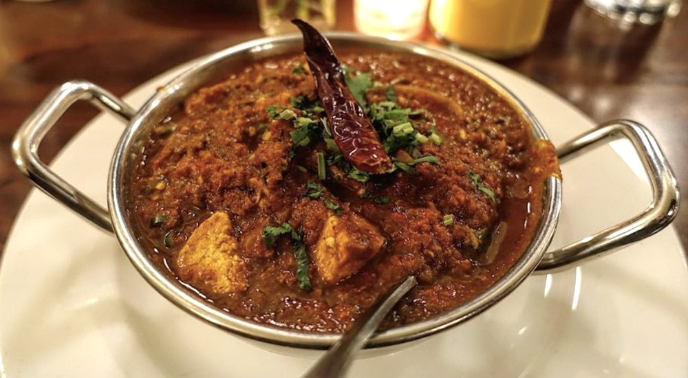

# Restaurant-Style Lavastorm Curry

*A specialist BIR challenge dish built around a fresh "molten lava" paste of naga, scotch bonnet, and Thai red chillies. Eye-watering by design, and yes, properly delicious if you respect the heat.*

**Serves:** 1

**Prep Time:** 10 minutes

**Cook Time:** 12 minutes

## Overview
Lavastorm belongs to the rarefied corner of the BIR menu shared with phaal, naga, and the various house-named "hottest curries on the menu" dishes. The defining ingredient is a freshly blended chilli paste, garlic, tandoori masala, and a deliberate blend of super-hot red chillies (naga, scotch bonnet, Thai red, with regular supermarket chillies as the rounder bottom note). Three tablespoons of that paste, plus extra-hot chilli powder, Kashmiri chilli powder, chilli flakes, and 8 to 10 sliced fresh green chillies stirred in at the end, build a wall of heat that needs careful balancing.

What stops the dish from being unbearable is the late layer of honey, sugar, lime juice, and a final spoon of yoghurt. The sweetness and acidity give the heat structure; the yoghurt softens the colour and the texture. Without those finishing notes you have a dish that just hurts. With them you have a curry that hits hard, layers in tropical-fruit chilli flavours from the naga and scotch bonnet, then rounds out as it cools on the tongue.

Cook this with the extractor fan on full and a window open. The chilli vapour coming off the pan during the high-heat stages is no joke.

---

## Ingredients

### Molten Lava Chilli Paste (makes more than needed; recipe uses 3 tbsp)
- 3 garlic cloves
- 1 tsp [Tandoori Masala](Spice-Mixes/tandoori-masala.md)
- 2 naga chillies
- 4 Thai red chillies
- 2 scotch bonnet or habanero chillies
- 1 to 2 regular supermarket red chillies (medium heat)
- a splash of water to help it blend

### Tempering
- 5 tbsp oil or ghee (75 ml)
- 10 cm cassia bark
- 1 tsp cumin seeds
- 2 green cardamom pods, split

### Aromatics
- 60 g onion, finely chopped
- 30 to 40 g red pepper, sliced (about a quarter of one)
- 2 tsp ginger-garlic paste

### Spice
- 2 tsp extra-hot chilli powder (or 3 to 4 tsp regular chilli powder)
- 2 tsp Kashmiri chilli powder
- 1.25 tsp [Mix Powder](Spice-Mixes/mixed-powder.md)
- 0.25 to 0.5 tsp salt
- 1 tsp kasuri methi

### Sauce
- 6 tbsp tomato paste
- 3 tbsp molten lava chilli paste (from above)
- 1 tbsp chilli flakes
- 1 to 2 tsp chilli or naga pickle (optional)
- 200 g [Pre-Cooked Chicken](Base/pre-cooked-chicken.md), [Pre-Cooked Lamb](Base/pre-cooked-lamb.md), beef, or vegetables
- 330 ml+ [Curry Base Gravy](Base/curry-base.md), heated through

### Balance and Finish
- 2 tsp fresh lime or lemon juice
- 2 tsp honey
- 1 tsp sugar
- 8 to 10 green chillies, finely sliced width-wise
- 2 to 3 tsp onion paste / bunjarra (optional)
- 1 tbsp natural yoghurt
- finely chopped fresh coriander, to garnish
- 1 to 2 tomato slices, to garnish

---

## Method

### Stage 1 - Make the molten lava paste
1. Roughly chop the garlic and chillies. Remove the membrane and seeds for slightly less heat if you want (skip this if you're going for full intensity).
2. Blitz in a small blender with the tandoori masala and a splash of water until smooth.
3. Set aside. The leftover paste keeps 3 to 4 days in the fridge and freezes well in ice-cube portions.

### Stage 2 - Temper
1. Set a frying pan on medium-high heat and add the oil or ghee.
2. Drop in the cassia bark, cumin seeds, and split cardamom pods.
3. Fry for 30 to 45 seconds, stirring frequently, to infuse the oil.

### Stage 3 - Soften the aromatics
1. Add the chopped onion and sliced red pepper. Cook for 1 to 2 minutes, stirring often, until the onion starts to brown at the edges.
2. Add the ginger-garlic paste. Fry for 15 to 25 seconds, stirring constantly, until the sizzling drops.

### Stage 4 - Bloom the spices
1. Add the kasuri methi, both chilli powders, mix powder, and salt.
2. Pour over 30 ml of base gravy to help bind the spices and stop them burning.
3. Fry for 30 to 40 seconds, constantly stirring and using the flat of the spoon to spread the spices across the pan. Add a little water or extra base gravy if the spices start sticking, they need to cook out properly here.

### Stage 5 - Lava paste and tomato base
1. Add the tomato paste, the molten lava chilli paste, the chilli flakes, and the optional chilli or naga pickle.
2. Turn the heat to high. Stir diligently for about 45 seconds until the oil separates and tiny craters appear around the edges of the pan. Turn the extractor fan up at this point.
3. Add the pre-cooked chicken (or chosen main). Mix well into the sauce.

### Stage 6 - Build the sauce
1. Pour in 75 ml of base gravy. Stir once, then leave undisturbed on high heat until the sauce reduces and the craters return.
2. Add a second 75 ml of base gravy. Stir and scrape once when it goes in, then leave to reduce again.
3. Pour in the final 150 ml of base gravy along with the lime juice, honey, sugar, sliced green chillies, and the optional onion paste. Stir and scrape once.
4. Cook on high heat for 4 to 5 minutes. Avoid stirring or scraping unless the curry is about to burn.
5. Taste cautiously. The chilli powders need to be fully cooked out (raw chilli reads sharp and dusty); cook longer if you can still taste the rawness. Adjust the sugar, salt, or lime juice as needed.

### Stage 7 - Yoghurt finish and plate
1. Drop the heat to low. Stir in the natural yoghurt, it helps the colour and softens the chilli edge slightly.
2. There will be a generous slick of oil on the surface. Spoon some off if you prefer a less rich result; leave it for the full BIR experience.
3. Plate up with the chopped coriander on top and a slice or two of tomato to one side.

---

## Notes
- Please read this bit before you start. Open a window, turn the extractor fan up to full, and seriously consider a face mask if your kitchen ventilation is on the modest side. The vapour coming off the pan in Stages 5 and 6 will absolutely catch in your throat and chest. I'm not exaggerating.
- Handle the chillies like they could ruin your evening, because they can. A fork or a pair of disposable gloves is your friend here. Wash your hands and the chopping board the moment you're done, and please don't touch your eyes, face, or anywhere sensitive until you've had a proper scrub.
- Naga and scotch bonnet chillies aren't really swappable with cayenne or jalapeño. The point isn't just the heat: it's that fruity, almost tropical note they bring, which is what makes a lavastorm taste like a lavastorm rather than just a very hot curry.
- The honey, sugar, and lime aren't really optional, despite where they sit in the ingredients list. Skip them and you'll have something that just hurts. With them, you've got a serious dish with real character behind the burn.
- Any lava paste you've got left over is properly useful. A small spoonful stirred into other curries gives them a lovely lift, and mixed with yoghurt it makes a brilliant marinade for grilled chicken or paneer.
- And the standard measure note: all spoons are level. 1 tsp = 5 ml, 1 tbsp = 15 ml.

---

## Serving
Pair with [Restaurant-Style Special Fried Rice](Restaurant-Style-Special-Fried-Rice.md) or plain basmati and a piece of naan to mop the sauce. A large bowl of cool raita on the side is genuinely necessary, milk, yoghurt, and dairy fat are the only effective rescue when the heat overwhelms.

---

## Storage
Keeps 2 to 3 days in the fridge in a sealed container. The heat mellows overnight as the chilli oils integrate with the sauce; day-two lavastorm is often more enjoyable than day-one. Reheat in a pan with a splash of water rather than the microwave to keep the yoghurt smooth and avoid the chilli vapour filling the kitchen all over again.
