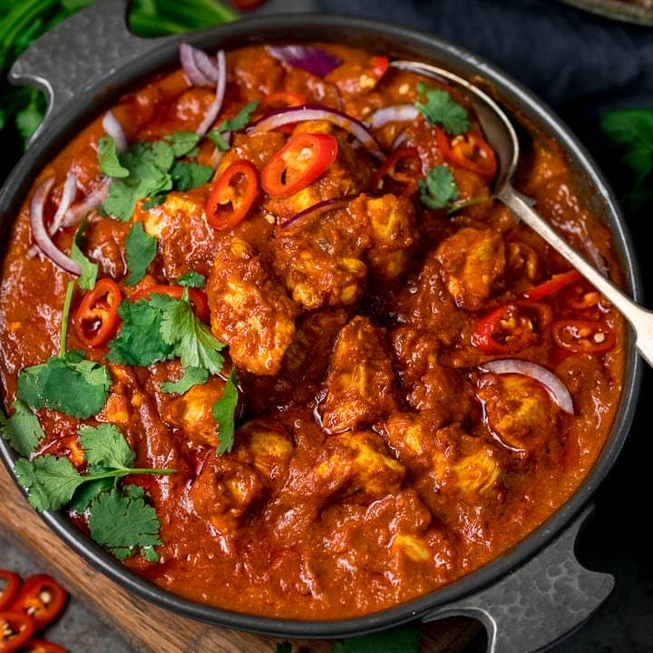

# Restaurant-Style Madras

*The benchmark hot-and-sour BIR curry: tomato-led, chilli-forward, with a squeeze of lemon and a splash of Worcestershire holding the whole thing in tension.*

**Serves:** 1

**Prep Time:** 5 minutes

**Cook Time:** 10 minutes

## Overview
A Madras lives or dies by balance. The heat is unmistakable, 1.5 to 2 teaspoons of chilli powder put it firmly above a jalfrezi, but it should never read as one-note. The trick is the sourness: a slug of tomato paste cooked back to oil-separation, lemon juice late in the build, and the BIR house touch of Worcestershire sauce. Together they pull the dish out of brute heat and into the savoury, slightly tangy register that defines a curry-house Madras.

The base build follows standard BIR practice. Whole spices (cassia bark, cumin) temper in hot oil, ginger-garlic paste browns, [Mix Powder](Spice-Mixes/mixed-powder.md) and chilli bloom in a splash of [Curry Base Gravy](Base/curry-base.md), tomato paste reduces, then the main ingredient (usually [Pre-Cooked Chicken](Base/pre-cooked-chicken.md), but lamb, beef, prawns, or vegetables all work) joins for the three-pour gravy reduction.

---

## Ingredients

### Tempering
- 4 tbsp oil (60 ml)
- 10 cm cassia bark
- 0.5 tsp cumin seeds
- 2 tsp ginger-garlic paste

### Spice
- 1.5 tsp [Mix Powder](Spice-Mixes/mixed-powder.md)
- 1.5 to 2 tsp chilli powder
- 0.25 to 0.5 tsp salt
- 1 tsp kasuri methi

### Sauce
- 5 to 6 tbsp tomato paste
- 2 tsp lemon juice (or lemon dressing)
- 1 tbsp finely chopped fresh coriander stalks
- 330 ml+ [Curry Base Gravy](Base/curry-base.md), heated through
- 200 g [Pre-Cooked Chicken](Base/pre-cooked-chicken.md), [Pre-Cooked Lamb](Base/pre-cooked-lamb.md), chicken tikka, prawns, or vegetables

### Finish
- 3 to 4 splashes Worcestershire sauce
- 0.5 tsp instant coffee granules (optional, for depth)
- 2 to 3 tsp onion paste / bunjarra (optional)
- 1 to 2 tsp sugar or mango chutney (optional)
- 1 tbsp finely chopped fresh coriander leaves, to garnish

---

## Method

### Stage 1 - Temper
1. Set a frying pan on medium-high heat and add the oil.
2. When hot, drop in the cassia bark and cumin seeds. Fry for 30 to 45 seconds, stirring frequently.
3. Add the ginger-garlic paste. Stir for about 30 seconds until it starts to brown and the sizzling drops.

### Stage 2 - Bloom the spices
1. Add the chilli powder, mix powder, kasuri methi, and salt.
2. Splash in 30 ml of base gravy so the spices cook without scorching.
3. Fry for 20 to 30 seconds, working the flat of the spoon across the pan to keep the spices evenly distributed.

### Stage 3 - Tomato base
1. Add the tomato paste and turn the heat to high.
2. Stir frequently for 30 seconds or so, until the oil separates and small dry craters appear around the edges of the pan.

### Stage 4 - Main ingredient
1. Add the pre-cooked chicken (or chosen main), the chopped coriander stalks, the lemon juice, and the optional coffee granules.
2. Mix thoroughly into the masala so every piece is coated.

### Stage 5 - Build the sauce
1. Pour in 75 ml of base gravy. Stir and scrape once. Leave to cook undisturbed until the dry craters return.
2. Add a second 75 ml of base gravy. Stir and scrape once when it goes in, then leave to reduce again.
3. Pour in the final 150 ml of base gravy along with the Worcestershire sauce, the optional onion paste, and the optional sugar or mango chutney. Stir and scrape once.
4. Cook on high heat for 4 to 5 minutes. Stir and scrape only to stop the sauce burning to the base; the caramelised edges carry a lot of the flavour, so resist the urge to keep moving the pan.
5. Add a splash more base gravy at the end if the sauce has tightened past where you want it.

### Stage 6 - Finish
1. Fish out the cassia bark.
2. Spoon off excess oil from the surface if you prefer (BIR practice leaves it on for sheen).
3. Plate up and scatter the chopped coriander leaves over the top.

---

## Notes
- The coffee granules are a classic curry-house trick, and they're not as strange as they sound. They don't make the curry taste of coffee. What they do is deepen the colour and add a faint, bitter bass note that gives the chilli something to lean on.
- Onion paste (sometimes called bunjarra) is genuinely worth making for this one. It adds a sweet-savoury layer the base gravy alone can't quite reach, and it rounds out the whole sauce.
- I know Worcestershire sauce sounds wrong in an Indian recipe, but trust me. It's standard in BIR kitchens, and it brings tamarind, anchovy, and vinegar all in one little splash.
- Heat scales with the chilli powder, so if you're not sure, start at 1.5 tsp. You can always push it harder next time.
- And the usual: all spoon measurements are level. 1 tsp = 5 ml, 1 tbsp = 15 ml.

---

## Serving
Pair with [Restaurant-Style Special Fried Rice](Restaurant-Style-Special-Fried-Rice.md) or plain basmati and a piece of naan to mop the sauce. A cooling raita and a wedge of lemon at the side round it out.

---

## Storage
Keeps 2 to 3 days in the fridge in a sealed container. Like most BIR curries the flavours settle and improve overnight. Reheat in a pan with a splash of water rather than the microwave to bring the sauce back without splitting the oil.
