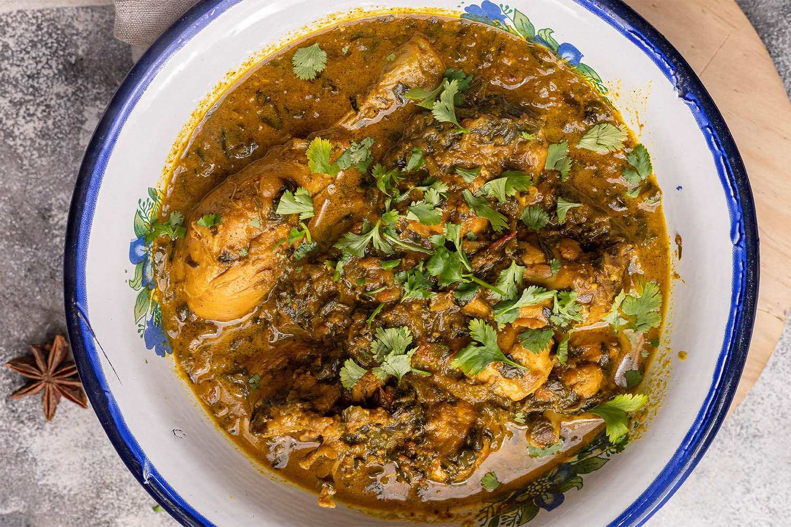

# Restaurant-Style Methi Curry

*A herb-forward BIR curry dominated by fresh fenugreek leaves, with a triple-fenugreek build (seeds, fresh leaves, kasuri methi optional) that gives the dish its distinctive bittersweet finish.*

**Serves:** 1

**Prep Time:** 10 minutes

**Cook Time:** 10 minutes

## Overview
Methi is the Hindi word for fenugreek, and this curry is built around the fresh herb in every form the kitchen can put it. Fenugreek seeds temper in the oil at the start; a generous handful of fresh methi leaves goes in with the tomato paste so the herb cooks down into the masala rather than sitting on top; and a final scatter of leaves over the plate keeps a clean herbaceous note on the finish.

The flavour profile is mild to medium and noticeably green. Fresh fenugreek leaves have a slightly bitter, faintly maple-like character that mellows as they cook. A whole-spice base of cumin, crushed coriander, fenugreek seeds, and a star anise puts a warm aromatic floor under the herb, and a finishing spoon of yoghurt rounds the dish without pushing it into korma territory. The three-pour [Curry Base Gravy](Base/curry-base.md) reduction concentrates everything into a medium-thick sauce.

---

## Ingredients

### Tempering
- 3 to 4 tbsp oil (45 to 60 ml)
- 0.5 tsp cumin seeds
- 0.5 tsp coriander seeds, crushed
- 0.25 tsp fenugreek seeds
- 1 star anise
- 1 large Asian bay leaf (tej patta), optional
- 0.5 tsp fennel seeds, optional

### Aromatics
- 75 g onion, finely chopped
- 1.5 tsp ginger-garlic paste

### Spice
- 1 tsp [Mix Powder](../../base-ingredients/curry-powder/mixed-powder.md)
- 0.25 to 0.5 tsp salt
- 0.25 to 0.5 tsp chilli powder (optional)

### Sauce
- 3 to 4 tbsp fresh fenugreek leaves (methi), finely chopped
- 3 tbsp tomato paste
- 1 tbsp finely chopped fresh coriander stalks
- 200 g [Pre-Cooked Chicken](Base/pre-cooked-chicken.md)
- 330 ml+ [Curry Base Gravy](Base/curry-base.md), heated through

### Finish
- 2 tbsp natural yoghurt
- 1 tbsp finely chopped fresh coriander leaves
- a few extra fenugreek leaves, to garnish

---

## Method

### Stage 1 - Prep
1. Crush the coriander seeds into small pieces with a rolling pin or a pestle and mortar. Whole seeds will not break down enough in the brief temper.

### Stage 2 - Temper
1. Set a frying pan on medium-high heat and add the oil.
2. Add the cumin seeds, crushed coriander seeds, fenugreek seeds, star anise, the optional bay leaf, and the optional fennel seeds.
3. Fry for 30 to 40 seconds, stirring frequently, until the seeds infuse the oil and you can smell the aromatics.

### Stage 3 - Soften the aromatics
1. Add the chopped onion. Fry for a couple of minutes, stirring occasionally, until it begins to brown around the edges.
2. Add the ginger-garlic paste and cook for 20 to 30 seconds, stirring constantly, until the sizzling subsides and you hear small crackles.

### Stage 4 - Bloom the spices
1. Add the mix powder, salt, and the optional chilli powder.
2. Fry for 20 to 30 seconds, working the flat of the spoon across the pan.
3. If the mixture starts drying out, splash in about 30 ml of base gravy so the spices cook without scorching.

### Stage 5 - Build the masala
1. Add the tomato paste and the fresh fenugreek leaves.
2. Turn the heat to high. Stir together and fry until the oil separates and tiny craters appear around the edges.
3. Add the coriander stalks and the pre-cooked chicken. Coat every piece in the sauce.

### Stage 6 - Pour the gravy
1. Add 75 ml of base gravy. Stir once. Leave undisturbed on high heat until the sauce reduces and the dry craters return.
2. Add a second 75 ml of base gravy. Stir and scrape once when it goes in, then leave to reduce again.
3. Pour in the final 150 ml of base gravy. Stir and scrape once.
4. Cook on high heat for 4 to 5 minutes, until the sauce hits a medium-thick consistency and the oil has separated.
5. Stir and scrape only when needed to prevent burning. The caramelisation on the base and sides of the pan is part of the flavour, so let it form.
6. Add a splash more base gravy if the sauce tightens past where you want it.

### Stage 7 - Finish
1. Drop the heat to low. Stir in the natural yoghurt and the chopped coriander leaves.
2. Fish out the star anise and bay leaf.
3. Plate up and scatter a few extra fresh fenugreek leaves over the top.

---

## Notes
- Fresh fenugreek really is the heart of this one. It's slightly bitter and beautifully herbaceous, and dried just can't quite replicate it. That said, if you can't track any down, you're not lost: 2.5 tsp of kasuri methi crushed gently between your palms will get you most of the way there. You'll just miss the green, almost-grassy top notes.
- Your best bet for fresh methi is an Indian or South Asian grocer, where you'll often find it in tied bunches sitting alongside the other greens. When you get it home, strip the leaves off the stems and bin the woody bits.
- The yoghurt at the end isn't doing the same job as it would in a korma. It's a tempering step rather than a base, so add it on low heat to keep it from splitting. Once it's stirred through, you can crank the heat back up briefly if the sauce needs to tighten.
- Just to be clear on the measures: all spoons are level. 1 tsp = 5 ml, 1 tbsp = 15 ml.

---

## Serving
- Pair with [Restaurant-Style Special Fried Rice](Restaurant-Style-Special-Fried-Rice.md) or plain basmati and a piece of methi paratha to double down on the herb. A side of plain raita keeps the bitter notes in check.

- ---

## Storage
Keeps 2 to 3 days in the fridge in a sealed container. The fresh-herb character is brightest on day one; flavours settle and round out by day two. Reheat in a pan with a splash of water rather than the microwave to keep the yoghurt smooth.
