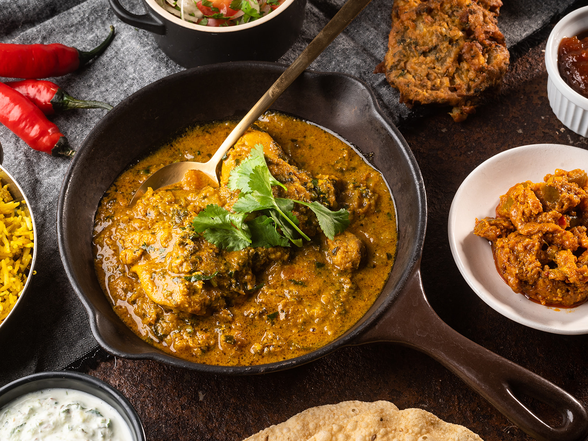

# Restaurant-Style Moghul Curry

*A rich, mild BIR curry in the Mughlai tradition: ground almonds, cream, sultanas, and warm whole spices, finished with half a hard-boiled egg.*

**Serves:** 1

**Prep Time:** 5 minutes

**Cook Time:** 10 minutes

## Overview
Moghul (sometimes spelled Mughal or Mughlai) curries trace back to the imperial kitchens of the Mughal Empire, where dishes were defined by nuts, dried fruit, dairy, and the warm-but-restrained spicing of cassia, clove, and green cardamom. The British restaurant version keeps the same DNA but builds on a [Curry Base Gravy](Base/curry-base.md) and finishes with a glug of single cream, putting it squarely in the mild-to-medium end of the menu next to korma and pasanda.

The defining ingredients are ground almonds (for body and a faintly nutty sweetness), sugar (because the dish reads sweet by design), and the whole spices toasted in oil at the start. Worcestershire sauce sneaks in as a savoury counterweight if you want it; sultanas add pockets of jammy sweetness; a hard-boiled egg sliced over the top is the traditional restaurant finish and worth the extra step.

---

## Ingredients

### Tempering
- 3 tbsp oil, ghee, or a mix
- 8 cm cassia bark
- 2 cloves
- 2 green cardamom pods, split (or the seeds only)

### Aromatics
- 70 g red pepper, finely diced
- 1.5 tsp garlic, very finely chopped
- 1 tsp ginger, very finely chopped
- 1 tsp kasuri methi

### Spice
- 1 tsp [Mix Powder](Spice-Mixes/mixed-powder.md)
- 0.25 tsp turmeric
- 0.25 to 0.5 tsp chilli powder (optional)
- 0.25 to 0.5 tsp salt

### Sauce
- 3 tbsp ground almonds (almond powder)
- 2 to 3 tsp white sugar
- 300 ml+ [Curry Base Gravy](Base/curry-base.md), heated through
- 200 g [Pre-Cooked Chicken](Base/pre-cooked-chicken.md), [Pre-Cooked Lamb](Base/pre-cooked-lamb.md), or other main
- a few splashes Worcestershire sauce (optional)
- 1 tsp lemon or lime juice
- 10 to 15 sultanas (optional)

### Finish
- 100 to 125 ml single cream, plus extra for garnish
- 1 to 2 tsp ghee (optional, for richness)
- a small pinch of [Garam Masala](Spice-Mixes/garam-masala.md)
- fresh coriander, finely chopped
- half a hard-boiled egg

---

## Method

### Stage 1 - Temper
1. Set a frying pan on medium-high heat and add the oil or ghee.
2. Drop in the cassia bark, cloves, and green cardamom. Fry for 45 to 60 seconds, stirring constantly so the whole spices infuse the oil without scorching.

### Stage 2 - Soften the aromatics
1. Add the diced red pepper. Fry for 1 to 2 minutes, stirring occasionally, until softened.
2. Add the chopped garlic and ginger and fry for a further 30 seconds.

### Stage 3 - Bloom the spices
1. Add the kasuri methi, mix powder, turmeric, salt, ground almonds, sugar, and the optional chilli powder.
2. Pour in 75 ml of base gravy straight away to keep the spices and almonds from catching.
3. Stir diligently for 20 to 30 seconds, working everything together into a thick paste.

### Stage 4 - Build the sauce
1. Add the pre-cooked chicken or lamb and mix well into the masala.
2. Turn the heat to high. Pour in 225 ml of base gravy along with the lemon juice and the optional Worcestershire sauce.
3. Stir and scrape once to bring everything together, then leave to cook on high heat for 3 to 4 minutes.
4. Resist the urge to meddle. The sauce needs to caramelise undisturbed to develop the right depth. Stir only if it threatens to catch on the base.

### Stage 5 - Cream and sweet finish
1. About 1 to 2 minutes before the end of cooking, drop the heat to low.
2. Stir in the single cream and the optional sultanas.
3. Bring the heat back up to high once the cream is mixed through.
4. Add a splash more base gravy if the sauce has tightened past where you want it.
5. Taste and adjust: a little more salt for savouriness, more sugar for sweetness, more cream for body.

### Stage 6 - Plate
1. For extra sheen, stir in 1 to 2 tsp of ghee just before serving. Otherwise spoon off any surplus oil from the surface.
2. Fish out the cassia bark and green cardamom pods.
3. Slide into a warm bowl. Dust with a pinch of garam masala, drizzle a little extra cream over the top, and scatter the chopped coriander.
4. Sit half a hard-boiled egg on top to finish.

---

## Notes
- The ground almonds really carry the body of this one. Please don't try to substitute almond essence or chopped nuts. The powder dissolves into the sauce in a way that the alternatives just can't replicate.
- The whole spices stay in the pan all the way through, quietly doing their infusing thing. Do remember to fish them out before serving so nobody bites down on a clove.
- Single cream is the standard BIR choice for this. Double cream works fine, but it'll push the dish into proper korma-level richness. Coconut cream takes you in a completely different direction and isn't really what we're after here.
- The hard-boiled egg garnish reads as a bit of old-school restaurant theatre, but it really is traditional, and the cool egg against the warm sauce is genuinely lovely. Worth the extra five minutes.
- And the usual: all spoon measurements are level. 1 tsp = 5 ml, 1 tbsp = 15 ml.

---

## Serving
Pair with [Restaurant-Style Special Fried Rice](Restaurant-Style-Special-Fried-Rice.md), plain basmati, or a peshwari naan; the sweetness of the moghul plays well off the coconut-almond stuffing. A side of plain raita keeps the palate clean between richer bites.

---

## Storage
Keeps 2 days in the fridge in a sealed container. The cream-based sauce thickens noticeably on cooling. Reheat gently in a pan with a splash of water or extra cream rather than the microwave, which can split the dairy.
