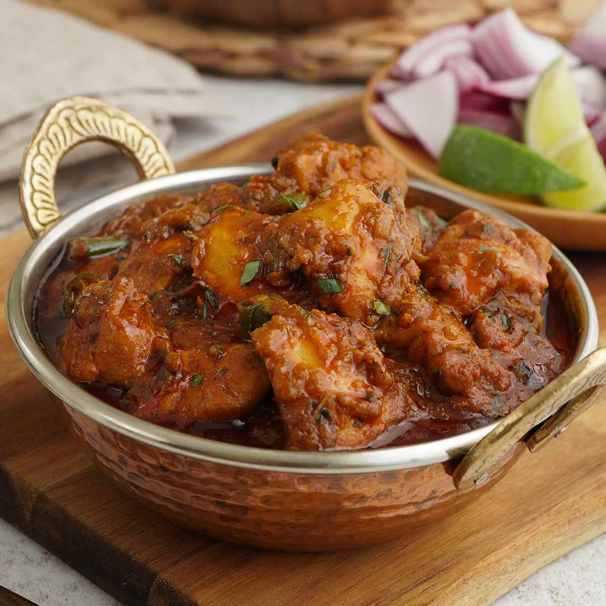

# Restaurant-Style Naga Curry

*A blistering BIR favourite built around Mr Naga chilli pickle, with a rounded sweetness that keeps the heat readable instead of punishing.*

**Serves:** 1

**Prep Time:** 5 minutes

**Cook Time:** 10 minutes

## Overview
A specialist dish from the hotter end of the BIR menu, defined by Mr Naga, the fermented chilli pickle made from Bhut Jolokia and related super-hots. The pickle goes in late so its fruity, slightly funky character survives the cook; honey or jaggery joins it at the end to soften the edge and pull the dish out of brute-force territory.

The base build is standard restaurant practice: cumin in hot oil, ginger-garlic paste, chilli powder and [Mix Powder](../../base-ingredients/curry-powder/mixed-powder.md) tempered with a splash of [Curry Base Gravy](Base/curry-base.md), then tomato paste cooked back to oil-separation before the [Pre-Cooked Chicken](Base/pre-cooked-chicken.md) (or [Pre-Cooked Lamb](Base/pre-cooked-lamb.md), or vegetables) joins the pan. The remainder of the base gravy goes in three additions so the sauce reduces and caramelises in waves.

---

## Ingredients

### Tempering
- 3 to 4 tbsp oil or ghee (45 to 60 ml)
- 1 tsp cumin seeds
- 2 tsp ginger-garlic paste
- 1 tsp kasuri methi

### Spice
- 1 tsp extra-hot chilli powder (or 2 tsp regular chilli powder)
- 1.5 tsp [Mix Powder](../../base-ingredients/curry-powder/mixed-powder.md)
- 0.25 to 0.5 tsp salt

### Sauce
- 4 to 6 tbsp tomato paste
- 330 ml+ [Curry Base Gravy](Base/curry-base.md), heated through
- 200 g [Pre-Cooked Chicken](Base/pre-cooked-chicken.md), [Pre-Cooked Lamb](Base/pre-cooked-lamb.md), or mixed vegetables

### Heat and Finish
- 1 tbsp Mr Naga chilli pickle (adjust to taste)
- 1 fresh naga chilli, finely chopped (optional; Scotch bonnet substitutes well)
- 2 to 3 tsp honey, jaggery, or brown sugar (optional but recommended)

### Garnish
- fresh coriander, finely chopped
- 1 slice cucumber
- a few very fine slices of red naga chilli

---

## Method

### Stage 1 - Temper
1. Set a frying pan on medium-high heat and add the oil or ghee.
2. When hot, add the cumin seeds. Fry for 30 to 45 seconds, stirring often, until they start to crackle.
3. Add the ginger-garlic paste. Stir constantly until it starts to brown and the sizzling sound drops.

### Stage 2 - Bloom the spices
1. Add the kasuri methi, extra-hot chilli powder, mix powder, and salt.
2. Splash in about 30 ml of base gravy so the spices cook without scorching.
3. Fry for 20 to 30 seconds, working the flat of the spoon across the pan.

### Stage 3 - Tomato base
1. Add the tomato paste and turn the heat to high.
2. Cook for 20 to 30 seconds, stirring occasionally, until the oil starts to separate and small craters appear around the edges.

### Stage 4 - Build the sauce
1. Add the pre-cooked chicken (or lamb / vegetables) and stir into the masala.
2. Pour in 75 ml of base gravy. Stir once and leave on high heat for 30 seconds or so, until tiny craters form again.
3. Add another 75 ml of base gravy. Stir and scrape the base and sides once when it goes in, then leave to cook as before.
4. Add a final 150 ml of base gravy and stir-scrape once more.
5. Cook on high heat for 4 to 5 minutes, until the sauce hits the consistency you want and the oil has separated cleanly.

### Stage 5 - Naga and balance
1. About halfway through Stage 4's final cook, stir in the Mr Naga pickle and the fresh naga chilli if using.
2. Thin with a little extra base gravy if the sauce tightens too far. Stir and scrape any caramelisation back into the sauce once or twice, more than that and you risk burning.
3. Taste cautiously a minute before the end. Stir in the honey, jaggery, or brown sugar; the sweetness rounds the sharpness of the Mr Naga without dulling the heat.

### Stage 6 - Plate
1. Slide into a warm bowl. Top with chopped coriander, a slice of cucumber, and very thin slices of red naga chilli.

---

## Notes
- Mr Naga is non-negotiable here, I'm afraid. That fermented funk is what separates a proper naga curry from a curry that just happens to be very hot. Subbing in a different hot sauce really does change the whole dish.
- If you can't get hold of fresh naga chillies, a Scotch bonnet steps in nicely. The colour and the fruitiness are close enough, even if the heat sits a touch lower.
- The honey is listed as optional, but please don't skip it. Without it the dish reads as just flat heat. With it, you get something properly complex.
- Heat scales with both the chilli powder and the Mr Naga, so if you're new to either, start at the lower end of both ranges. You can always push the pickle harder next time.

---

## Serving
- Pile onto [Restaurant-Style Special Fried Rice](Restaurant-Style-Special-Fried-Rice.md) or plain basmati, with a cooling raita and plenty of cucumber to hand. Naan helps mop the sauce and gives the palate something to fall back on between forkfuls.

- ---

## Storage
Keeps 2 to 3 days in the fridge in a sealed container. The heat mellows slightly overnight and the flavours round out, many BIR cooks consider day-two naga the better version. Reheat gently with a splash of water to loosen.
