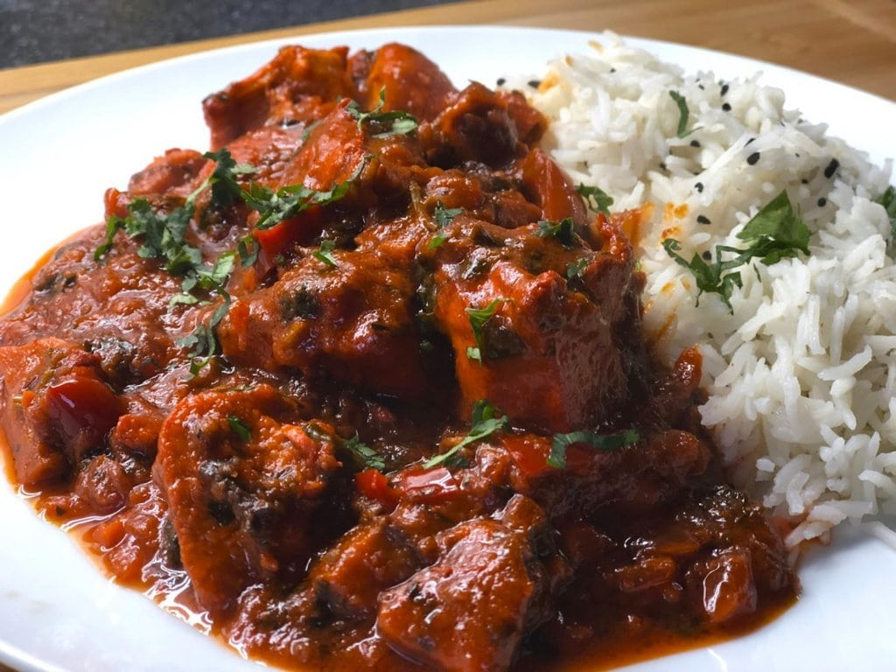

# Restaurant-Style Pathia

*The hot-sweet-and-sour Parsi-rooted BIR curry: chilli backbone, tamarind sharpness, and a measured dose of jaggery and mango chutney for the unmistakable balance.*

**Serves:** 1

**Prep Time:** 5 minutes

**Cook Time:** 10 minutes

## Overview
Pathia traces back to Parsi home cooking, where the sweet-sour-spicy triad — usually balanced with jaggery, vinegar or tamarind, and dried red chilli — is a defining feature of the cuisine. The British curry-house version stays faithful to that flavour profile but rebuilds it around a [Curry Base Gravy](Base/curry-base.md), making it a close cousin of dhansak and a near-twin of vindaloo in heat level, distinguished from both by its specific sweet-sour finish.

The dish reads hot, but the chilli sits inside a frame of mango chutney, jaggery, lemon juice, tamarind, and Worcestershire sauce. None of those should dominate; the goal is a sauce where each spoonful pings sweet, then sharp, then savoury, then hot in quick succession. Kashmiri chilli powder carries colour and a softer warmth, and a quarter-teaspoon of smoked paprika lays down a faint smoky bass note that's the dish's BIR-era signature.

Prawns work particularly well in a pathia and are arguably the traditional choice, but pre-cooked chicken, lamb, or beef all pair cleanly with the sweet-sour-hot profile.

---

## Ingredients

### Tempering
- 4 tbsp oil (60 ml)
- 10 cm cassia bark
- 1 tej patta (Asian bay leaf), optional
- 60 to 80 g onion, very finely chopped
- 2 tsp ginger-garlic paste

### Spice
- 1 tsp chilli powder
- 1 tsp Kashmiri chilli powder (mild)
- 1.5 tsp [Mix Powder](Spice-Mixes/mixed-powder.md)
- 0.25 tsp smoked paprika
- 0.25 to 0.5 tsp salt
- 1 tsp kasuri methi

### Sauce
- 5 to 6 tbsp tomato paste
- 1 tbsp finely chopped fresh coriander stalks
- 330 ml+ [Curry Base Gravy](Base/curry-base.md), heated through
- 200 g prawns or [Pre-Cooked Chicken](Base/pre-cooked-chicken.md), [Pre-Cooked Lamb](Base/pre-cooked-lamb.md), or beef

### Sweet-Sour Finish
- 1.5 tsp mango chutney
- 1.5 tsp jaggery or brown sugar
- 1.5 tsp lemon juice, freshly squeezed
- 2 tsp tamarind sauce, or 0.5 tsp tamarind concentrate
- a few splashes Worcestershire sauce
- 1 tbsp finely chopped fresh coriander leaves, to garnish

---

## Method

### Stage 1 - Temper
1. Set a frying pan on medium-high heat and add the oil.
2. When hot, drop in the cassia bark and the optional tej patta. Fry for 30 to 45 seconds, stirring to infuse the oil.
3. Add the chopped onion. Fry for 1 to 2 minutes, stirring occasionally, until the onion is translucent and starting to brown at the edges.
4. Add the ginger-garlic paste. Stir until it begins to brown and the sizzling sound drops, signalling most of the water has cooked off.

### Stage 2 - Bloom the spices
1. Add the kasuri methi, mix powder, both chilli powders, smoked paprika, and salt.
2. Splash in 30 ml of base gravy straight away to keep the spices from scorching.
3. Fry for 20 to 30 seconds, stirring constantly and using the flat of the spoon to spread the spices evenly across the pan.

### Stage 3 - Tomato base
1. Turn the heat to high. Add the tomato paste.
2. Stir constantly until the oil separates and small craters appear around the edges of the pan.

### Stage 4 - Main ingredient
1. Add the pre-cooked chicken (or chosen meat) and the chopped coriander stalks. Mix well to coat every piece in the masala.
2. If using prawns, hold them back until Stage 5 — they only need a couple of minutes in the sauce.

### Stage 5 - Build the sauce
1. Pour in 75 ml of base gravy. Stir once, then leave undisturbed on high heat for 30 to 45 seconds until the sauce reduces and small craters return around the edges.
2. Add a second 75 ml of base gravy. Stir and scrape once when it goes in, then leave to reduce again.
3. Pour in the final 150 ml of base gravy along with the mango chutney, jaggery, tamarind, lemon juice, and Worcestershire sauce. Stir and scrape once.
4. Cook on high heat for 4 to 5 minutes, until the sauce hits a medium-thick consistency and the oil has separated.
5. Resist the urge to keep stirring. The caramelisation on the base and sides of the pan is where a lot of the flavour comes from; intervene only if the sauce is about to burn.
6. Add a splash more base gravy if the sauce tightens past where you want it.

### Stage 6 - Prawns (if using) and finish
1. If using prawns, add them a couple of minutes before the end of cooking. Coat them thoroughly in the sauce to stop them drying out. The prawns will release juice as they cook, which loosens the sauce slightly.
2. Add the chopped coriander leaves 30 seconds before the end.
3. Taste and adjust: extra salt for savouriness, jaggery for sweetness, tamarind or lemon for sharpness, chilli for heat.
4. Fish out the cassia bark and tej patta.
5. Spoon off any excess oil from the surface if you prefer.
6. Plate up with an extra scatter of coriander.

---

## Notes
- Tamarind varies wildly in concentration depending on the form, so do start at the low end and taste before adding more. Tamarind concentrate, in particular, is roughly four times stronger than bottled tamarind sauce. Easy does it.
- Smoked paprika is easy to overdo. Some brands (especially Spanish pimentón) are aggressive at even a quarter teaspoon, so do sample yours first before committing to the full amount.
- The sweet-sour-hot balance is genuinely personal. My recipe is calibrated for a curry that reads sharp first, hot second, sweet on the finish, but please feel free to reweight to whatever your tongue prefers.
- Prawns are arguably the traditional choice for a pathia, and the dish absolutely sings with them. Frozen raw king prawns work just fine. Defrost them first and pat them dry.
- And the usual: all spoon measurements are level. 1 tsp = 5 ml, 1 tbsp = 15 ml.

---

## Serving
Pair with [Restaurant-Style Special Fried Rice](Restaurant-Style-Special-Fried-Rice.md), plain basmati, or a buttery naan to mop the sauce. A side of cool raita and a wedge of lemon round it off.

---

## Storage
Keeps 2 to 3 days in the fridge in a sealed container (prawn versions are best eaten within 1 to 2 days). The sweet-sour-hot balance settles overnight and the flavours integrate. Reheat in a pan with a splash of water rather than the microwave to avoid overcooking any prawns and to keep the oil from splitting out.
