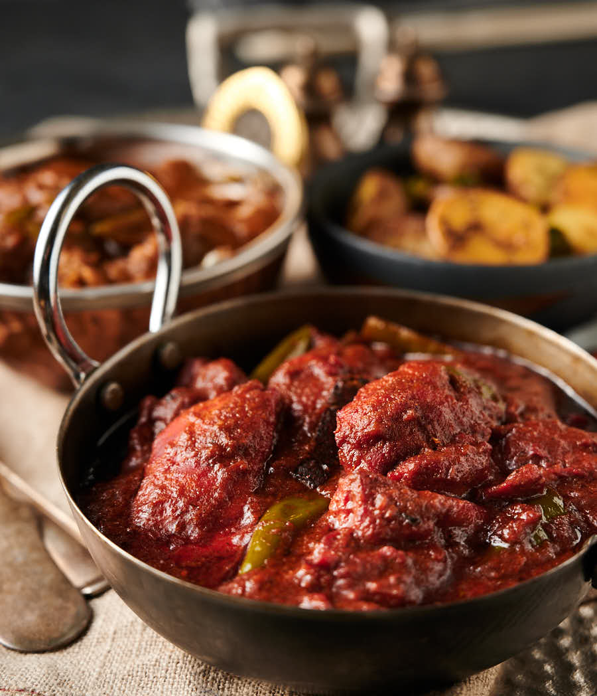

# Restaurant-Style Phaal

*The BIR challenge dish, no qualifiers: 3 tablespoons of chilli powder plus flakes and Mr Naga, leaning on lemon and a touch of sugar to keep the heat readable rather than punishing.*

**Serves:** 1

**Prep Time:** 5 minutes

**Cook Time:** 12 minutes

## Overview
Phaal is the restaurant category-killer for heat, traditionally claimed (though disputed) as a British invention from the Birmingham balti scene rather than a true Indian dish. The pitch is straightforward: take a standard BIR build and load it with three tablespoons of chilli powder in three forms (extra-hot, Kashmiri and chilli flakes), back it up with chilli chutney or Mr Naga pickle, and reduce hard so the heat is concentrated rather than diluted. The trick is making it taste of something other than pain. Kashmiri chilli powder does most of the colouring work without proportional heat; the extra-hot powder and flakes are where the bite comes from; Mr Naga adds fruity, almost tropical chilli notes. A late slug of lemon juice and an optional spoon of sugar pull the dish into balance. Cook with the extractor fan on full and a window open; the capsaicin vapour catches in the throat and chest, and a small splatter on bare skin will smart for hours.

---

## Ingredients

### Tempering
- 5 tbsp oil (75 ml)
- 1 tsp fennel seeds
- 1 tbsp ginger-garlic paste

### Spice (the chilli load)
- 1 tbsp extra-hot chilli powder
- 2 tbsp Kashmiri chilli powder
- 1 tbsp chilli flakes
- 1 tbsp chilli chutney or pickle (Mr Naga or similar)
- 2 tsp [Mix Powder](../../base-ingredients/curry-powder/mixed-powder.md)
- 0.25 tsp [Garam Masala](../../base-ingredients/curry-powder/garam-masala.md)
- 1 tsp kasuri methi
- 0.25 to 0.5 tsp salt

### Sauce
- 7 tbsp tomato paste
- 1 tbsp finely chopped fresh coriander stalks
- 200 g [Pre-Cooked Chicken](Base/pre-cooked-chicken.md), chicken tikka, [Pre-Cooked Lamb](Base/pre-cooked-lamb.md), beef, or vegetables
- 330 ml+ [Curry Base Gravy](Base/curry-base.md), heated through

### Balance and Finish
- 2 tsp lemon juice
- 2 tsp sugar (optional but recommended)
- 1 tbsp finely chopped fresh coriander leaves, to garnish

---

## Method

### Stage 1 - Temper
1. Set a frying pan on medium-high heat and add the oil.
2. When hot, add the fennel seeds. Fry for 30 to 45 seconds, stirring, to infuse the oil.
3. Add the ginger-garlic paste. Fry for 20 to 30 seconds, until it starts to brown and the sizzling drops, the cue that the water content has cooked out.

### Stage 2 - Bloom the spices
1. Add the kasuri methi, mix powder, extra-hot chilli powder, Kashmiri chilli powder, chilli flakes, chilli chutney or Mr Naga, garam masala, and salt.
2. Splash in 30 ml of base gravy immediately to bind the spices and stop them scorching.
3. Fry for 40 to 50 seconds, stirring constantly with the flat of the spoon. Add a little more base gravy or water if the mixture sticks. There are a lot of dry chilli powders here and they need this time to cook out properly, undercooked chilli powder tastes harsh, bitter, and dusty, and will give you a rough digestive ride later.
4. Turn the extractor fan up. The next stage produces the worst of the capsaicin vapour.

### Stage 3 - Tomato base
1. Turn the heat to high. Pour in the tomato paste.
2. Stir constantly for 30 to 45 seconds until the oil separates and small craters appear around the edges of the pan.

### Stage 4 - Main ingredient
1. Add the pre-cooked chicken (or chosen main) and the chopped coriander stalks.
2. Mix well so every piece is coated in the masala.

### Stage 5 - Build the sauce
1. Pour in 75 ml of base gravy. Stir once, then leave undisturbed on high heat until the sauce reduces, the oil resurfaces, and the dry craters return.
2. Add a second 75 ml of base gravy. Stir and scrape once when it goes in, then leave to reduce again.
3. Pour in the final 150 ml of base gravy along with the lemon juice and the optional sugar. Stir and scrape once.
4. Cook on high heat for 4 to 5 minutes. Avoid fiddling, the caramelisation on the base and sides is part of the dish.
5. Taste cautiously. If the curry reads sharp or dusty, the chilli powders aren't fully cooked out, give it another minute or two.
6. Add a splash more base gravy if the sauce tightens past where you want it.

### Stage 6 - Finish
1. There will be a heavy slick of oil on the surface. Spoon some off if you prefer a less rich result; leave it for the full BIR experience.
2. Plate up and scatter the chopped coriander leaves on top.

---

## Notes
- Please read this bit before you start. Open a window, turn the extractor fan up to full, and seriously consider a face mask if your kitchen ventilation is on the modest side. The vapour from the chilli powders hitting hot oil is genuinely painful to breathe. I'm not exaggerating.
- Handle the chilli pickles, naga products, and dry chilli powders with proper care. Wash your hands thoroughly afterwards, and please don't touch your face, eyes, or anywhere sensitive until you have.
- The sugar isn't really optional, despite where it sits in the ingredients list. Skip it and the dish reads as just flat heat; with it, you can actually taste the chilli flavours behind the burn.
- The chilli powders genuinely need the full 40 to 50 seconds in Stage 2 to lose their raw harshness. If you skimp on this step the dish tastes worse and feels worse afterwards. Both worth avoiding.
- Mr Naga is the BIR-default chilli pickle for a phaal, but any fierce chilli chutney will do the job. Do sample yours first though, because heat levels vary wildly between brands.
- And the usual: all spoon measurements are level. 1 tsp = 5 ml, 1 tbsp = 15 ml.

---

## Serving
- Pair with [Restaurant-Style Special Fried Rice](Restaurant-Style-Special-Fried-Rice.md) or plain basmati and a piece of naan. A large bowl of cool raita on the side is necessary, milk, yoghurt, and dairy fat are the only effective rescue when the heat overwhelms. Water makes it worse.

- ---

## Storage
Keeps 2 to 3 days in the fridge in a sealed container. The heat mellows slightly overnight as the chilli oils integrate with the sauce. Reheat in a pan with a splash of water rather than the microwave to keep the sauce smooth and avoid the chilli vapour filling the kitchen all over again.
