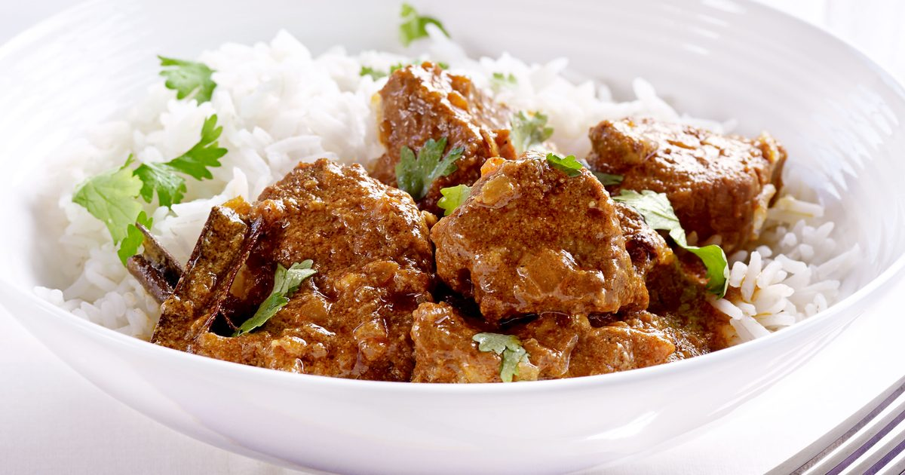

# Restaurant-Style Rogan Josh

*Kashmiri-rooted BIR favourite, finished with a separate tomato-and-ghee topping that gets poured over the curry at the table for visual drama and a final hit of fresh flavour.*

**Serves:** 1

**Prep Time:** 10 minutes

**Cook Time:** 15 minutes

## Overview
Rogan josh ("oily red") comes from Kashmir, where the original is a slow-cooked Wazwan dish of lamb in a deeply spiced, Kashmiri-chilli-stained gravy enriched with yogurt. The British restaurant adaptation keeps the colour (Kashmiri chilli, paprika and tandoori masala do the heavy lifting), the yogurt finish and the warm whole-spice base, but rebuilds the dish around a curry-base gravy so it cooks in 15 minutes rather than two hours. Two builds in one pan. First the main curry: tempered whole spices, softened onion and red pepper, fresh-toasted cumin and coriander, three-pour gravy reduction, late yogurt for the rounded Kashmiri profile. Then a separate topping: ghee, whole cherry tomatoes, fresh coriander and garam masala fried in the same pan to deglaze the caramelised residue, poured over the curry just before serving. That topping is the dish's signature presentation and a serious flavour boost. Lamb is the traditional protein and works best.

---

## Ingredients

### Main Curry, Tempering
- 3 tbsp oil
- 10 cm cassia bark
- 1 tej patta (Asian bay leaf), optional
- 0.5 tsp fennel seeds
- seeds from 0.5 to 1 black cardamom pods (optional; discard the outer pods)

### Aromatics
- 0.5 medium onion (about 75 g peeled), halved lengthwise and finely sliced
- 0.25 to 0.5 red pepper (about 40 to 50 g), cut into 2 to 3 cm squares
- 1.5 tsp ginger-garlic paste

### Toasted Ground Spice
- 0.5 tsp cumin seeds
- 0.5 tsp coriander seeds

### Spice
- 1.5 tsp [Mix Powder](../../base-ingredients/curry-powder/mixed-powder.md)
- 2 tsp Kashmiri chilli powder
- 0.5 tsp [Tandoori Masala](../../base-ingredients/curry-powder/tandoori-masala.md)
- 1 tsp paprika
- 0.25 to 0.5 tsp salt
- a pinch of freshly ground black pepper
- 1 tsp kasuri methi

### Sauce
- 4 to 5 tbsp tomato paste
- 1.5 tbsp finely chopped fresh coriander stalks
- 370 ml+ [Curry Base Gravy](Base/curry-base.md), heated through
- 200 g [Pre-Cooked Lamb](Base/pre-cooked-lamb.md), [Pre-Cooked Chicken](Base/pre-cooked-chicken.md), chicken tikka, prawns, or vegetables
- 2 tbsp natural yoghurt

### Topping
- 1 tbsp ghee (or unsalted butter)
- 6 whole cherry tomatoes (or 2 small-medium tomatoes cut into quarters)
- 1.5 tbsp finely chopped fresh coriander leaves
- 0.25 tsp [Garam Masala](../../base-ingredients/curry-powder/garam-masala.md)
- about 40 ml extra base gravy
- a splash of water for deglazing

---

## Method

### Stage 1 - Toast and grind the seeds
1. Set a dry frying pan on medium heat. Add the cumin and coriander seeds.
2. Toast for 45 to 60 seconds, shaking the pan, until the seeds darken and the aroma sharpens.
3. Tip into a mortar (or spice grinder) and grind to a fine powder. Set aside.

### Stage 2 - Temper
1. Set a frying pan on medium-high heat and add the oil.
2. Drop in the cassia bark, fennel seeds, the optional black cardamom seeds, and the optional tej patta.
3. Fry for 30 to 45 seconds, stirring frequently, until the whole spices infuse the oil.

### Stage 3 - Soften the aromatics
1. Add the sliced onion and the red pepper squares.
2. Fry for a couple of minutes, stirring occasionally, until the onion is translucent and the pepper has just started to soften.
3. Add the ginger-garlic paste. Stir frequently for 15 to 30 seconds, until the sizzling subsides.

### Stage 4 - Bloom the spices
1. Add the toasted ground cumin and coriander, mix powder, Kashmiri chilli powder, tandoori masala, paprika, salt, ground black pepper, and kasuri methi.
2. Splash in about 30 ml of base gravy the moment the spices start drying out.
3. Fry for 20 to 30 seconds, stirring constantly with the flat of the spoon to keep the spices evenly distributed.

### Stage 5 - Tomato base
1. Add the tomato paste. Turn the heat to high.
2. Stir constantly until the oil separates and tiny craters appear around the edges of the pan.
3. Add the coriander stalks and the pre-cooked lamb (or chosen main). Mix well to coat every piece.

### Stage 6 - Build the sauce
1. Pour in 75 ml of base gravy. Stir once, then leave undisturbed on high heat until the sauce reduces and the dry craters return.
2. Add a second 75 ml of base gravy. Stir and scrape once, then leave to reduce again.
3. Pour in the final 150 ml of base gravy. Stir and scrape once.
4. Cook on high heat for 4 to 5 minutes, until the sauce hits a medium consistency.
5. Stir and scrape only when needed to prevent burning. The caramelisation on the base and sides of the pan is part of the flavour and the topping will deglaze it later.
6. A minute before the end, drop the heat to low and stir in the natural yoghurt.

### Stage 7 - Transfer and rest
1. Fish out the cassia bark and tej patta.
2. Scrape the curry out into a serving dish, leaving the sticky residue on the pan's base and sides, this is the foundation of the topping.
3. Keep the curry warm while you make the topping.

### Stage 8 - The topping
1. Return the pan to medium-high heat and add the ghee.
2. Once melted, add the cherry tomatoes, chopped coriander leaves, garam masala, and 40 ml of base gravy.
3. Stir and let the sauce start to caramelise, 30 to 45 seconds.
4. Add a splash of water to thin the sauce and help deglaze. Scrape the residue off the base and sides into the sauce.
5. Cook for 2 to 3 minutes, until the tomatoes have softened but still hold their shape.
6. Pour the topping over the main curry and serve immediately.

---

## Notes
- The two-step cook really is what makes this dish distinctive. Skipping the topping turns it into a fairly standard BIR lamb curry. Still nice, but not what you came for.
- Freshly toasting and grinding the cumin and coriander matters more here than in most BIR curries, because the dish reads relatively mildly spiced. That toast layer adds the depth pre-ground spices can't quite give you.
- Kashmiri chilli powder is your colour engine. Please don't be tempted to swap it for regular chilli powder. You'll end up with something duller and one-note hotter.
- Lamb is the traditional choice. If you're using [Pre-Cooked Lamb](Base/pre-cooked-lamb.md), aim for chunks at least cherry-tomato-sized so they hold their shape against the sauce.
- The yoghurt goes in on low heat to stop it splitting. Whole-milk natural yoghurt holds together best; low-fat has a tendency to break up.
- And the usual: all spoon measurements are level. 1 tsp = 5 ml, 1 tbsp = 15 ml.

---

## Serving
- Pair with plain basmati or [Restaurant-Style Special Fried Rice](Restaurant-Style-Special-Fried-Rice.md), and a piece of naan or chapati to mop the sauce. Pour the topping over at the table for the visual effect; a side of cool raita keeps the spice in check.

- ---

## Storage
Keeps 2 to 3 days in the fridge in a sealed container. Stir the topping into the main curry before refrigerating, the tomato and ghee meld into the sauce overnight. Reheat in a pan with a splash of water rather than the microwave to keep the yoghurt smooth and the lamb tender.
