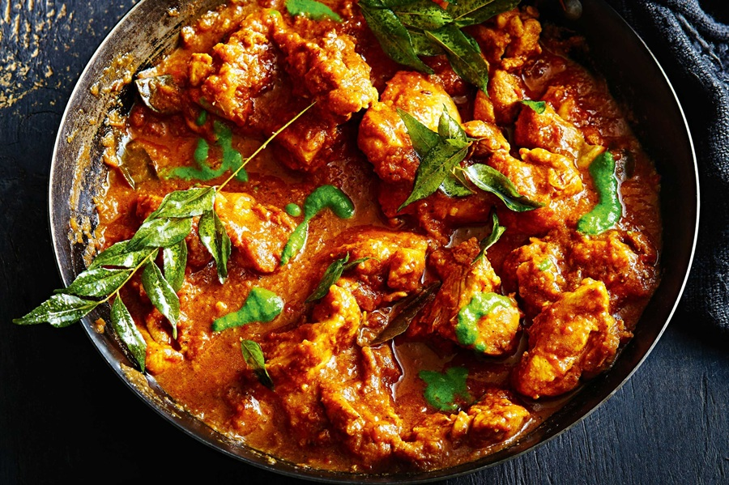

# Restaurant-Style South Indian Tamarind Curry

*A tart, coconut-rich curry built around tamarind and Indian pickle: sour and savoury with a soft sweet edge from jaggery and coconut milk.*

**Serves:** 1 to 2

**Prep Time:** 5 minutes

**Cook Time:** 12 minutes

## Overview
South Indian cooking leans heavily on the sour register; tamarind, kokum, curd and lime do work that yogurt and tomato paste handle further north. This BIR interpretation borrows that southern instinct and stitches it onto the standard restaurant build: a curry-base gravy foundation, three-pour reduction, pre-cooked meat. What lands on the plate is a thinner, more pourable sauce than a typical BIR curry, defined by the bright tang of tamarind and the rounded sweetness of coconut milk. Indian pickle pushes the dish past simple sour: lime, mango or any spicy mixed pickle, chopped smooth so the bits dissolve into the sauce. Jaggery balances the acidity without dulling it. The result is a curry that reads sharp, fragrant and savoury all at once. Three forms of tamarind work here: bottled sauce (often pre-sweetened), concentrate (consistent), or pulp soaked from a block (most flavourful but slowest).

---

## Ingredients

### Tempering
- 3 tbsp oil or ghee (45 ml), vegetable ghee or butter ghee gives the roundest flavour
- 10 cm cassia bark
- 0.5 tsp cumin seeds
- seeds from 1 black cardamom pod (optional; discard the outer pod)
- 1.5 tsp ginger-garlic paste

### Spice
- 1 tsp kasuri methi
- 1.25 tsp [Mix Powder](../../base-ingredients/curry-powder/mixed-powder.md)
- 0.25 to 0.5 tsp chilli powder (optional)
- 0.25 to 0.5 tsp salt

### Sauce
- 3 to 4 tbsp tomato paste
- 200 g [Pre-Cooked Chicken](Base/pre-cooked-chicken.md), chicken tikka, [Pre-Cooked Lamb](Base/pre-cooked-lamb.md), prawns, or vegetables
- 380 ml+ [Curry Base Gravy](Base/curry-base.md), heated through

### Sour and Sweet Finish
- tamarind, in one of:
 - 1.75 tbsp bottled tamarind sauce (East End, Maggi, etc.), often pre-sweetened, taste before adding more sugar
 - 0.75 to 1 tsp tamarind concentrate
 - 2.5 tbsp tamarind pulp (soaked from a block, mashed, and strained)
- 2 tsp Indian pickle of choice, chopped smooth
- 150 ml coconut milk
- 1 to 2 tsp jaggery or brown sugar (optional)

---

## Method

### Stage 1 - Temper
1. Set a frying pan on medium-high heat and add the oil or ghee.
2. Drop in the cassia bark, cumin seeds, and the optional black cardamom seeds.
3. Fry for 30 to 40 seconds, stirring frequently, until the whole spices infuse the oil.
4. Add the ginger-garlic paste. Stir constantly for 20 to 30 seconds, until the sizzling subsides.

### Stage 2 - Bloom the spices
1. Add the kasuri methi, mix powder, salt, and the optional chilli powder.
2. Fry for 20 to 30 seconds, stirring constantly with the flat of the spoon.
3. Splash in about 30 ml of base gravy the moment the spices start sticking, they need a touch of liquid to cook through without scorching.

### Stage 3 - Tomato base
1. Add the tomato paste and the pre-cooked chicken (or chosen main).
2. Turn the heat to high. Stir thoroughly so every piece is coated in the masala.

### Stage 4 - Build the sauce
1. Add 75 ml of base gravy. Stir once, then leave undisturbed on high heat until the sauce reduces and the dry craters return around the edges.
2. Add a second 75 ml of base gravy. Stir and scrape once when it goes in, then leave to reduce again.

### Stage 5 - Tamarind and coconut
1. Pour in the final 200 ml of base gravy along with the tamarind, the chopped pickle, the coconut milk, and the optional jaggery.
2. Stir and scrape once to bring everything together.
3. Cook on high heat for 4 to 5 minutes. Stir and scrape once or twice only when needed to prevent the sauce burning to the base, the caramelisation is part of the flavour.
4. Add a splash more base gravy at the end if the sauce has tightened past where you want it. South Indian tamarind curries traditionally run thinner than most BIR sauces.

### Stage 6 - Taste and adjust
1. Taste before serving. The sour-sweet balance is personal: more tamarind for sharper, more jaggery for rounder, more pickle for funkier heat.
2. Fish out the cassia bark and serve.

---

## Notes
- Bottled tamarind sauce is the easiest way in, but do check the label before you start. Most commercial brands come already sweetened, so cut back or skip the jaggery entirely if that's what you're using.
- Tamarind concentrate is potent stuff. The range here (0.75 to 1 tsp) is genuinely small, and overdoing it tips the dish from balanced into properly sour-sharp territory. Easy does it.
- Tamarind pulp (sold in compressed blocks) gives you the cleanest, fruitiest flavour if you can be bothered. Soak a walnut-sized lump in 4 to 5 tbsp of warm water for 10 minutes, mash it with your fingers to break it up, then push the whole lot through a sieve to catch the seeds and fibre.
- Your pickle choice really does change the character of the dish. Lime pickle gives a bright, bitter edge; mango pickle is sweeter and fruitier; mixed Indian pickle (achaar) lands somewhere comfortably in between. Pick whichever calls to you.
- Please use full-fat coconut milk. The light stuff will thin your sauce out without giving you the body the dish really needs.
- And the usual: all spoon measurements are level. 1 tsp = 5 ml, 1 tbsp = 15 ml.

---

## Serving
- Pair with plain basmati or [Restaurant-Style Special Fried Rice](Restaurant-Style-Special-Fried-Rice.md). A piece of dosa or appam works particularly well if you have one to hand. Skip the heavy raita; a wedge of lime and a few extra fresh coriander leaves are all the dish needs alongside.

- ---

## Storage
Keeps 2 to 3 days in the fridge in a sealed container. The tamarind mellows overnight and the coconut milk thickens; both are improvements. Reheat in a pan with a splash of water rather than the microwave to keep the coconut milk smooth.
